# Project Luna Protocol

Autonomous Discord bot. Runs a local LLM (llama.cpp) and converses naturally — sleep, inattention, typos, hesitations, forgetfulness, voice messages, anti-spam queue, persistence, auto-restart, rotating status.

- Model fine-tuned on [Discord-Dialogues](https://huggingface.co/datasets/mookiezi/Discord-Dialogues) (7.3M exchanges, 17M turns)
- Quantized GGUF format (e.g. `Discord-Hermes-3-8B.Q3_K_M.gguf`)
- Three LLM modes: `cli` (spawn llama-cli), `server` (HTTP → llama-server), `proxy` (bot → HTTP → separate llm-server)
- Event-driven architecture: `llmBus` for LLM tokens/errors, `stateBus` for auto-persist
- LLM auto-restart (cli mode) with exponential backoff and preserved queue

```
┌─────────────────────────────────────────────────────┐
│                   core/bus.ts                        │
│  TypedBus<K, V> — on / off / once / emit            │
├──────────────────┬──────────────────────────────────┤
│   core/llm-bus   │       state/state-bus             │
│  token / done /  │     state:changed                 │
│  error / crash / │     → persistence auto            │
│  flush / ready / │                                   │
│  reset           │                                   │
└────────┬─────────┴────────┬─────────────────────────┘
         │                  │
┌────────▼─────────┐  ┌────▼──────────────────────┐
│ core/llm-core.ts │  │ bot.ts (Eris)             │
│                  │  │ bot/pending.ts             │
│ mode cli         │  │ bot/reactions.ts           │
│   spawn llama-cli│  │ state/trigger.ts           │
│ mode server      │  │ state/state.ts             │
│   HTTP → llama-  │  │ behavior/*                 │
│   server:port    │  │ tts/*                      │
│ mode proxy       │  │ spontaneous.ts             │
│   HTTP → llm-    │  │                            │
│   server (sép.)  │  │                            │
└──────────────────┘  └────────────────────────────┘
```

## Structure

```
src/
├── index.ts           # → cli.ts
├── cli.ts             # CLI (bot | server | direct)
├── bot.ts             # Main Eris handler
├── config.ts          # YAML config + env var override
├── spontaneous.ts     # Weighted spontaneous messages
├── guild.ts           # findMostActiveChannel
├── core/
│   ├── bus.ts         # Generic TypedBus (on/off/once/emit)
│   ├── llm-bus.ts     # LLM Bus (token, done, flush, error, crash, ready, reset)
│   ├── llm-core.ts    # Spawn CLI or HTTP server, queue, parsing, restart
│   ├── llm-client.ts  # HTTP client to llm-server (proxy mode)
│   └── llm-server.ts  # NDJSON HTTP server (proxy mode)
├── state/
│   ├── state-bus.ts   # State bus (state:changed → auto-persist)
│   ├── state.ts       # Cooldowns, activity, conversation tracking
│   ├── trigger.ts     # Trigger evaluation
│   └── persistence.ts # Save/restore state.json
├── behavior/
│   ├── mannerisms.ts  # Delay, ignore, reactions, concentration
│   ├── sleep.ts       # Sleep schedules
│   └── typo.ts        # AZERTY/QWERTY typos
├── bot/
│   ├── pending.ts     # Anti-spam queue
│   ├── reactions.ts   # Reaction commands (❌▶️🗑️)
│   └── typo-correction.ts # Deferred typo correction
└── tts/
    ├── piper.ts       # Piper TTS synthesis
    ├── audio.ts       # Sanitization, WAV→OGG, duration
    ├── upload.ts      # Discord CDN upload
    └── voice-message.ts  # Voice message orchestration
```

---

## Overview

> Detailed diagrams (state machines, flowcharts, Gantt) are available in the [`state-machines/`](state-machines/) folder — 22 Mermaid diagrams covering the entire codebase.

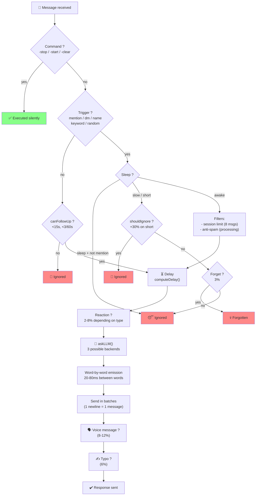

---

## Trigger System

### State machine — incoming message decision

```mermaid
flowchart TD
    START(["Discord message received"]) --> BOT_AUTHOR{"author.bot ?"}
    BOT_AUTHOR -->|"yes"| SKIP["❌ Ignored (other bot)"]

    BOT_AUTHOR -->|"no"| TEXT_CMD{"Text message ?"}
    TEXT_CMD -->|"-stop"| STOPCMD["setPaused(true)\nresetLLM()\n✅"]
    TEXT_CMD -->|"-start"| STARTCMD["setPaused(false)\n✅"]
    TEXT_CMD -->|"-clear"| CLEARCMD["resetLLM()\nclearCooldown()\n✅"]
    TEXT_CMD -->|"other"| MENTION{"@mentions\nbotId ?"}

    MENTION -->|"yes"| SET_PAUSED_OFF["setPaused(false)"]
    SET_PAUSED_OFF --> RESPOND["✅ reason=mention"]

    MENTION -->|"no"| DM_CHECK{"DM ?"}
    DM_CHECK -->|"DM + replyInDM"| RESPOND_DM["✅ reason=dm"]
    DM_CHECK -->|"DM without reply"| DM_IGNORE["❌ DM ignored"]

    DM_CHECK -->|"no"| PAUSED_CHECK{"isPaused() ?"}
    PAUSED_CHECK -->|"yes"| PAUSED_IGN["❌ Bot paused"]

    PAUSED_CHECK -->|"no"| COOLDOWN{"isOnCooldown() ?"}
    COOLDOWN -->|"yes"| CD_IGN["❌ Cooldown active"]

    COOLDOWN -->|"no"| NAME_CHECK{"Bot name\nin message ?"}
    NAME_CHECK -->|"yes"| MARK_REPLIED["markReplied()"]
    MARK_REPLIED --> RESPOND_NAME["✅ reason=name"]

    NAME_CHECK -->|"no"| KW_CHECK{"Keyword\ndetected ?"}
    KW_CHECK -->|"yes"| MARK_KW["markReplied()"]
    MARK_KW --> RESPOND_KW["✅ reason=keyword"]

    KW_CHECK -->|"no"| RANDOM_ROLL{"1.5% random\nchance ?"}
    RANDOM_ROLL -->|"yes"| MARK_RANDOM["markReplied()"]
    MARK_RANDOM --> RESPOND_RANDOM["✅ reason=random"]

    RANDOM_ROLL -->|"no (98.5%)"| TRACK_USER["trackSpeaker(user)\nwithout responding"]

    RESPOND --> SLEEP_GATE
    RESPOND_DM --> SLEEP_GATE
    RESPOND_NAME --> SLEEP_GATE
    RESPOND_KW --> SLEEP_GATE
    RESPOND_RANDOM --> SLEEP_GATE

    SLEEP_GATE --> CHECK_SLEEP_BEH{getSleepBehavior()}
    CHECK_SLEEP_BEH -->|"sleep + not mention/dm"| SLEEP_IGNORE["😴 Ignored (sleep)"]
    CHECK_SLEEP_BEH -->|"slow / short / null"| SESSION_CHECK

    SESSION_CHECK --> SESSION_PAUSED{"sessionPaused\non this channel ?"}
    SESSION_PAUSED -->|"yes"| QUEUE_MSG["📥 Queued\n(30s session pause)"]
    SESSION_PAUSED -->|"no"| EXPIRE_CHECK{"sessionResetMinutes\nexpired ?"}
    EXPIRE_CHECK -->|"yes"| RESET_COUNTER["sessionCounts.delete(cid)"]
    EXPIRE_CHECK -->|"no"| IGNORE_ROLL
    RESET_COUNTER --> IGNORE_ROLL

    IGNORE_ROLL -->|"shouldIgnore()\n+30% on short"| IGNORED["🙈 Ignored"]
    IGNORE_ROLL --> FORGET_ROLL{"forgetChance\n3% ?"}
    FORGET_ROLL -->|"yes"| FORGOTTEN["💀 Forgotten"]
    FORGET_ROLL -->|"no"| LOG_REACT

    LOG_REACT["logAndReact()\nsetTimeout + reaction"] --> WAIT_DELAY["⏳ computeDelay()\nreal wait"]
    WAIT_DELAY --> TRIGGER_REPLY["triggerLunaReply()"]

    TRIGGER_REPLY --> PROCESSING_CHECK{"processing.has(key) ?"}
    PROCESSING_CHECK -->|"yes"| QUEUE_PENDING["📥 Queued\n(already processing)"]
    PROCESSING_CHECK -->|"no"| MARK_P["markProcessing()"]

    MARK_P --> LLM_FLOW["🤖 askLLM()\nstreaming tokens..."]

    LLM_FLOW --> CHECK_SESSION_LIMIT["checkSessionLimit()"]
    CHECK_SESSION_LIMIT --> UNDER_LIMIT["✅ Session OK"]
    CHECK_SESSION_LIMIT --> PAUSE_SESSION["⏸️ Pause 30s\n then drainSessionQueue()"]
    UNDER_LIMIT --> DRAIN_PENDING["drainPending() →\nnext message ?"]
    DRAIN_PENDING -->|"yes"| TRIGGER_REPLY
    DRAIN_PENDING -->|"no"| DONE["✅ Done"]

    style SKIP fill:#f88
    style STOPCMD fill:#8f8
    style STARTCMD fill:#8f8
    style CLEARCMD fill:#8f8
    style SLEEP_IGNORE fill:#f88
    style IGNORED fill:#f88
    style FORGOTTEN fill:#f88
    style DONE fill:#8f8
```

### Trigger priority order

| # | Reason | Conditions | Bypass ignore | Bypass pause |
|---|---|---|---|---|
| 1 | `mention` | @bot | Yes (0%) | Yes |
| 2 | `dm` | DM with `replyInDM = true` | Yes (0%) | No |
| 3 | `name` | "Luna"/"Pixie"/alias (whole word) | No (8%) | No |
| 4 | `keyword` | `hello`, `hi`, `hey`, `yo`, `ai`, `bot`... (whole word) | No (8%) | No |
| 5 | `follow-up` | Bot was last speaker + < 15s + < 3 / 60s | — | — |
| 6 | `random` | 1.5% chance on non-matching | No (8%) | No |

Whole word matching (`\b`): "ai" does not match "mais", "vrai", "lait".

### Cooldown

8 seconds between two responses in the same channel. Bypassed by mentions and follow-ups.

### Follow-up

The bot registers itself as `lastSpeaker`. Any subsequent message within 15s triggers an immediate response (no timer, no keyword check). Budget: 3 follow-ups per 60s window (via `responseCount` decremented after 60s).

---

## Response Mechanisms

### Variable concentration

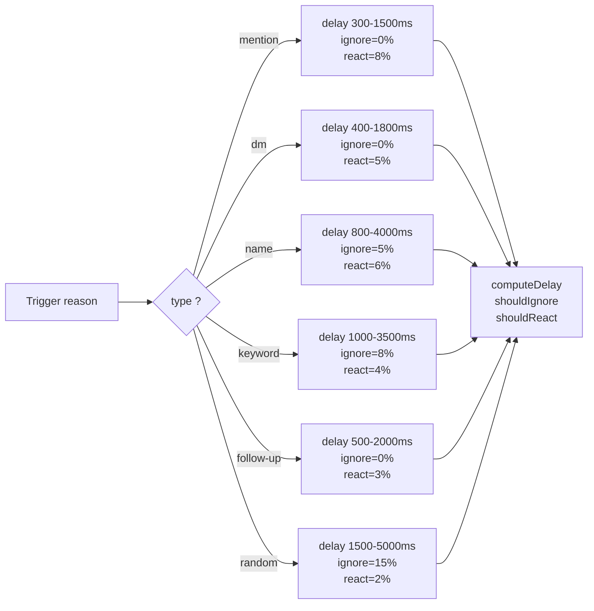

| Trigger | Min delay | Max delay | Ignore | Reaction |
|---|---|---|---|---|
| `mention` | 300ms | 1500ms | 0% | 8% |
| `dm` | 400ms | 1800ms | 0% | 5% |
| `name` | 800ms | 4000ms | 5% | 6% |
| `keyword` | 1000ms | 3500ms | 8% | 4% |
| `follow-up` | 500ms | 2000ms | 0% | 3% |
| `random` | 1500ms | 5000ms | 15% | 2% |

Configurable via `concentration` in `config.yml`:

```yaml
concentration:
  mention:
    delay_min: 300
    delay_max: 1500
    ignore_chance: 0.0
    react_chance: 0.08
  dm:
    delay_min: 400
    delay_max: 1800
    ignore_chance: 0.0
    react_chance: 0.05
  name:
    delay_min: 800
    delay_max: 4000
    ignore_chance: 0.05
    react_chance: 0.06
  keyword:
    delay_min: 1000
    delay_max: 3500
    ignore_chance: 0.08
    react_chance: 0.04
  follow-up:
    delay_min: 500
    delay_max: 2000
    ignore_chance: 0.0
    react_chance: 0.03
  random:
    delay_min: 1500
    delay_max: 5000
    ignore_chance: 0.15
    react_chance: 0.02
```

### Typos

Configurable probability (`typo_chance`, default 6%) of replacing a letter with an adjacent key (AZERTY/QWERTY). Correction after 2-4s:

| Style | Behavior |
|---|---|
| `edit` | Edits the message |
| `message` | New message: `word*` |
| `mixed` | 50/50 random (default) |

AZERTY example: `bonjour → bonjpur`, `salut → slaut`, `comment → cpmment`.

### Voice Messages (TTS)

Configurable probability (`voice_message_chance`, default 8%). Full pipeline:

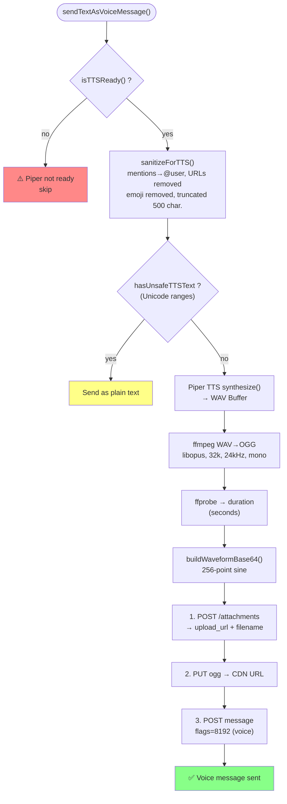

### Typing indicator

```typescript
llmBus.once("token", startTyping)  → sends typing + 8s interval
finally: clearInterval, llmBus.off  → stops typing + cleanup
```

Typing only appears when the LLM starts generating (first `token` event on `llmBus`).

### Real-time response

The LLM streams its response line by line (`\n`). Each line is split into words (tokens), emitted one by one on `llmBus.emit("token", word)`. At each `\n`, a `flush` event is emitted — the bot immediately sends the accumulated message. No simulated delay: the pace is the LLM's own. Only the first message has a `messageReference` (visual reply). In voice mode, streaming is skipped (single voice message).

### Reactions

30% server custom emoji, 70% unicode emoji.

### Reply style

Weighted according to recent bot activity in the channel:

| Context | messageReference | mentionRepliedUser | Weight |
|---|---|---|---|
| Cold | true | false | 70% |
| Cold | true | true | 20% |
| Cold | false | false | 10% |
| Active | true | false | 50% |
| Active | true | true | 15% |
| Active | false | false | 30% |
| Active | false | true | 5% |

In DMs, `messageReference` is always `false`.

### Sleep schedules

```mermaid
flowchart TD
    START(["getSleepBehavior()"]) --> SCHED{"timeSchedules\nexists ?"}
    SCHED -->|"no"| AWAKE["return null\n(permanently awake)"]

    SCHED -->|"yes"| TZ["Get timezone\n(e.g. Europe/Paris)"]
    TZ --> NOW["currentMinutes =\nHH*60 + MM\n(local time)"]

    NOW --> LOOP["For each entry\nin timeSchedules"]
    LOOP --> PARSE["startMin = parseTime(start)\nendMin = parseTime(end)"]
    PARSE --> WINDOW{"isInWindow(now,\nstartMin, endMin) ?"}

    WINDOW -->|"yes"| BEHAVIOR{"entry.behavior ?"}
    BEHAVIOR -->|"sleep"| SLEEP["😴 Sleep:\nonly mentions/DM\npass through"]
    BEHAVIOR -->|"slow"| SLOW["🐢 Slow:\ndelay ×3-5\nreactions ≤2%"]
    BEHAVIOR -->|"short"| SHORT["⏳ Short:\nignore +30%\nreactions ≤2%"]
    SLEEP --> RETURN
    SLOW --> RETURN
    SHORT --> RETURN

    WINDOW -->|"no"| NEXT["Next entry"]
    NEXT --> LOOP
    NEXT -->|"no more entries"| AWAKE

    note right of WINDOW: Handles midnight+\n(22:00-07:00) correctly
    note right of BEHAVIOR: Each mode affects\ndelay, ignore_chance,\nand reaction_chance
```

| Mode | Effect |
|---|---|
| `sleep` | Only mentions and DMs pass through |
| `slow` | Delay ×3-5, reactions nearly zero |
| `short` | Ignore chance +30%, reactions nearly zero |

Timeline example:

```mermaid
gantt
    title Sleep schedules
    dateFormat HH:mm
    axisFormat %H:%M
    tickInterval 2hour

    section Behavior
    Awake        : active, 07:00, 3h
    Short        : short, 10:00, 1h
    Awake        : active2, 11:00, 5h
    Slow         : slow, 16:00, 2h
    Awake        : active3, 18:00, 4h
    Sleep        : sleep, 22:00, 9h
```

### Spontaneous Messages

Every 5 minutes, 12% chance the bot posts a message on its own initiative.

```mermaid
flowchart TD
    START(["Timer 5min"]) --> CHANCE{"Math.random() <\nspontaneousChance (12%) ?"}
    CHANCE -->|"no"| WAIT(["Next cycle"])
    CHANCE -->|"yes"| BUSY{"isLLMBusy() ?"}
    BUSY -->|"yes"| WAIT

    BUSY -->|"no"| PICK["pickWeightedGuild(client)\nWhitelist filter\nSort by lastMessageID\nDecreasing linear weight"]

    PICK --> SELECTED{"Channel found ?"}
    SELECTED -->|"no"| WAIT
    SELECTED -->|"yes"| FETCH["fetchContext(channel, N)\ngetMessages({limit: 5})\n→ username: content"]

    FETCH --> RESET["resetLLM() → /clear"]
    RESET --> PROMPT["Build prompt:\n'Join the conversation...'"]

    PROMPT --> ASK["askLLM({username: 'system', text})"]
    ASK --> REPLY{"reply.trim()\nnon-empty ?"}
    REPLY -->|"no"| EMPTY["log: empty response"]
    REPLY -->|"yes"| SEND["createMessage(channel, reply)"]
    SEND --> MARK["markBotActivity(channel.id)"]
    SEND --> ERR{"Error ?"}
    ERR -->|"yes"| PERM["log: permission failure"]
    MARK --> RESET_AGAIN["resetLLM()"]
    PERM --> RESET_AGAIN
    EMPTY --> RESET_AGAIN
    RESET_AGAIN --> WAIT

    note right of PICK: More active servers have\na higher chance of being chosen\n(linear weighted selection)
```

**Server selection**: ranking by `lastMessageID` of the most active channel, decreasing linear weight (the most active server has N× more chances than the last).

### Hesitation

The bot sometimes starts its response with a hesitation word: `uh...`, `um...`, `well...`, `i mean...`, `hmm...`, `so...`. Configurable via `hesitation_chance` (default 15%) and `hesitation_words`.

### Forgetfulness

Even after matching a trigger, the bot can "forget" to respond with a probability of `forget_chance` (default 3%). No message, no reaction — as if it hadn't seen it.

### Inactivity warmup

If the bot has not been active for `inactivity_warmup_minutes` (default 10 min), the response delay is multiplied by `inactivity_warmup_multiplier` (default ×2) — simulates a "waking up" time after an absence.

### Dynamic Discord Status

The Discord status alternates between several configured presets (`dynamic_status_presets`), rotating every `dynamic_status_interval_minutes` minutes. Supported types: Playing (0), Streaming (1), Listening (2), Watching (3), Custom (4), Competing (5). During sleep hours, the bot switches to `invisible`.

```mermaid
stateDiagram-v2
    [*] --> SCHEDULE: startDynamicStatus()
    SCHEDULE --> SLEEP_CHECK: updateStatus() timer
    SLEEP_CHECK --> INVISIBLE: sleep → editStatus("invisible")
    SLEEP_CHECK --> SKIP_ROLL: awake

    INVISIBLE --> RESCHEDULE: scheduleNext()
    RESCHEDULE --> SLEEP_CHECK: jitter 0.5-1.5x

    SKIP_ROLL --> RESCHEDULE: 10% chance → keep status
    SKIP_ROLL --> REPEAT_ROLL: 90%

    REPEAT_ROLL --> USE_LAST: 15% → repeat last preset
    REPEAT_ROLL --> NEXT_PRESET: 85% → round-robin

    NEXT_PRESET --> APPLY: statusIndex++
    USE_LAST --> APPLY: lastPresetIndex
    APPLY --> editStatus(preset.status, [{name, type}])
    APPLY --> RESCHEDULE
```

### Anti-spam

```mermaid
stateDiagram-v2
    [*] --> TRIGGER_REPLY: triggerLunaReply(key)\nkey = "channelId:userId"

    TRIGGER_REPLY --> PROCESSING_CHECK
    PROCESSING_CHECK --> QUEUED: processing.has(key) == true
    PROCESSING_CHECK --> MARK_PROCESSING: free

    QUEUED --> queuePending(): Map.set(key, {msg, reason})
    QUEUED --> [*]: waiting

    MARK_PROCESSING --> processing.add(key)
    MARK_PROCESSING --> LLM_REPLY: askLLM() streaming

    LLM_REPLY --> CLEANUP: doneProcessing() + cleanup handlers
    CLEANUP --> DRAIN: drainPending(key)

    DRAIN --> PENDING_EXISTS: queued !== null
    DRAIN --> [*]: nothing waiting

    PENDING_EXISTS --> RECURSE: triggerLunaReply(msg)
    RECURSE --> PROCESSING_CHECK: safe recursion

    note right of QUEUED: Only one message queued\nper (channel:user)\nthe previous one is overwritten
    note right of RECURSE: If the new round is busy,\nauto re-queue
```

Key `channelId:userId`. Only one message queued per user per channel. Processed as soon as the current response finishes.

### Persistence


**Persisted:** pendingMessages, paused, cooldowns, timestamps, lastSpeaker, follow-up counters.

**Auto-save:** any state mutation emits on `stateBus` → automatic save (debounce 500ms). No more manual `saveAllState()` calls needed.

### Auto-restart LLM (mode `cli`)

If the llama-cli process crashes (OOM, segfault, etc.), it is automatically restarted:

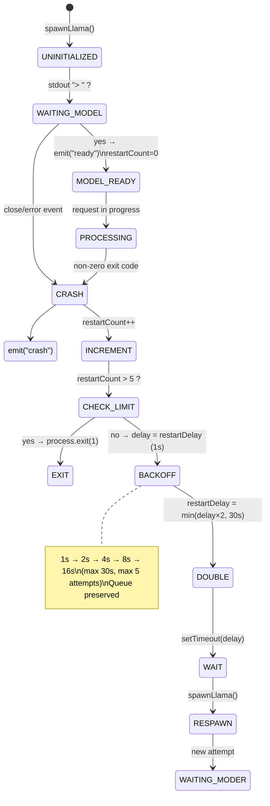

Useful for aggressive quantizations (Q2_K) that may crash on complex prompts.

---

## Commands

Invisible — no public message, just a ✅ confirmation.

**By text:** `-stop` (pause + reset), `-start` (resume), `-clear` (reset history)

**By reactions** on one of the bot's messages:

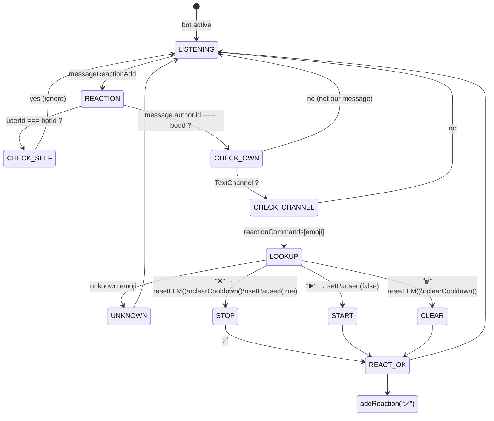

| Emoji | Effect |
|---|---|
| ❌ | Stop |
| ▶️ | Start |
| 🗑️ | Clear |

Internal error → ❌ on the message (no public error message).

---

## Detailed response flow

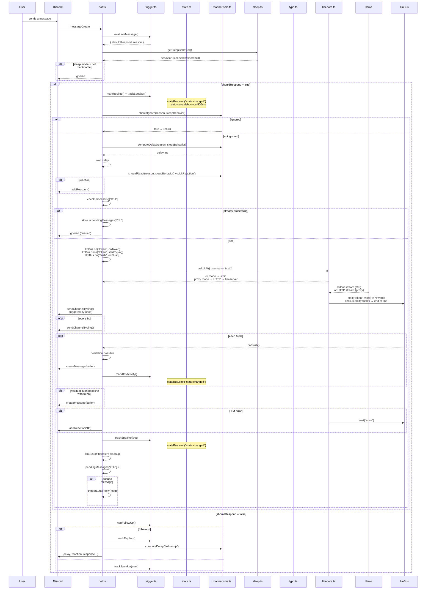

---

## Configuration

Single `config.yml` file. Shell env vars override YAML keys if present. Hot-reload for dynamic values (triggers, delays, behaviors) — no restart needed.

See `config.example.yml` for the exhaustive list: LLM, TTS, triggers, concentration, typos, WPM, hesitation, forget, inactivity warmup, dynamic status, sleep, spontaneous, reply styles.

### `system_prompt`

Key `system_prompt` with the system prompt. Supports YAML multiline format (`|`).

```yaml
discord_token: "your_token"
llama_cli_path: "bin/llama/llama-cli"
llama_model_path: "./models/Discord-Hermes-3-8B.Q3_K_M.gguf"
llm_host: "localhost"
llm_port: 3124
llm_mode: "cli"          # cli → spawn llama-cli, server → HTTP llama-server, proxy → bot client via llm-server
system_prompt: |
  You are Luna...
tts_model_path: "./bin/piper/en_GB-southern_english_female-low.onnx"
tts_binary_path: "bin/piper/piper"
ffmpeg_path: "bin/ffmpeg/ffmpeg"
ffprobe_path: "bin/ffmpeg/ffprobe"

names: ["Luna", "Pixie"]
keywords: ["hello", "hi", "hey", "yo", "ai", "bot"]
typo_chance: 0.06
voice_message_chance: 0.08
```

**LLM parameters** (hardcoded in `src/config.ts`). ChatML template (`<|im_start|>/<|im_end|>`). Threads detected via `os.cpus().length`.

```yaml
temp: 0.75
dynatemp-range: 0.15
top-k: 40
top-p: 0.95
min-p: 0.05
repeat-penalty: 1.12
repeat-last-n: 256
presence-penalty: 0.1
batch: 4096
ubatch: 256
context: 4096
```

---

## Detailed Architecture Diagrams

The [`state-machines/`](state-machines/) folder contains **22 Mermaid diagrams** covering the entire source code:

| # | Diagram | Type |
|---|---------|------|
| 01 | Architecture Overview | `graph` |
| 02 | Message Processing (complete) | `stateDiagram` |
| 03 | Trigger Evaluation (flowchart) | `flowchart` |
| 04 | LLM Core Queue (3 backends) | `stateDiagram` |
| 05 | Crash Recovery (backoff) | `stateDiagram` |
| 06 | Session Limit (pause 30s) | `stateDiagram` |
| 07 | Anti-Spam Queue | `flowchart` |
| 08 | Dynamic Status | `stateDiagram` |
| 09 | Spontaneous Message | `flowchart` |
| 10 | TTS Pipeline | `flowchart` |
| 11 | Typo Correction | `flowchart` |
| 12 | Follow-up Detection | `stateDiagram` |
| 13 | State Persistence | `flowchart` |
| 14 | Event Bus Architecture | `graph` |
| 15 | Delay Computation | `flowchart` |
| 16 | Sleep Schedule | `flowchart` |
| 17 | Hesitation & Forget | `flowchart` |
| 18 | Reply Style Selection | `flowchart` |
| 19 | Config Hot-Reload | `flowchart` |
| 20 | Reaction Commands | `stateDiagram` |
| 21 | Timing Gantt | `gantt` |
| 22 | Complete Lifecycle | `stateDiagram` |

All PNGs are available in [`state-machines/output/`](state-machines/output/). Below are key overview diagrams:

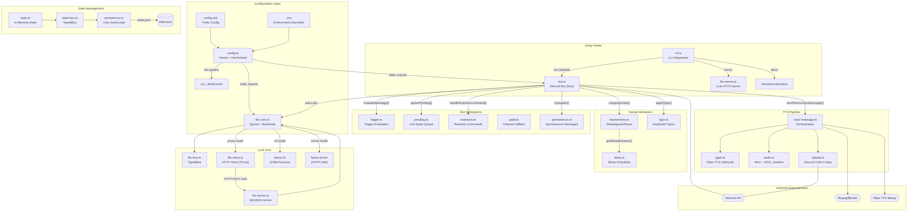
*Architecture Overview — global system components and data flow*

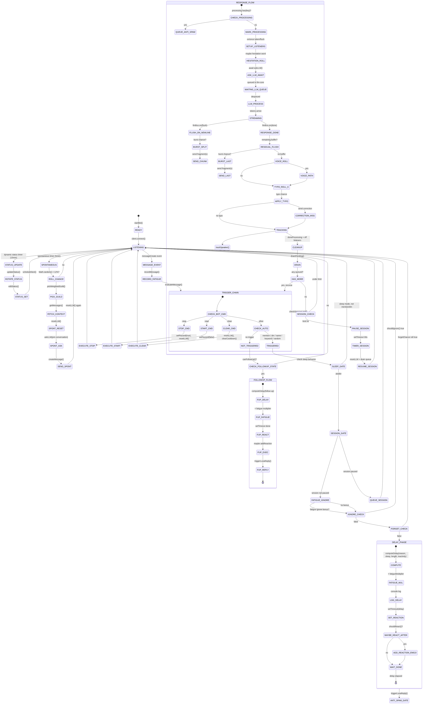
*Complete Lifecycle — full bot behavior from message to response, including timers and edge cases*

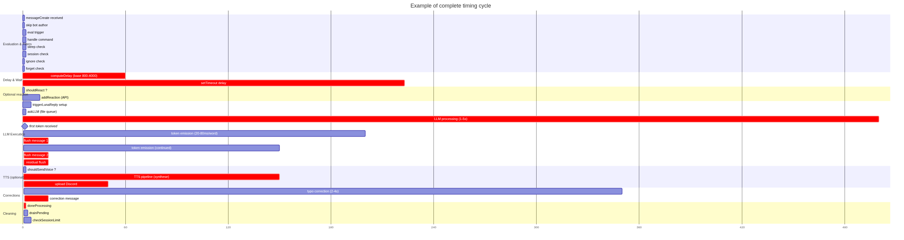
*Timing Gantt — real wait times for delays, reactions, LLM streaming, and corrections*

---

## Dataset

[**Discord-Dialogues**](https://huggingface.co/datasets/mookiezi/Discord-Dialogues) — 7.3M exchanges, 17M turns, 140M words. Real Discord conversations spring-summer 2025, filtered PII/ToS/bots/commands. Apache 2.0.

| Metric | Value |
|---|---|
| Samples | 7 303 464 |
| Total turns | 16 881 010 |
| Total words | 139 922 950 |
| Average tokens | 32.8 |
| Tokenizer | Hermes-3-Llama-3.1-8B |


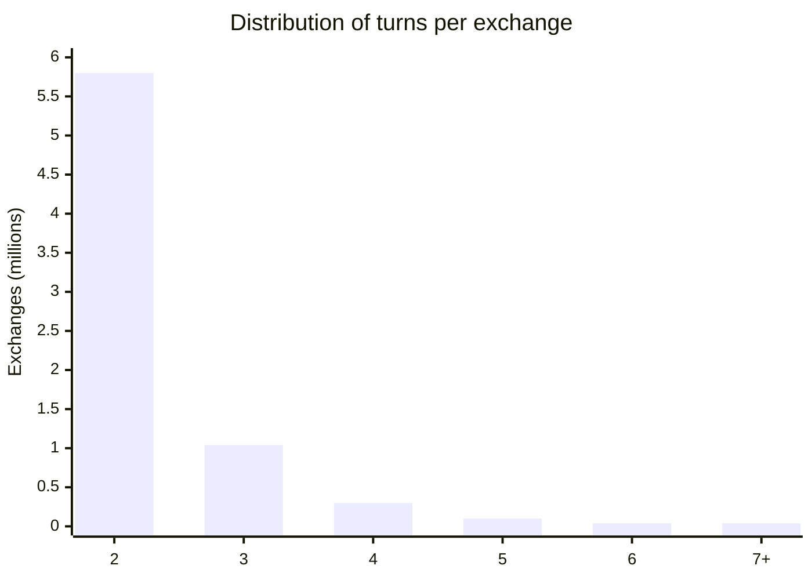

---

## Logs

| Prefix | Info |
|---|---|
| `[trigger]` | Evaluation + result of each message |
| `[mannerisms]` | Delay, ignore, reaction, msgLength, inactivity |
| `[bot]` | Decision, follow-up, reply style, forget |
| `[tts]` | Synthesis, upload, voice message |
| `[persist]` | Save/restore |
| `[llm-core]` | Spawn, crash, restart, CLI/server mode |
| `[llmBus]` | LLM events (token, done, flush, error, ready) |

---

## Setup

```bash
npm install
cp config.example.yml config.yml
# edit config.yml
npm run dev                    # dev (hot reload)
npm run build && npm start     # production
```

| Script | Description |
|---|---|
| `dev` | Bot + server (hot reload, bun) |
| `start` | Bot + server (production, concurrently) |
| `build` | Bundle bot + server |
| `client-only` | Bot only (proxy mode) |
| `server-only` | LLM server only |
| `direct` | Direct CLI mode: `node . direct` |
| `lint` / `format` / `check` | Biome |
| `download-model` | GGUF from HuggingFace |
| `diagrams` | Export 22 Mermaid diagrams as dark-theme PNGs |

### LLM deployment modes

| Mode | Usage | Description |
|---|---|---|
| `cli` | `llm_mode: cli` | Bot manages the LLM directly (spawn llama-cli). Monolithic, single process. |
| `server` | `llm_mode: server` | Bot calls llama-server via HTTP. llama-server must be running alongside. |
| `proxy` (default) | `llm_mode: proxy` | Bot client → HTTP → llm-server (which manages the LLM). Two processes, ideal for PM2. |

### PM2 (production)

```bash
./start.sh   # launches llm-server + llm-client under PM2
```

### Hot-reload config

`config.yml` is reloaded at runtime via `watchConfig()` (called in `startBot()`).  
The getters on `export const config` (e.g. `config.typoChance`, `config.concentration`) return live values.  
No restart needed to modify triggers, delays, behaviors.  
Static values (`discord_token`, `llama_cli_path`, `llm_mode`, etc.) require a restart.

## Discord Developer Portal

- **Message Content Intent** (Bot tab)
- Scope `bot` + permissions: `Send Messages`, `Read Message History`, `Add Reactions`
- Gateway intents: `guilds`, `guildMessages`, `guildMessageReactions`, `messageContent`, `directMessages`
