# Luna-Protocol Project

Fully autonomous and sentient-like Discord bot. Runs a local LLM (llama.cpp) and converses naturally -- sleep, inattention, typos, hesitations, forgetfulness, topic fatigue, message bursts, voice messages, anti-spam queue, persistence, auto-restart, rotating status.

> [!NOTE]
> **Luna Protocol now has its own official models!** 🚀
> 
> The project includes optimized models trained specifically for Discord conversations:
> - **Luna-Protocol-1.5B-Fine-Tuned-Qwen2.5.Q4_K_M.gguf** (Recommended) - Lightweight, fast, perfect for Discord bots
> - Available on [HuggingFace](https://huggingface.co/fox3000foxy/Luna-Protocol-1.5B-Discord-Dialogues)
>
> These models come with **few-shot priming support** to guide conversation style and improve consistency.

- Models fine-tuned on [Discord-Dialogues](https://huggingface.co/datasets/mookiezi/Discord-Dialogues) (7.3M exchanges, 17M turns)
- Quantized GGUF format (e.g. `Luna-Protocol-1.5B-Fine-Tuned-Qwen2.5.Q5_K_M.gguf`)
- **Few-shot priming**: Inject example conversations to guide model behavior (configurable in `config.yml`)
- Two LLM modes: `direct` (bot → llama‑server directly, shared model / prompt cache), `online` (OpenAI‑compatible API)
- Event-driven architecture: `llmBus` for LLM tokens/errors, `stateBus` for auto-persist

```
┌─────────────────────────────────────────────────────┐
│                   core/bus.ts                        │
│  TypedBus<K, V> -- on / off / once / emit            │
├──────────────────┬──────────────────────────────────┤
│   core/llm-bus   │       state/state-bus             │
│  token / done /  │     state:changed                 │
│  error / crash / │     → persistence auto            │
│  flush / ready / │                                   │
│  reset           │                                   │
└────────┬─────────┴────────┬─────────────────────────┘
         │                  │
┌──────────────────┐  ┌────▼──────────────────────┐
│ core/llm-core.ts │  │ bot.ts (Eris)             │
│                  │  │ bot/pending.ts             │
│ mode direct      │  │ bot/reactions.ts           │
│   llama‑server   │  │ state/trigger.ts           │
│ mode online      │  │ state/state.ts             │
│   OpenAI API     │  │ behavior/*                 │
│                  │  │ tts/*                      │
│                  │  │ spontaneous.ts             │
│                  │  │                            │
└──────────────────┘  └────────────────────────────┘
```

## Structure

```
src/
├── index.ts           # → cli.ts
├── cli.ts             # CLI (bot)
├── bot.ts             # Main Eris handler
├── config.ts          # YAML config + env var override
├── spontaneous.ts     # Weighted spontaneous messages
├── guild.ts           # findMostActiveChannel
├── core/
│   ├── bus.ts         # Generic TypedBus (on/off/once/emit)
│   ├── llm-bus.ts     # LLM Bus (token, done, flush, error, crash, ready, reset)
│   ├── llm-core.ts    # Queue, proxy/online dispatch, word emission, restart
│   ├── llm-client.ts  # Sessions manager + HTTP client to llama-server
├── state/
│   ├── state-bus.ts   # State bus (state:changed → auto-persist)
│   ├── state.ts       # Cooldowns, activity, conversation tracking
│   ├── trigger.ts     # Trigger evaluation
│   └── persistence.ts # Save/restore state.json
├── behavior/
│   ├── mannerisms.ts  # Delay, ignore, reactions, concentration
│   ├── sleep.ts       # Sleep schedules
│   └── typo.ts        # AZERTY/QWERTY typos
├── bot/
│   ├── pending.ts     # Anti-spam queue
│   ├── reactions.ts   # Reaction commands (❌▶️🗑️)
│   └── typo-correction.ts # Deferred typo correction
└── tts/
    ├── piper.ts       # Piper TTS synthesis
    ├── audio.ts       # Sanitization, WAV→OGG, duration
    ├── upload.ts      # Discord CDN upload
    └── voice-message.ts  # Voice message orchestration
```

---

## Few-shot Priming

**Few-shot priming** is a technique that injects example conversations into the model's context to guide its behavior and improve consistency. Instead of the model learning style only from the system prompt, it learns from actual examples.

### How it works

Before each user message, Luna Protocol can include a few examples of past conversations. This "primes" the model to:
- Adopt the desired tone (casual, friendly, witty, etc.)
- Match response length and style
- Follow conversation patterns
- Improve overall coherence

### Configuration

In `config.yml`:

```yaml
few_shot_enabled: true
few_shot_examples:
  - user: "yo whats good"
    assistant: "nm just chillin, u"
  - user: "bored af"
    assistant: "lol same energy fr"
  - user: "hey how are you"
    assistant: "im doing pretty good tbh, just vibing"
```

### Example flow

1. System prompt: `"Your name is Luna..."`
2. Few-shot examples: `[user: "yo whats good", assistant: "nm just chillin, u"]`
3. Current message: `user: "hey Luna, what's up?"`
4. Model generates response in the same style as the examples

This approach is especially effective with the new Luna Protocol models, which are fine-tuned on Discord conversations.

---

## Overview

> Detailed diagrams (state machines, flowcharts, Gantt) are available in the [`state-machines/`](state-machines/) folder -- 22 Mermaid diagrams covering the entire codebase.

[](state-machines/readme-diagrams/r01.mmd)

---

## Trigger System

### State machine -- incoming message decision

[](state-machines/readme-diagrams/r02.mmd)

### Trigger priority order

| # | Reason | Conditions | Bypass ignore | Bypass pause |
|---|---|---|---|---|
| 1 | `mention` | @bot | Yes (0%) | Yes |
| 2 | `dm` | DM with `replyInDM = true` | Yes (0%) | No |
| 3 | `name` | "Luna"/"Pixie"/alias (whole word) | No (8%) | No |
| 4 | `keyword` | `hello`, `hi`, `hey`, `yo`, `ai`, `bot`... (whole word) | No (8%) | No |
| 5 | `follow-up` | Bot was last speaker + < 15s + < 3 / 60s | -- | -- |
| 6 | `random` | 1.5% chance on non-matching | No (8%) | No |

Whole word matching (`\b`): "ai" does not match "mais", "vrai", "lait".

### Cooldown

8 seconds between two responses in the same channel. Bypassed by mentions and follow-ups.

### Follow-up

The bot registers itself as `lastSpeaker`. Any subsequent message within 15s triggers an immediate response (no timer, no keyword check). Budget: 3 follow-ups per 60s window (via `responseCount` decremented after 60s).

---

## Response Mechanisms

### Variable concentration

[](state-machines/readme-diagrams/r03.mmd)

| Trigger | Min delay | Max delay | Ignore | Reaction |
|---|---|---|---|---|
| `mention` | 300ms | 1500ms | 0% | 8% |
| `dm` | 400ms | 1800ms | 0% | 5% |
| `name` | 800ms | 4000ms | 5% | 6% |
| `keyword` | 1000ms | 3500ms | 8% | 4% |
| `follow-up` | 500ms | 2000ms | 0% | 3% |
| `random` | 1500ms | 5000ms | 15% | 2% |

Configurable via `concentration` in `config.yml`:

```yaml
concentration:
  mention:
    delay_min: 300
    delay_max: 1500
    ignore_chance: 0.02
    react_chance: 0.08
  dm:
    delay_min: 400
    delay_max: 1800
    ignore_chance: 0
    react_chance: 0.05
  name:
    delay_min: 800
    delay_max: 4000
    ignore_chance: 0.02
    react_chance: 0.06
  keyword:
    delay_min: 1000
    delay_max: 3500
    ignore_chance: 0.02
    react_chance: 0.04
  follow-up:
    delay_min: 500
    delay_max: 2000
    ignore_chance: 0.02
    react_chance: 0.03
  random:
    delay_min: 1500
    delay_max: 5000
    ignore_chance: 0.02
    react_chance: 0.02
```

### Typos

Configurable probability (`typo_chance`, default 6%) of replacing a letter with an adjacent key (AZERTY/QWERTY). Correction after 2-4s:

| Style | Behavior |
|---|---|
| `edit` | Edits the message |
| `message` | New message: `word*` |
| `mixed` | 50/50 random (default) |

AZERTY example: `bonjour → bonjpur`, `salut → slaut`, `comment → cpmment`.

### Voice Messages (TTS)

Configurable probability (`voice_message_chance`, default 8%). Full pipeline:

[](state-machines/readme-diagrams/r04.mmd)

### Typing indicator

`startTyping()` is called before `askLLM()` — the typing indicator stays active during generation (refreshed every 8s via `setInterval`). Cleaned up in `finally` (`clearInterval`).

### Real-time response

The LLM streams its response line by line (`\n`). Each line is split into words (tokens), emitted one by one on `llmBus.emit("token", word)`. At each `\n`, a `flush` event is emitted -- the bot immediately sends the accumulated message. No simulated delay: the pace is the LLM's own. Only the first message has a `messageReference` (visual reply). In voice mode, streaming is skipped (single voice message).

### Reactions

30% server custom emoji, 70% unicode emoji.

### Reply style

Weighted according to recent bot activity in the channel:

| Context | messageReference | mentionRepliedUser | Weight |
|---|---|---|---|
| Cold | true | false | 70% |
| Cold | true | true | 20% |
| Cold | false | false | 10% |
| Active | true | false | 50% |
| Active | true | true | 15% |
| Active | false | false | 30% |
| Active | false | true | 5% |

In DMs, `messageReference` is always `false`.

### Sleep schedules

[](state-machines/readme-diagrams/r05.mmd)

| Mode | Effect |
|---|---|
| `sleep` | Only mentions and DMs pass through |
| `slow` | Delay ×3-5, reactions nearly zero |
| `short` | Ignore chance +30%, reactions nearly zero |

Timeline example:

[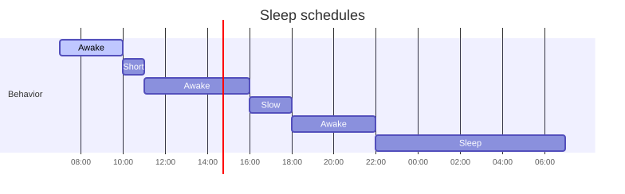](state-machines/readme-diagrams/r06.mmd)

### Spontaneous Messages

Every 5 minutes, 12% chance the bot posts a message on its own initiative.

[](state-machines/readme-diagrams/r07.mmd)

**Server selection**: ranking by `lastMessageID` of the most active channel, decreasing linear weight (the most active server has N× more chances than the last).

### Hesitation

The bot sometimes starts its response with a hesitation word: `uh...`, `um...`, `well...`, `i mean...`, `hmm...`, `so...`. Configurable via `hesitation_chance` (default 15%) and `hesitation_words`.

### Forgetfulness

Even after matching a trigger, the bot can "forget" to respond with a probability of `forget_chance` (default 3%). No message, no reaction -- as if it hadn't seen it.

### Inactivity warmup

If the bot has not been active for `inactivity_warmup_minutes` (default 10 min), the response delay is multiplied by `inactivity_warmup_multiplier` (default ×2) -- simulates a "waking up" time after an absence.

### Dynamic Discord Status

The Discord status alternates between several configured presets (`dynamic_status_presets`), rotating every `dynamic_status_interval_minutes` minutes. Supported types: Playing (0), Streaming (1), Listening (2), Watching (3), Custom (4), Competing (5). During sleep hours, the bot switches to `invisible`.

[](state-machines/readme-diagrams/r08.mmd)

### Anti-spam

[](state-machines/readme-diagrams/r09.mmd)

Key `channelId:userId`. Only one message queued per user per channel. Processed as soon as the current response finishes.

### Persistence

[](state-machines/readme-diagrams/r10.mmd)

**Persisted:** pendingMessages, paused, cooldowns, timestamps, lastSpeaker, follow-up counters.

**Auto-save:** any state mutation emits on `stateBus` → automatic save (debounce 500ms). No more manual `saveAllState()` calls needed.

---

## Commands

Invisible -- no public message, just a ✅ confirmation.

**By text:** `-stop` (pause + reset), `-start` (resume), `-clear` (reset history)

**By reactions** on one of the bot's messages:

[](state-machines/readme-diagrams/r12.mmd)

| Emoji | Effect |
|---|---|
| ❌ | Stop |
| ▶️ | Start |
| 🗑️ | Clear |

Internal error → ❌ on the message (no public error message).

---

## Detailed response flow

[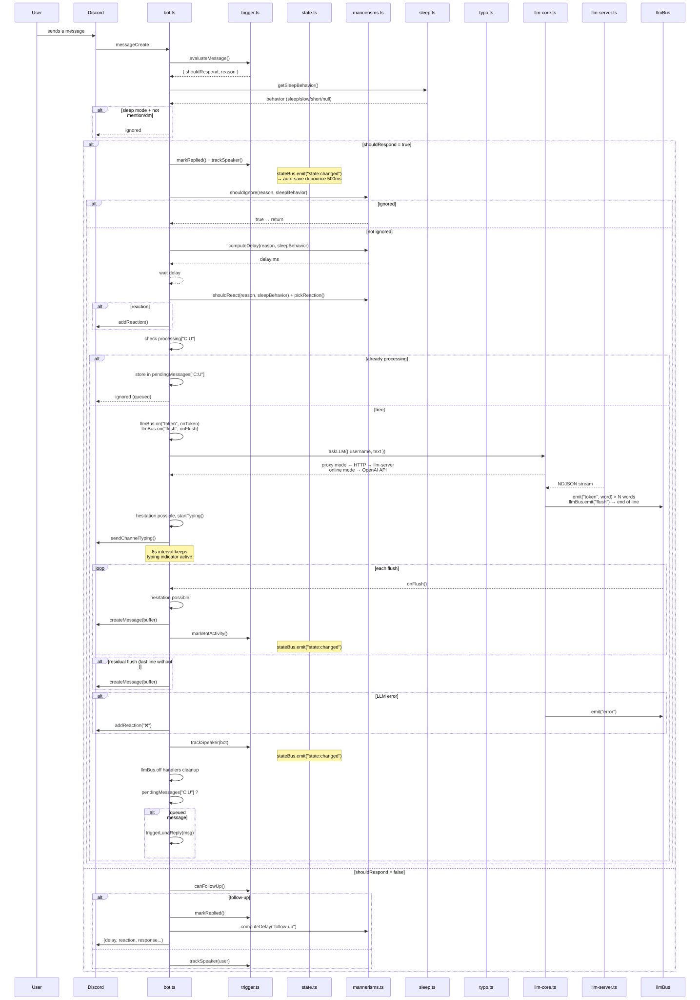](state-machines/readme-diagrams/r13.mmd)

---

## Configuration

Single `config.yml` file. Shell env vars override YAML keys if present. Hot-reload for dynamic values -- no restart needed.

### Hot-reload legend

| Icon | Meaning |
|------|---------|
| ✅ | Hot-reloadable -- changes picked up at runtime |
| ❌ | Requires restart |

### Secrets & Paths (❌)

| Key | Type | Default | Description |
|-----|------|---------|-------------|
| `discord_token` | string | *(required)* | Discord bot token |
| `llama_model_path` | string | `"./models/Discord-Micae-Hermes-3-3B.Q8_0.gguf"` | Path to GGUF model |
| `llm_host` | string | `"localhost"` | LLM host (llama-server) |
| `llm_port` | number | `3125` | LLM port (llama-server) |
| `llm_session_ttl` | number | `10` | LLM session TTL in minutes (KV cache prune) |
| `llm_mode` | `"direct"`, `"online"` | `"direct"` | `direct` → bot → local llama‑server, `online` → OpenAI‑compatible API |
| `llm_api_endpoint` | string | `""` | OpenAI-compatible endpoint (mode `online`) |
| `llm_api_token` | string | `""` | API token (mode `online`) |
| `llm_model` | string | `"gpt-4o-mini"` | Model name sent in API requests (mode `online`) |
| `tts_model_path` | string | `"./tts-engine/..."` | Piper TTS model (.onnx) |
| `tts_binary_path` | string | `"bin/piper/piper"` | Piper binary path |
| `ffmpeg_path` | string | `"bin/ffmpeg/ffmpeg"` | ffmpeg binary |
| `ffprobe_path` | string | `"bin/ffmpeg/ffprobe"` | ffprobe binary |

### System Prompt (❌)

| Key | Type | Default | Description |
|-----|------|---------|-------------|
| `system_prompt` | string (YAML `\|`) | `"Your name is Luna..."` | System prompt for the LLM. Falls back to `prompt.txt` if unset. |

### Triggers (✅)

| Key | Type | Default | Description |
|-----|------|---------|-------------|
| `names` | string[] | `["Luna", "Pixie"]` | Names the bot recognizes as its own (whole word) |
| `keywords` | string[] | `["hello","hi","hey","yo","help","question","ai","llm","bot"]` | Keywords that trigger a response (whole word) |
| `random_chance` | number | `0.015` | Probability (0.0-1.0) that a non-matching message triggers a response |
| `cooldown_seconds` | number | `8` | Min seconds between two bot replies in the same channel |
| `reply_in_dm` | boolean | `true` | Whether the bot responds to DMs |

### Mannerisms -- Concentration (✅)

| Key | Type | Default | Description |
|-----|------|---------|-------------|
| `concentration` | object | *(see below)* | Per-trigger delays, ignore & reaction chances |

Each trigger type supports:
```yaml
concentration:
  mention:      { delay_min: 300,  delay_max: 1500, ignore_chance: 0.02, reaction_chance: 0.08 }
  dm:           { delay_min: 400,  delay_max: 1800, ignore_chance: 0,    reaction_chance: 0.05 }
  name:         { delay_min: 800,  delay_max: 4000, ignore_chance: 0.02, reaction_chance: 0.06 }
  keyword:      { delay_min: 1000, delay_max: 3500, ignore_chance: 0.02, reaction_chance: 0.04 }
  follow-up:    { delay_min: 500,  delay_max: 2000, ignore_chance: 0.02, reaction_chance: 0.03 }
  random:       { delay_min: 1500, delay_max: 5000, ignore_chance: 0.02, reaction_chance: 0.02 }
```

### Reactions (✅)

| Key | Type | Default | Description |
|-----|------|---------|-------------|
| `server_emoji_chance` | number | `0.3` | Probability the reaction is a server custom emoji (vs standard) |
| `reactions` | string[] | 14 standard emoji | List of unicode emojis for reactions |

### Spontaneous Messages (✅)

| Key | Type | Default | Description |
|-----|------|---------|-------------|
| `spontaneous_interval_ms` | number | `300000` | Interval (ms) between spontaneous message attempts |
| `spontaneous_chance` | number | `0.12` | Probability (0.0-1.0) that an attempt succeeds |
| `spontaneous_context_messages` | number | `5` | Recent messages read for context |
| `spontaneous_whitelist` | string | `"*"` | Comma-separated guild IDs allowed for spontaneous (`"*"` = all) |

### Typos (✅)

| Key | Type | Default | Description |
|-----|------|---------|-------------|
| `typo_chance` | number | `0.06` | Probability a message contains a typo |
| `typo_correction_delay_min` | number | `2000` | Min delay (ms) before correction |
| `typo_correction_delay_max` | number | `4000` | Max delay (ms) before correction |
| `typo_layout` | `"azerty"` \| `"qwerty"` | `"azerty"` | Keyboard layout for adjacent-key typos |
| `typo_correction_style` | `"edit"` \| `"message"` \| `"mixed"` | `"mixed"` | Correction style: edit message, new `word*` message, or 50/50 |

### Message Burst (✅)

| Key | Type | Default | Description |
|-----|------|---------|-------------|
| `burst_chance` | number | `0.15` | Probability a response is split into 2-3 fragments sent at human pace |
| `burst_delay_min` | number | `1500` | Min delay (ms) between burst fragments |
| `burst_delay_max` | number | `4000` | Max delay (ms) between burst fragments |

### Topic Fatigue (✅)

| Key | Type | Default | Description |
|-----|------|---------|-------------|
| `topic_fatigue_enabled` | boolean | `true` | Enable topic fatigue system |
| `topic_fatigue_window` | number | `10` | Messages analyzed to detect recurring topics |
| `topic_fatigue_threshold` | number | `3` | Word occurrences before fatigue kicks in |
| `topic_fatigue_delay_multiplier` | number | `2` | Delay multiplier when fatigued |
| `topic_fatigue_ignore_bonus` | number | `0.15` | Extra ignore probability when fatigued (0.0-1.0) |

### Human-like Behaviors (✅)

| Key | Type | Default | Description |
|-----|------|---------|-------------|
| `hesitation_chance` | number | `0.15` | Probability of starting with a filler word |
| `hesitation_words` | string[] | `["uh...","um...","well...","i mean...","hmm...","so..."]` | Filler word list |
| `forget_chance` | number | `0.03` | Probability the bot forgets to respond even after trigger |
| `inactivity_warmup_minutes` | number | `10` | Minutes of inactivity before warmup kicks in |
| `inactivity_warmup_multiplier` | number | `2` | Delay multiplier after inactivity period |

### Dynamic Status (✅)

| Key | Type | Default | Description |
|-----|------|---------|-------------|
| `dynamic_status_interval_minutes` | number | `15` | Rotation interval (minutes) between status presets |
| `dynamic_status_presets` | object[] | `[]` (disabled) | Array of `{ status, text, type }`. type: 0=Playing, 1=Streaming, 2=Listening, 3=Watching, 4=Custom, 5=Competing |

### Sleep Schedules (✅)

| Key | Type | Default | Description |
|-----|------|---------|-------------|
| `timezone` | string | `"Europe/Paris"` | IANA timezone for schedule evaluation |
| `time_schedules` | object[] | `[]` (always active) | Array of `{ start, end, behavior? }` with `sleep`, `slow`, or `short` behavior |

### Session Limits (✅)

| Key | Type | Default | Description |
|-----|------|---------|-------------|
| `session_message_limit` | number | `8` | Max exchanges before a pause |
| `session_pause_seconds` | number | `30` | Pause duration (seconds) after limit hit |
| `session_reset_minutes` | number | `3` | Idle time before session counter resets |

### TTS / Voice Messages (✅)

| Key | Type | Default | Description |
|-----|------|---------|-------------|
| `voice_message_chance` | number | `0.08` | Probability a reply is sent as voice message instead of text |

### Reply Styles (✅)

| Key | Type | Default | Description |
|-----|------|---------|-------------|
| `reply_styles` | object[] | Weighted 50/15/30/5 | Array of `{ message_reference, mention_replied_user, weight }` entries |

### LLM Parameters (hardcoded in `src/config.ts`)

ChatML template (`<|im_start|>/<|im_end|>`). Threads auto-detected via `os.cpus().length`.

```yaml
temp: 0.75
dynatemp-range: 0.15
top-k: 40
top-p: 0.95
min-p: 0.05
repeat-penalty: 1.12
repeat-last-n: 256
presence-penalty: 0.1
batch: 4096
ubatch: 256
context: 4096
```

---

## Detailed Architecture Diagrams

The [`state-machines/`](state-machines/) folder contains **24 Mermaid diagrams** covering the entire source code, each with a detailed human-language explanation:

| # | Diagram | Type |
|---|---------|------|
| 01 | Architecture Overview | `graph` |
| 02 | Message Processing (complete) | `stateDiagram` |
| 03 | Trigger Evaluation (flowchart) | `flowchart` |
| 04 | LLM Core Queue (3 backends) | `stateDiagram` |
| 05 | Crash Recovery (backoff) | `stateDiagram` |
| 06 | Session Limit (pause 30s) | `stateDiagram` |
| 07 | Anti-Spam Queue | `flowchart` |
| 08 | Dynamic Status | `stateDiagram` |
| 09 | Spontaneous Message | `flowchart` |
| 10 | TTS Pipeline | `flowchart` |
| 11 | Typo Correction | `flowchart` |
| 12 | Follow-up Detection | `stateDiagram` |
| 13 | State Persistence | `flowchart` |
| 14 | Event Bus Architecture | `graph` |
| 15 | Delay Computation | `flowchart` |
| 16 | Sleep Schedule | `flowchart` |
| 17 | Hesitation & Forget | `flowchart` |
| 18 | Reply Style Selection | `flowchart` |
| 19 | Config Hot-Reload | `flowchart` |
| 20 | Reaction Commands | `stateDiagram` |
| 21 | Timing Gantt | `gantt` |
| 22 | Complete Lifecycle | `stateDiagram` |
| 23 | Message Burst | `flowchart` |
| 24 | Topic Fatigue | `flowchart` |

All SVGs are available in [`state-machines/output/`](state-machines/output/). Below are key overview diagrams:

[](state-machines/01-architecture-overview.mmd)
*Architecture Overview -- global system components and data flow*

[](state-machines/22-complete-lifecycle.mmd)
*Complete Lifecycle -- full bot behavior from message to response, including timers and edge cases*

[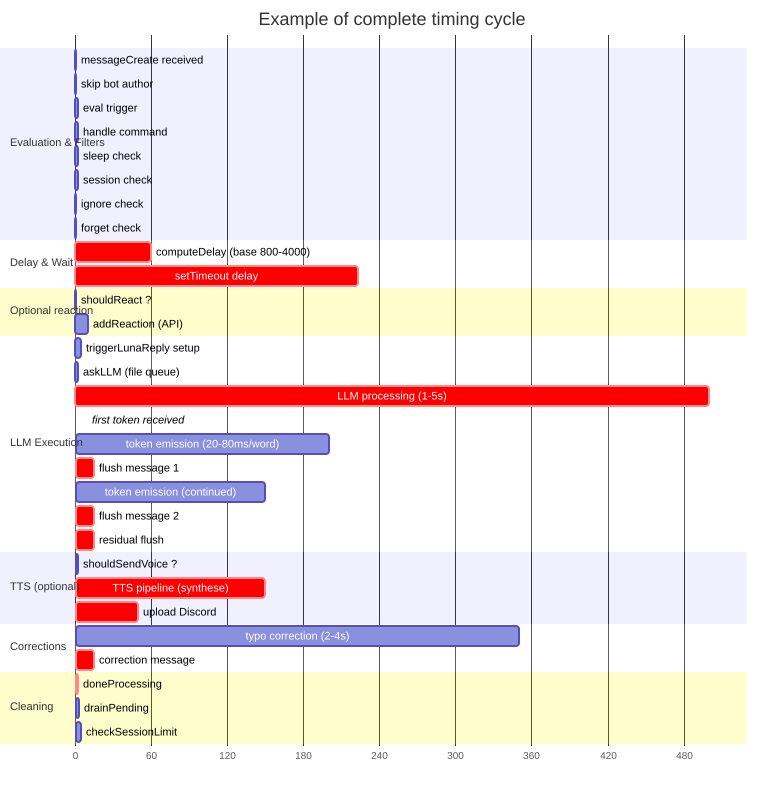](state-machines/21-timing-gantt.mmd)
*Timing Gantt -- real wait times for delays, reactions, LLM streaming, and corrections*

---

## Dataset

[**Discord-Dialogues**](https://huggingface.co/datasets/mookiezi/Discord-Dialogues) -- 7.3M exchanges, 17M turns, 140M words. Real Discord conversations spring-summer 2025, filtered PII/ToS/bots/commands. Apache 2.0.

Explore the dataset interactively: [**Atlas Map**](https://atlas.nomic.ai/data/mookiezi/discord-alpha/map)

| Metric | Value |
|---|---|
| Samples | 7 303 464 |
| Total turns | 16 881 010 |
| Total words | 139 922 950 |
| Average tokens | 32.8 |
| Tokenizer | Hermes-3-Llama-3.1-8B |


[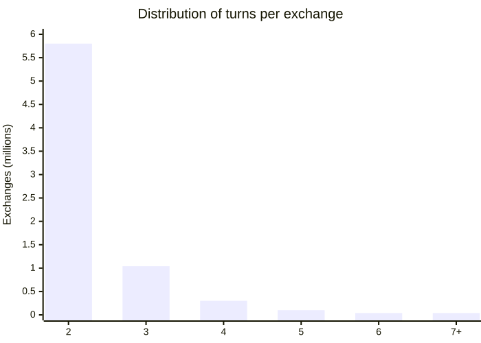](state-machines/readme-diagrams/r14.mmd)

---

## Logs

| Prefix | Info |
|---|---|
| `[trigger]` | Evaluation + result of each message |
| `[mannerisms]` | Delay, ignore, reaction, msgLength, inactivity |
| `[bot]` | Decision, follow-up, reply style, forget |
| `[tts]` | Synthesis, upload, voice message |
| `[persist]` | Save/restore |
| `[llm-core]` | Queue, proxy/online, LLM events |
| `[llmBus]` | LLM events (token, done, flush, error, ready) |

---

## Setup

```bash
npm install
cp config.example.yml config.yml
# edit config.yml
npm run dev                    # dev (hot reload)
npm run build && npm start     # production
```

| Script | Description |
|---|---|---|
| `build` | Bundle self-contained CLI |
| `start` | Run bot |
| `lint` / `format` / `check` | Biome |
| `test` | Run tests (Bun) |
| `download-model` | GGUF from HuggingFace |
| `diagrams` | Export Mermaid diagrams as SVGs/PNGs |

### LLM deployment modes

| Mode | Usage | Description |
|------|-------|-------------|
| `direct` (default) | `llm_mode: direct` | Bot client → HTTP → llama‑server (shared model, 4 slots, prompt cache). Two PM2 processes. |
| `online` | `llm_mode: online` | Bot calls any OpenAI‑compatible API (OpenAI, OpenRouter, Groq, Together...). No local LLM needed. |

### PM2 (production)

```bash
./start.sh   # launches llm-server + llm-client under PM2
```

### Hot-reload config

`config.yml` is reloaded at runtime via `watchConfig()` (called in `startBot()`).  
The getters on `export const config` (e.g. `config.typoChance`, `config.concentration`) return live values.  
No restart needed to modify triggers, delays, behaviors.  
Static values (`discord_token`, `llm_mode`, etc.) require a restart.

## Discord Developer Portal

- **Message Content Intent** (Bot tab)
- Scope `bot` + permissions: `Send Messages`, `Read Message History`, `Add Reactions`
- Gateway intents: `guilds`, `guildMessages`, `guildMessageReactions`, `messageContent`, `directMessages`
