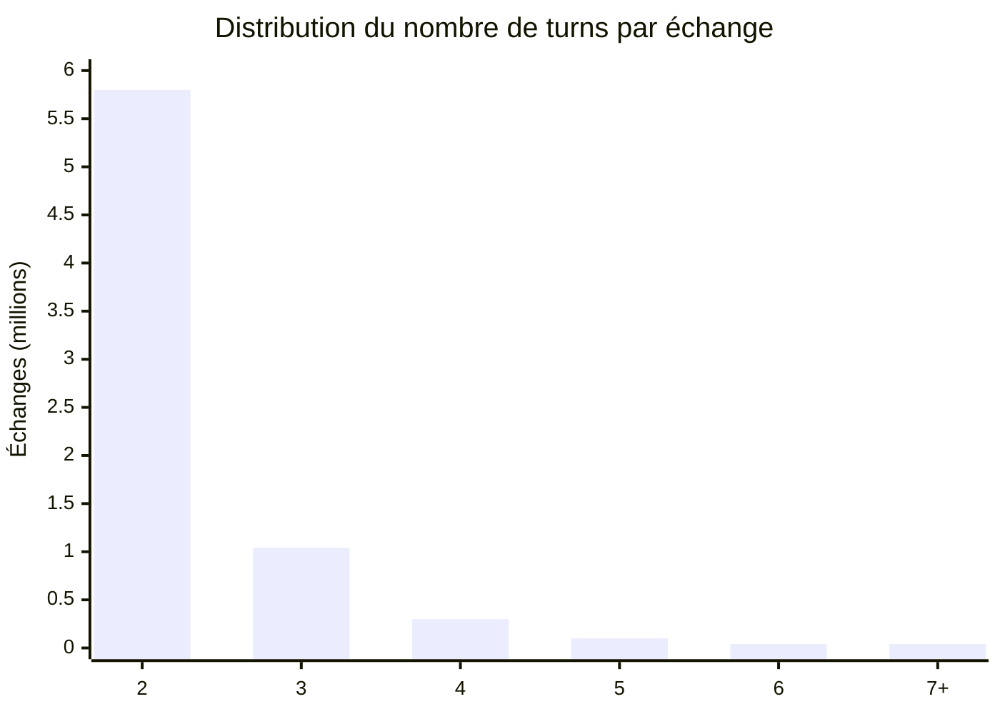
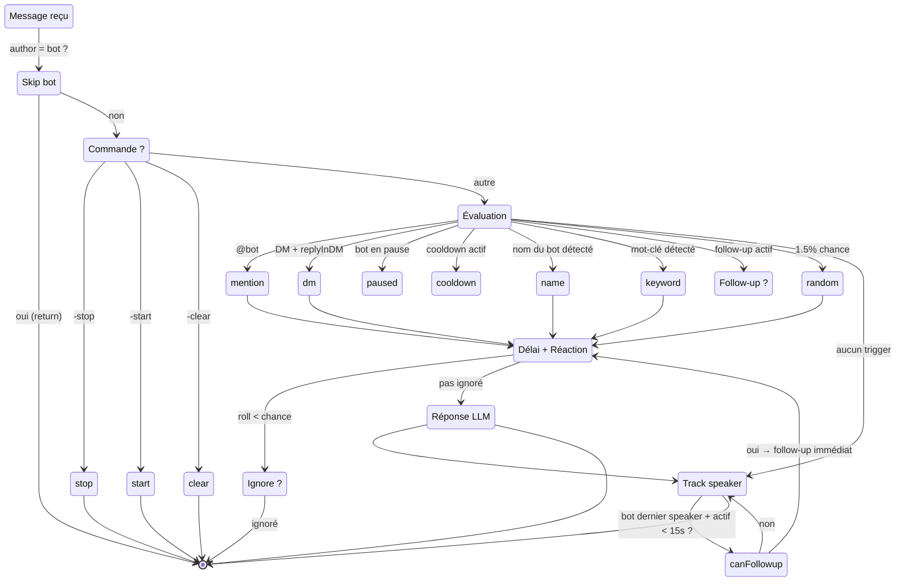
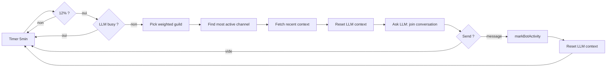
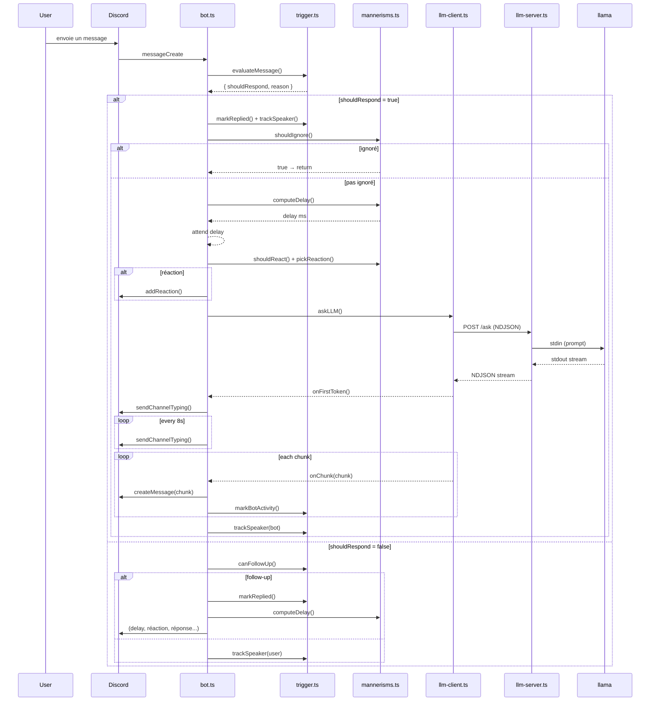

# pixieglow — Discord LLM Bot

Bot Discord autonome qui fait tourner un LLM local (llama.cpp) et converse de façon naturelle en serveur et en DM. Le modèle est fine-tuné sur [Discord-Dialogues](https://huggingface.co/datasets/mookiezi/Discord-Dialogues) pour produire des échanges réalistes.

## Architecture

```
┌─────────────────┐   NDJSON/HTTP    ┌──────────────────────┐
│  llm-server.ts  │ ◄──────────────► │      bot client      │
│  (port 3124)    │   POST /ask       │    (Eris / Discord)  │
│                 │   POST /reset     │                      │
│  llama-cli      │   GET /health     │  trigger.ts          │
│  process        │                   │  mannerisms.ts       │
└─────────────────┘                   │  spontaneous.ts     │
                                      └──────────────────────┘
```

Deux processus séparés — le LLM (llama-cli avec chargement du modèle) et le client Discord (hot-reloadable sans recharger le modèle). Communication en NDJSON streamé sur HTTP.

**Pourquoi NDJSON plutôt que SSE ?** Plus simple à parser ligne par ligne, chaque ligne est un JSON complet.

## Dataset

Le modèle utilisé est fine-tuné sur [**Discord-Dialogues**](https://huggingface.co/datasets/mookiezi/Discord-Dialogues) — **7.3M échanges**, **16.9M turns**, **140M mots**, collectés sur Discord printemps-été 2025. Conversations humaines réelles filtrées (PII, ToS, bots, commandes). Licence Apache 2.0.



| Métrique | Valeur |
|---|---|
| Échantillons | 7 303 464 |
| Turns total | 16 881 010 |
| Mots total | 139 922 950 |
| Tokens moyen | 32.8 |
| Tokenizer | Hermes-3-Llama-3.1-8B |

Le bot est prévu pour tourner sur un GGUF quantifié (ex. `Discord-Hermes-3-8B.Q3_K_M.gguf`).


---

## Système de déclenchement

### State machine — décision message entrant



### Ordre de priorité des déclencheurs

| # | Raison | Conditions | Bypass ignore | Bypass pause |
|---|---|---|---|---|
| 1 | `mention` | Le bot est `@mentionné` | Oui (0%) | Oui |
| 2 | `dm` | Message privé avec `replyInDM = true` | Oui (0%) | Non |
| 3 | `name` | Message contient "Luna", "Pixie" ou le pseudo du bot (mot entier) | Non (8%) | Non |
| 4 | `keyword` | Message contient un mot-clé (mot entier) : `hello`, `hi`, `hey`, `yo`, `ai`, `bot`... | Non (8%) | Non |
| 5 | `follow-up` | Bot était le dernier interlocuteur + activité < 15s + < 3 follow-up / 60s | — | — |
| 6 | `random` | 1.5% de chance sur chaque message qui n'a pas matché | Non (8%) | Non |

**Mot entier (`\b`)** : "ai" ne matche pas "mais", "vrai", "lait". Seul le mot isolé "ai" ou "AI" déclenche.

### Cooldown

8 secondes entre deux réponses dans un même salon. Bypassé par les mentions et les follow-up.

### Follow-up

Quand le bot répond, il s'enregistre comme `lastSpeaker`. Tout message suivant dans les 15s déclenche une réponse immédiate (sans timer, sans check de mot-clé). Budget : 3 follow-up par fenêtre de 60s (via `responseCount` décrémenté après 60s).

---

## Mécanismes de réponse

### Délai variable

```
delay = 800 + random(0, 3200) ms
```

Simule le temps de réflexion. Aucun typing pendant ce délai — le typing n'apparaît que quand le LLM commence à générer (premier token reçu).

### Ignore chance

8% des triggers non-mention/non-DM sont ignorés (simule l'inattention humaine). 0% pour les mentions et DMs.

### Réactions

6% de chance. Quand le bot réagit :
- 30% → émoji personnalisé du serveur (aléatoire parmi les emojis du guild)
- 70% → émoji unicode depuis une liste prédéfinie

### Typing indicator

```typescript
onFirstToken: startTyping   → envoie typing + intervalle 8s
finally: clearInterval      → arrête le typing
```

### Réponse multi-chunk

Le LLM stream sa réponse en chunks (découpés sur les `\n`). Chaque chunk devient un message Discord séparé. Seul le premier message a un `messageReference` (reply visuel).

### Reply style

Pondéré selon que le salon est en "conversation active" (bot a parlé récemment) ou non :

| Contexte | `messageReference` | `mentionRepliedUser` | Poids |
|---|---|---|---|
| Froid | `true` | `false` | 70% |
| Froid | `true` | `true` | 20% |
| Froid | `false` | `false` | 10% |
| Actif | `true` | `false` | 50% |
| Actif | `true` | `true` | 15% |
| Actif | `false` | `false` | 30% |
| Actif | `false` | `true` | 5% |

En DM, `messageReference` est toujours `false`.

### Messages spontanés

Toutes les 5 minutes, 12% de chance que le bot poste un message de son propre chef.



**Sélection du serveur** : classement par `lastMessageID` du salon le plus actif, poids linéaire décroissant (le serveur le plus actif a N× plus de chances que le dernier).

---

## Commandes

| Commande | Effet |
|---|---|
| `-stop` | Pause tous les déclencheurs, reset le contexte LLM, vide les cooldowns |
| `-start` | Réactive le bot |
| `-clear` | Reset l'historique de conversation du salon + cooldowns + follow-up |

---

## Configuration

Deux couches, la YAML écrase les valeurs par défaut, puis `.env` écrase pour les secrets et chemins.

### `config.yml` (recommandé)

Toute la configuration du bot : triggers, mannerisms, styles de reply. Exemple :

```yaml
names:
  - "Luna"
  - "Pixie"

keywords:
  - "hello"
  - "hi"
  - "hey"
  - "ai"
  - "bot"

random_chance: 0.015
cooldown_seconds: 8
reply_in_dm: true

response_delay_min: 800
response_delay_max: 4000

reaction_chance: 0.06
ignore_chance: 0.08

spontaneous_interval_ms: 300000
spontaneous_chance: 0.12
```

Voir le fichier complet à la racine.

### `.env`

| Variable | Défaut | Description |
|---|---|---|
| `DISCORD_TOKEN` | — | Token du bot Discord (obligatoire) |
| `LLAMA_CLI_PATH` | `../llama-b9682/llama-cli` | Chemin vers l'exécutable `llama-cli` |
| `LLAMA_MODEL_PATH` | `./models/*.gguf` | Chemin du modèle GGUF |
| `PORT` | `3124` | Port du serveur LLM HTTP |

### `prompt.txt`

Fichier lu au démarrage, contient le system prompt. Exemple :

```
Your name is pixieglow. You are a 21-year-old girl studying art.
Talk naturally and never prefix your replies with your name.
```

### Paramètres LLM (llama-cli)

Les flags `-t` / `-tb` (thread count) sont automatiquement détectés via `os.cpus().length`.

```yaml
temp: 0.75
dynatemp-range: 0.15
top-k: 40
top-p: 0.95
min-p: 0.05
repeat-penalty: 1.12
repeat-last-n: 256
presence-penalty: 0.1
batch: 4096
ubatch: 256
context: 4096
```

Chat template : ChatML (`<|im_start|>/<|im_end|>`)

Ces paramètres sont codés en dur dans `src/config.ts` (non modifiables via `config.yml`).

---

## Logs

Le bot trace toutes ses décisions avec des préfixes filtrables :

| Préfixe | Information |
|---|---|
| `[trigger]` | Évaluation de chaque message, résultat (`→ name`, `→ keyword`, `→ rien`...) |
| `[trigger]` | `canFollowUp=` avec les raisons (recentBot, lastSpeaker, followCount) |
| `[mannerisms]` | Délai calculé, rolls d'ignore/réaction avec la valeur |
| `[bot]` | Décision de répondre, follow-up immédiat, reply style choisi |
| `[spontaneous]` | Message spontané envoyé ou réponse vide |
| `[eris]` | Erreurs de la librairie Discord (attrapées sans crash) |

---

## Setup

```bash
# Cloner et installer
npm install

# Configuration
cp .env.example .env
# éditer DISCORD_TOKEN dans .env
# éditer config.yml (triggers, mannerisms, LLM, etc.)

# System prompt
echo "Your name is pixieglow. You are a 21-year-old girl studying art." > prompt.txt

# Lancer en dev
npm run dev

# Build + production
npm run build
npm start
```

### Scripts npm

| Script | Description |
|---|---|
| `npm run dev` | LLM server (hot) + esbuild watch + bot client (watch) |
| `npm run start` | LLM server + bot client (production) |
| `npm run build` | Bundle le bot avec esbuild → `self-cli.js` |
| `npm run client-only` | Build watch + bot client (sans LLM server) |
| `npm run server-only` | LLM server uniquement |
| `npm run lint` | Biome lint |
| `npm run format` | Biome format |

---

## Portail Développeur Discord

- Activer **Message Content Intent** (onglet Bot)
- Inviter avec scope `bot` + permissions `Send Messages`, `Read Message History`, `Add Reactions`
- Gateway intents : `guilds`, `guildMessages`, `messageContent`, `directMessages`

---

## Structure du projet

```
src/
├── index.ts          # Point d'entrée (import startBot)
├── bot.ts            # Client Eris, message handler, triggerLunaReply
├── config.ts         # Toute la configuration (env, triggers, LLM, styles)
├── trigger.ts        # Évaluation des messages, cooldowns, follow-up
├── mannerisms.ts     # Délai, ignore, réactions
├── spontaneous.ts    # Messages spontanés pondérés
├── guild.ts          # findMostActiveChannel helper
├── llm-server.ts     # Serveur HTTP NDJSON, spawn llama-cli, queue
├── llm-client.ts     # Client HTTP vers le serveur LLM
└── llm.ts            # Ancienne version monolithique (archivée)
```

### Flux détaillé d'une réponse


