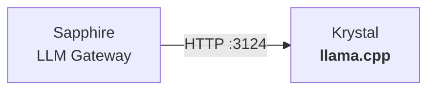

<p align="center">
  <picture>
    <source media="(prefers-color-scheme: dark)" srcset="images/logo.png">
    
  </picture>
  <h1 align="center">Krystal</h1>
  <p align="center">LLM inference server for the Luna Protocol ecosystem</p>
  <p align="center">
    <a href="https://github.com/protocol-luna/krystal/blob/main/LICENSE">
      
    </a>
    <a href="https://llama.cpp/">
      
    </a>
    <a href="https://huggingface.co/fox3000foxy/Luna-Protocol-1.5B-Discord-Dialogues-200k-instruct">
      
    </a>
    <a href="https://github.com/protocol-luna">
      
    </a>
  </p>
</p>

Krystal runs llama.cpp server to serve GGUF models via an OpenAI-compatible HTTP API.



## Setup

Single-backend mode — serves the Luna Protocol 1.5B model on port 3124.

```bash
# Start the server
./start.sh
```

Runs via PM2 with the Luna Protocol 1.5B model:
- `Luna-Protocol-1.5B-Fine-Tuned-Qwen2.5-200k-instruct.Q4_K_M.gguf` (941 MB)

## Model

The model is a fine-tuned Qwen2.5 1.5B, trained on 200k Discord dialogues. Available on HuggingFace:

[fox3000foxy/Luna-Protocol-1.5B-Discord-Dialogues-200k-instruct](https://huggingface.co/fox3000foxy/Luna-Protocol-1.5B-Discord-Dialogues-200k-instruct)

```bash
# Download the model
npm run download-model
```

## Configuration

Key parameters in `start.sh`:

| Parameter | Value |
|-----------|-------|
| Port | 3124 |
| Model | Luna 1.5B Q4_K_M (941 MB) |
| Context | 4096 tokens |
| GPU layers | 0 (CPU only) |
| Threads | 6 |

## Requirements

- llama.cpp compiled server
- GGUF model in `models/`
- ~1 GB disk per model
- ~3 GB RAM for 1.5B Q4_K_M

## Running

```bash
# Start
pm2 start start.sh --interpreter bash --name krystal-small

# View logs
pm2 logs krystal-small

# Stop
pm2 stop krystal-small

# Restart
pm2 restart krystal-small
```
