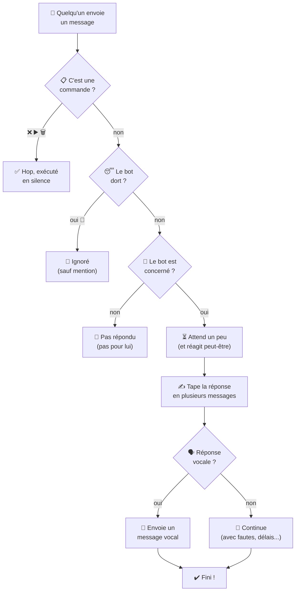
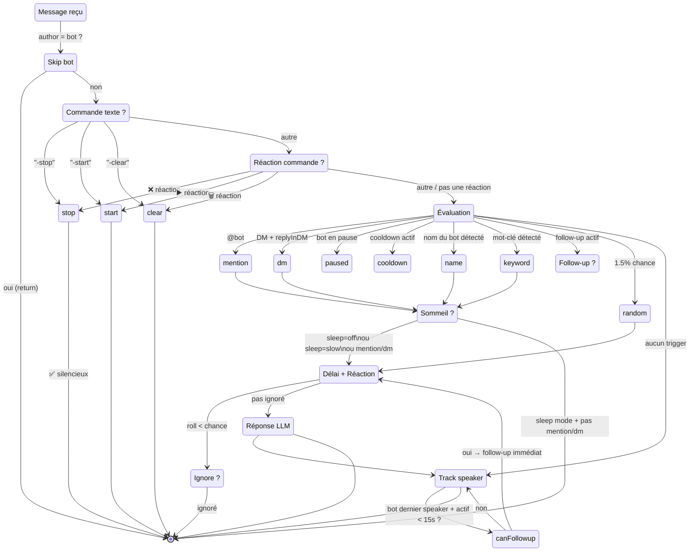
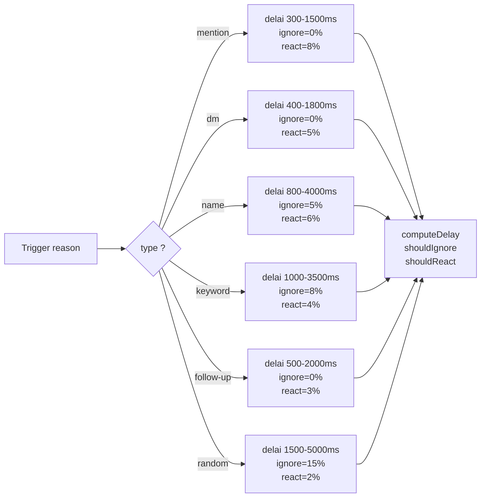
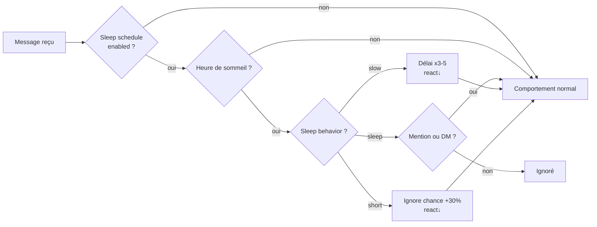
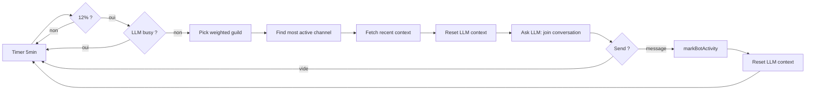
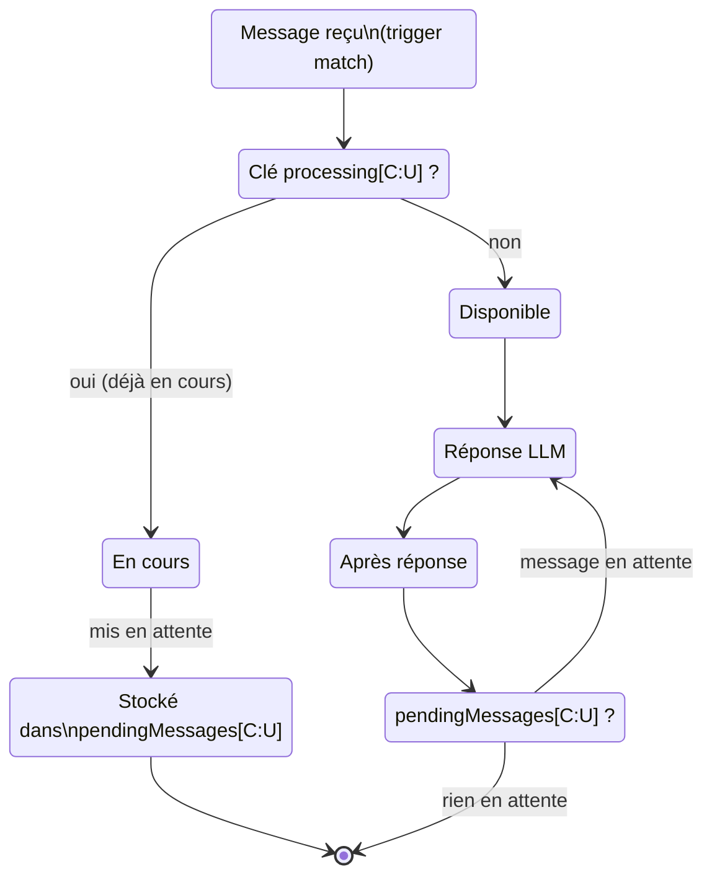
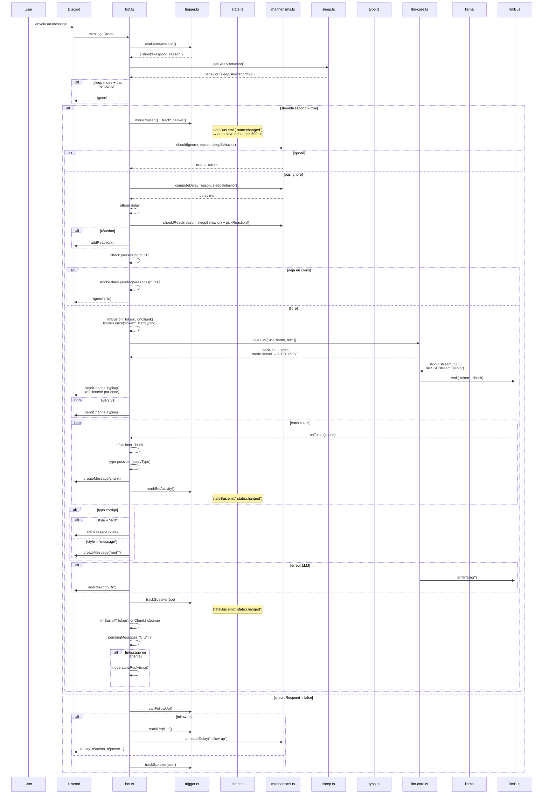
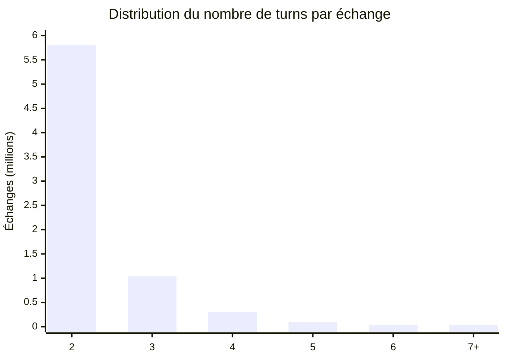

# pixieglow

Bot Discord autonome. Fait tourner un LLM local (llama.cpp) et converse de façon naturelle — sommeil, inattention, fautes de frappe, messages vocaux, file anti-spam, persistance, auto-restart.

- Modèle fine-tuné sur [Discord-Dialogues](https://huggingface.co/datasets/mookiezi/Discord-Dialogues) (7.3M échanges, 17M turns)
- Format GGUF quantifié (ex. `Discord-Hermes-3-8B.Q3_K_M.gguf`)
- Trois modes LLM : `cli` (spawn llama-cli), `server` (HTTP → llama-server), `proxy` (bot → HTTP → llm-server séparé)
- Architecture événementielle : `llmBus` pour les tokens/erreurs LLM, `stateBus` pour l'auto-persist
- Auto-restart du LLM (mode cli) avec backup exponentiel et file préservée

```
┌─────────────────────────────────────────────────────┐
│                   core/bus.ts                        │
│  TypedBus<K, V> — on / off / once / emit            │
├──────────────────┬──────────────────────────────────┤
│   core/llm-bus   │       state/state-bus             │
│  token / done /  │     state:changed                 │
│  error / crash / │     → persistence auto            │
│  ready / reset   │                                   │
└────────┬─────────┴────────┬─────────────────────────┘
         │                  │
┌────────▼─────────┐  ┌────▼──────────────────────┐
│ core/llm-core.ts │  │ bot.ts (Eris)             │
│                  │  │ bot/pending.ts             │
│ mode cli         │  │ bot/reactions.ts           │
│   spawn llama-cli│  │ state/trigger.ts           │
│ mode server      │  │ state/state.ts             │
│   HTTP → llama-  │  │ behavior/*                 │
│   server:port    │  │ tts/*                      │
│ mode proxy       │  │ spontaneous.ts             │
│   HTTP → llm-    │  │                            │
│   server (sép.)  │  │                            │
└──────────────────┘  └────────────────────────────┘
```

## Structure

```
src/
├── index.ts           # → cli.ts
├── cli.ts             # CLI (bot | server | direct)
├── bot.ts             # Handler principal Eris
├── config.ts          # Config YAML + surcharge vars d'env
├── spontaneous.ts     # Messages spontanés pondérés
├── guild.ts           # findMostActiveChannel
├── core/
│   ├── bus.ts         # TypedBus générique (on/off/once/emit)
│   ├── llm-bus.ts     # Bus LLM (token, done, error, crash, ready, reset)
│   ├── llm-core.ts    # Spawn CLI ou HTTP server, queue, parsing, restart
│   ├── llm-client.ts  # Client HTTP vers llm-server (mode proxy)
│   └── llm-server.ts  # Serveur HTTP NDJSON (mode proxy)
├── state/
│   ├── state-bus.ts   # Bus state (state:changed → auto-persist)
│   ├── state.ts       # Cooldowns, activité, suivi conversation
│   ├── trigger.ts     # Évaluation des déclencheurs
│   └── persistence.ts # Sauvegarde/restauration state.json
├── behavior/
│   ├── mannerisms.ts  # Délai, ignore, réactions, concentration
│   ├── sleep.ts       # Plages de sommeil
│   └── typo.ts        # Fautes AZERTY/QWERTY
├── bot/
│   ├── pending.ts     # File anti-spam
│   ├── reactions.ts   # Commandes par réactions (❌▶️🗑️)
│   └── typo-correction.ts # Correction différée des fautes
└── tts/
    ├── piper.ts       # Synthèse Piper TTS
    ├── audio.ts       # Sanitization, WAV→OGG, durée
    ├── upload.ts      # Upload CDN Discord
    └── voice-message.ts  # Orchestration message vocal
```

---

## Vue d'ensemble



---

## Système de déclenchement

### State machine — décision message entrant



### Ordre de priorité des déclencheurs

| # | Raison | Conditions | Bypass ignore | Bypass pause |
|---|---|---|---|---|
| 1 | `mention` | @bot | Oui (0%) | Oui |
| 2 | `dm` | MP avec `replyInDM = true` | Oui (0%) | Non |
| 3 | `name` | "Luna"/"Pixie"/pseudo (mot entier) | Non (8%) | Non |
| 4 | `keyword` | `hello`, `hi`, `hey`, `yo`, `ai`, `bot`... (mot entier) | Non (8%) | Non |
| 5 | `follow-up` | Bot dernier interlocuteur + < 15s + < 3 / 60s | — | — |
| 6 | `random` | 1.5% de chance sur les non-matchés | Non (8%) | Non |

Recherche par mot entier (`\b`) : "ai" ne matche pas "mais", "vrai", "lait".

### Cooldown

8 secondes entre deux réponses dans un même salon. Bypassé par mentions et follow-up.

### Follow-up

Le bot s'enregistre comme `lastSpeaker`. Tout message suivant dans les 15s déclenche une réponse immédiate (sans timer, sans check de mot-clé). Budget : 3 follow-up par fenêtre de 60s (via `responseCount` décrémenté après 60s).

---

## Mécanismes de réponse

### Concentration variable



| Trigger | Délai min | Délai max | Ignore | Réaction |
|---|---|---|---|---|
| `mention` | 300ms | 1500ms | 0% | 8% |
| `dm` | 400ms | 1800ms | 0% | 5% |
| `name` | 800ms | 4000ms | 5% | 6% |
| `keyword` | 1000ms | 3500ms | 8% | 4% |
| `follow-up` | 500ms | 2000ms | 0% | 3% |
| `random` | 1500ms | 5000ms | 15% | 2% |

Configurable via `concentration` dans `config.yml` :

```yaml
concentration:
  mention:
    delay_min: 300
    delay_max: 1500
    ignore_chance: 0.0
    react_chance: 0.08
  dm:
    delay_min: 400
    delay_max: 1800
    ignore_chance: 0.0
    react_chance: 0.05
  name:
    delay_min: 800
    delay_max: 4000
    ignore_chance: 0.05
    react_chance: 0.06
  keyword:
    delay_min: 1000
    delay_max: 3500
    ignore_chance: 0.08
    react_chance: 0.04
  follow-up:
    delay_min: 500
    delay_max: 2000
    ignore_chance: 0.0
    react_chance: 0.03
  random:
    delay_min: 1500
    delay_max: 5000
    ignore_chance: 0.15
    react_chance: 0.02
```

### Fautes de frappe

Probabilité configurable (`typo_chance`, défaut 6%) de remplacer une lettre par une touche adjacente (AZERTY/QWERTY). Correction après 2-4s :

| Style | Comportement |
|---|---|
| `edit` | Édite le message |
| `message` | Nouveau message : `mot*` |
| `mixed` | 50/50 aléatoire (défaut) |

Exemple AZERTY : `bonjour → bonjpur`, `salut → slaut`, `comment → cpmment`.

### Messages vocaux (TTS)

Probabilité configurable (`voice_message_chance`, défaut 8%). Pipeline : Piper TTS → WAV → OGG (ffmpeg) → mesure durée (ffprobe) → upload CDN Discord (3 étapes : création d'attachment, PUT du fichier, POST du message vocal).

Le texte est nettoyé avant synthèse : mentions → `@utilisateur`, URLs supprimées, tronqué à 500 caractères. Si le texte contient des emoji, envoi en texte brut (évite les crashs Piper).

### Typing indicator

```typescript
llmBus.once("token", startTyping)  → envoie typing + intervalle 8s
finally: clearInterval, llmBus.off  → arrête le typing + nettoie
```

Pas de typing pendant le délai de concentration — le typing n'apparaît que quand le LLM commence à générer (premier event `token` sur `llmBus`).

### Réponse multi-chunk

Le LLM stream sa réponse en chunks (découpés sur les `\n`). Chaque chunk devient un message Discord séparé, avec un délai proportionnel à la longueur du chunk (`min(délai × length/200, 1)`) entre chaque message — simule le temps d'écrire. Seul le premier message a un `messageReference` (reply visuel). En mode vocal, le typing indicator est désactivé et les chunks sont ignorés (un seul message vocal).

### Réactions

30% émoji personnalisé du serveur, 70% émoji unicode.

### Reply style

Pondéré selon activité récente du bot dans le salon :

| Contexte | messageReference | mentionRepliedUser | Poids |
|---|---|---|---|
| Froid | true | false | 70% |
| Froid | true | true | 20% |
| Froid | false | false | 10% |
| Actif | true | false | 50% |
| Actif | true | true | 15% |
| Actif | false | false | 30% |
| Actif | false | true | 5% |

En DM, `messageReference` toujours `false`.

### Plages de sommeil



| Mode | Effet |
|---|---|
| `sleep` | Seules mentions et DMs passent |
| `slow` | Délai ×3-5, réactions quasi nulles |
| `short` | Ignore chance +30%, réactions quasi nulles |

Timeline exemple :

```mermaid
gantt
    title Plages de sommeil
    dateFormat HH:mm
    axisFormat %H:%M
    tickInterval 2hour

    section Comportement
    Éveillé        : active, 07:00, 3h
    Court          : short, 10:00, 1h
    Éveillé        : active2, 11:00, 5h
    Lent           : slow, 16:00, 2h
    Éveillé        : active3, 18:00, 4h
    Sommeil        : sleep, 22:00, 9h
```



### Messages spontanés

Toutes les 5 minutes, 12% de chance que le bot poste un message de son propre chef.



**Sélection du serveur** : classement par `lastMessageID` du salon le plus actif, poids linéaire décroissant (le serveur le plus actif a N× plus de chances que le dernier).

### Anti-spam



Clé `channelId:userId`. Un seul message en attente par utilisateur par salon. Traité dès la fin de la réponse en cours.

### Persistance

```mermaid
flowchart LR
    A[Mutation d'état\nsetPaused / markReplied\nmarkBotActivity / etc.] --> B[stateBus.emit\n"state:changed"]
    B --> C[persistence.ts\nécoute le bus]
    C --> D[scheduleSave\ndebounce 500ms]
    D --> E[async writeFile\nstate.json]
    F[Démarrage] --> G[loadState async]
    G --> H[restoreState]
    G --> I[récupère messages\nen attente via API]
```

**Persisté :** pendingMessages, paused, cooldowns, timestamps, lastSpeaker, follow-up counters.

**Auto-save :** toute mutation state émet sur `stateBus` → sauvegarde automatique (debounce 500ms). Plus besoin d'appels `saveAllState()` manuels.

### Auto-restart LLM (mode `cli`)

Si le processus llama-cli crash (OOM, segfault, etc.), il est automatiquement relancé :

1. Réinitialisation des flags internes (`isModelReady`, `isProcessing`)
2. La file d'attente (`requestQueue`) est préservée — les requêtes en cours sont retraitées
3. Backup exponentiel : 1s → 2s → 4s → 8s → 16s (max 5 tentatives)
4. Après un redémarrage réussi, le compteur de tentatives est réinitialisé

Utile pour les quantifications agressives (Q2_K) qui peuvent crash sur des prompts complexes.

---

## Commandes

Invisibles — pas de message public, juste une ✅ de confirmation.

**Par texte :** `-stop` (pause + reset), `-start` (reprise), `-clear` (reset historique)

**Par réactions** sur un message du bot :
| Emoji | Effet |
|---|---|
| ❌ | Stop |
| ▶️ | Start |
| 🗑️ | Clear |

Erreur interne → ❌ sur le message (pas de message d'erreur public).

---

## Flux détaillé d'une réponse



---

## Configuration

Fichier unique `config.yml`. Variables d'env shell surchargent les clés YAML si présentes.

### `system_prompt`

Clé `system_prompt` avec le prompt système. Supporte le format YAML multiligne (`|`).

```yaml
discord_token: "ton_token"
llama_cli_path: "bin/llama/llama-cli"
llama_model_path: "./models/Discord-Hermes-3-8B.Q3_K_M.gguf"
llm_host: "localhost"
llm_port: 3124
llm_mode: "cli"          # cli → spawn llama-cli, server → HTTP llama-server, proxy → bot client via llm-server
system_prompt: |
  Tu es Luna...
tts_model_path: "./bin/piper/en_GB-southern_english_female-low.onnx"
tts_binary_path: "bin/piper/piper"
ffmpeg_path: "bin/ffmpeg/ffmpeg"
ffprobe_path: "bin/ffmpeg/ffprobe"

names: ["Luna", "Pixie"]
keywords: ["hello", "hi", "hey", "yo", "ai", "bot"]
typo_chance: 0.06
voice_message_chance: 0.08
```

**Paramètres LLM** (codés en dur dans `src/config.ts`). Chat template ChatML (`<|im_start|>/<|im_end|>`). Threads détectés via `os.cpus().length`.

```yaml
temp: 0.75
dynatemp-range: 0.15
top-k: 40
top-p: 0.95
min-p: 0.05
repeat-penalty: 1.12
repeat-last-n: 256
presence-penalty: 0.1
batch: 4096
ubatch: 256
context: 4096
```

---

## Dataset

[**Discord-Dialogues**](https://huggingface.co/datasets/mookiezi/Discord-Dialogues) — 7.3M échanges, 17M turns, 140M mots. Conversations réelles Discord printemps-été 2025, filtrées PII/ToS/bots/commandes. Apache 2.0.

| Métrique | Valeur |
|---|---|
| Échantillons | 7 303 464 |
| Turns total | 16 881 010 |
| Mots total | 139 922 950 |
| Tokens moyen | 32.8 |
| Tokenizer | Hermes-3-Llama-3.1-8B |




---

## Logs

| Préfixe | Info |
|---|---|
| `[trigger]` | Évaluation + résultat de chaque message |
| `[mannerisms]` | Délai, ignore, réaction |
| `[bot]` | Décision, follow-up, reply style |
| `[tts]` | Synthèse, upload, voice message |
| `[persist]` | Sauvegarde/restauration |
| `[llm-core]` | Spawn, crash, restart, mode CLI/server |
| `[llmBus]` | Événements LLM (token, done, error, ready) |

---

## Setup

```bash
npm install
cp config.example.yml config.yml
# éditer config.yml
npm run dev                    # dev (hot reload)
npm run build && npm start     # production
```

| Script | Description |
|---|---|---|
| `dev` | Bot + server (hot reload, bun) |
| `start` | Bot + server (production, concurrently) |
| `build` | Bundle bot + server |
| `client-only` | Bot uniquement (proxy mode) |
| `server-only` | Serveur LLM uniquement |
| `direct` | Mode CLI direct : `node . direct` |
| `lint` / `format` / `check` | Biome |
| `download-model` | GGUF depuis HuggingFace |

### Modes de déploiement LLM

| Mode | Usage | Description |
|---|---|---|
| `cli` | `llm_mode: cli` | Bot gère le LLM en direct (spawn llama-cli). Monolithique, un seul process. |
| `server` | `llm_mode: server` | Bot appelle llama-server via HTTP. llama-server doit tourner à côté. |
| `proxy` (default) | `llm_mode: proxy` | Bot client → HTTP → llm-server (qui gère le LLM). Deux processes, idéal pour PM2. |

### PM2 (production)

```bash
./start.sh   # lance llm-server + llm-client sous PM2
```

### Hot-reload config

`config.yml` est relu à chaud via `watchConfig()` (appelé dans `startBot()`).  
Les getters de `export const config` (ex: `config.typoChance`, `config.concentration`) retournent les valeurs live.  
Pas de restart nécessaire pour modifier les triggers, délais, comportements.  
Les valeurs statiques (`discord_token`, `llama_cli_path`, `llm_mode`, etc.) nécessitent un restart.

## Discord Developer Portal

- **Message Content Intent** (onglet Bot)
- Scope `bot` + permissions : `Send Messages`, `Read Message History`, `Add Reactions`
- Gateway intents : `guilds`, `guildMessages`, `guildMessageReactions`, `messageContent`, `directMessages`
