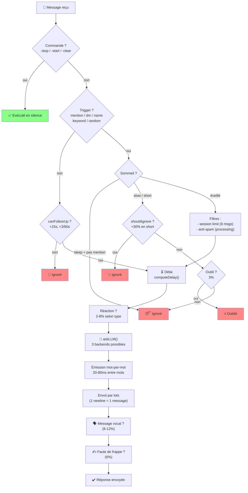
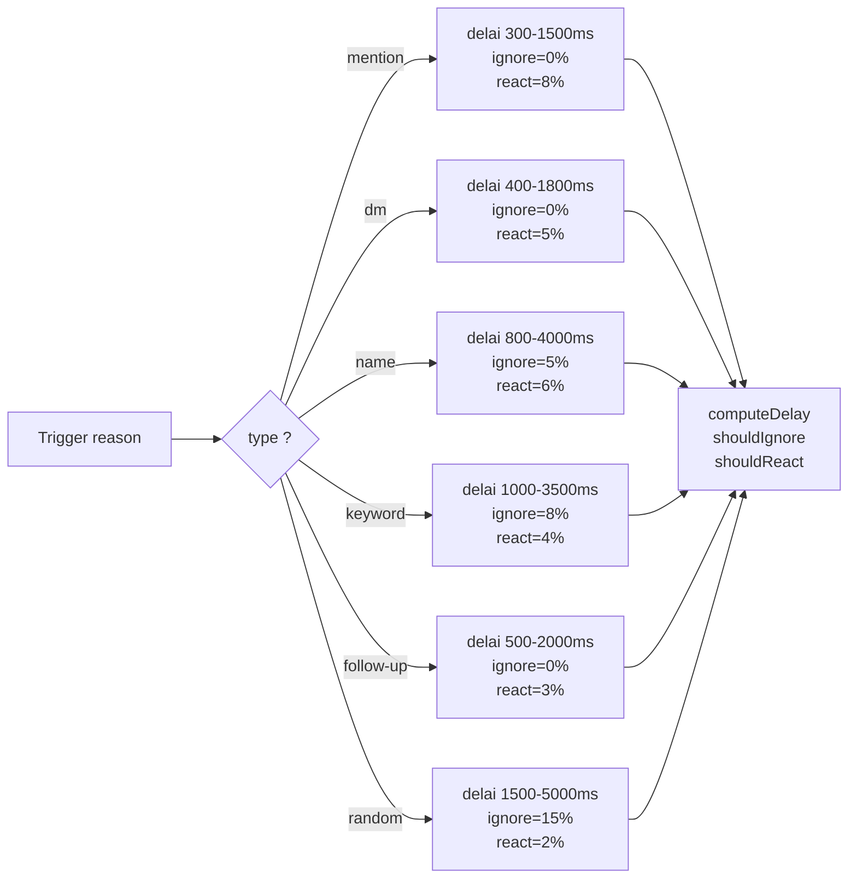
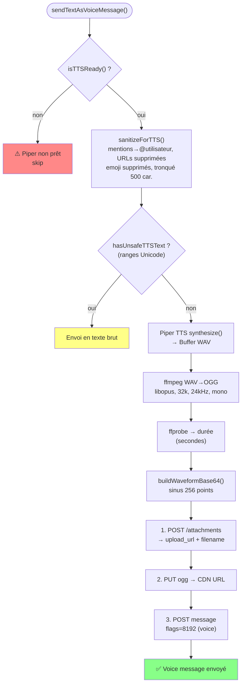
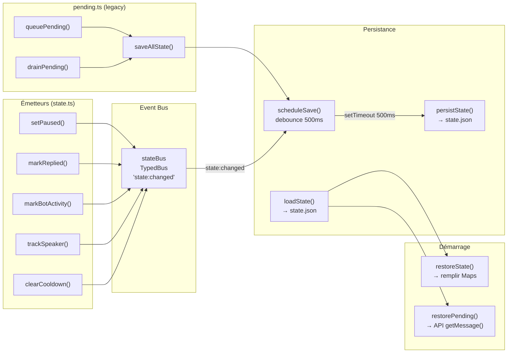
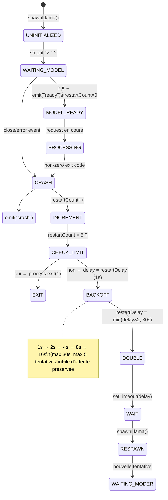
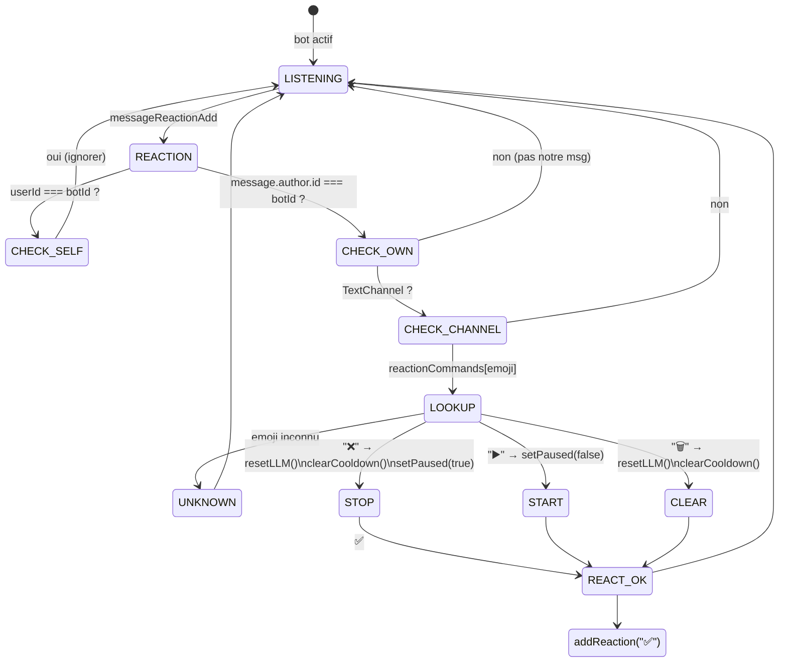
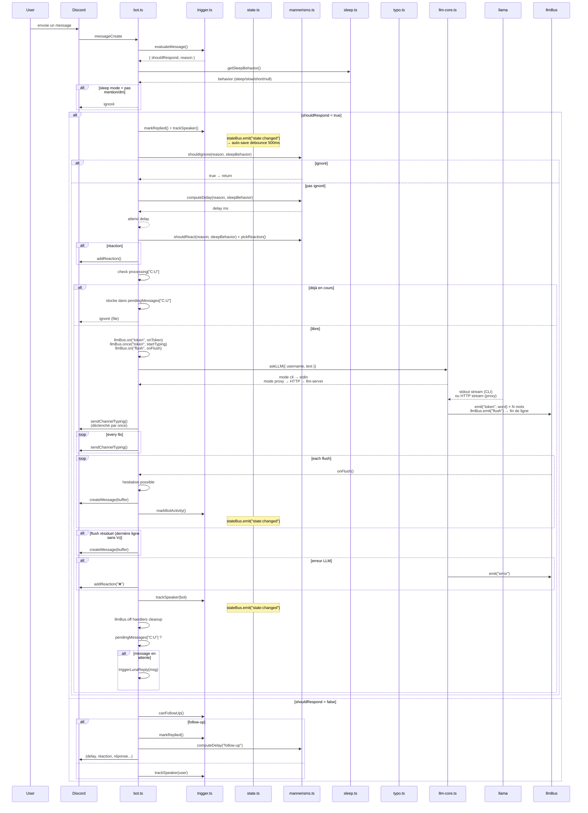
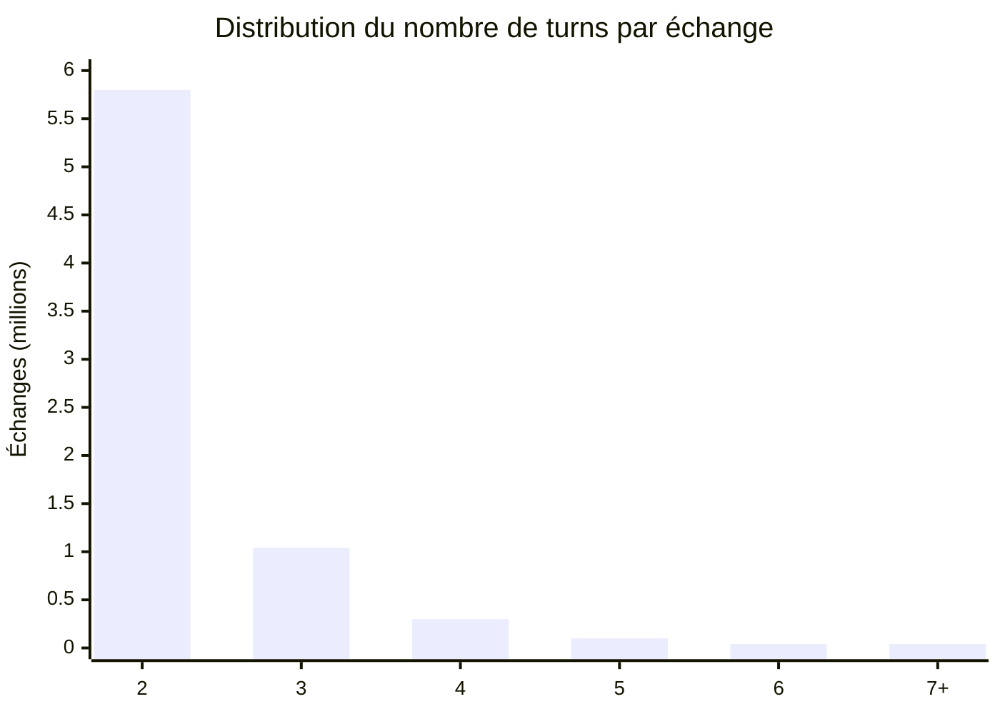

# Projet protocole Luna

Bot Discord autonome. Fait tourner un LLM local (llama.cpp) et converse de façon naturelle — sommeil, inattention, fautes de frappe, hésitations, oublis, messages vocaux, file anti-spam, persistance, auto-restart, statut rotatif.

- Modèle fine-tuné sur [Discord-Dialogues](https://huggingface.co/datasets/mookiezi/Discord-Dialogues) (7.3M échanges, 17M turns)
- Format GGUF quantifié (ex. `Discord-Hermes-3-8B.Q3_K_M.gguf`)
- Trois modes LLM : `cli` (spawn llama-cli), `server` (HTTP → llama-server), `proxy` (bot → HTTP → llm-server séparé)
- Architecture événementielle : `llmBus` pour les tokens/erreurs LLM, `stateBus` pour l'auto-persist
- Auto-restart du LLM (mode cli) avec backup exponentiel et file préservée

```
┌─────────────────────────────────────────────────────┐
│                   core/bus.ts                        │
│  TypedBus<K, V> — on / off / once / emit            │
├──────────────────┬──────────────────────────────────┤
│   core/llm-bus   │       state/state-bus             │
│  token / done /  │     state:changed                 │
│  error / crash / │     → persistence auto            │
│  flush / ready / │                                   │
│  reset           │                                   │
└────────┬─────────┴────────┬─────────────────────────┘
         │                  │
┌────────▼─────────┐  ┌────▼──────────────────────┐
│ core/llm-core.ts │  │ bot.ts (Eris)             │
│                  │  │ bot/pending.ts             │
│ mode cli         │  │ bot/reactions.ts           │
│   spawn llama-cli│  │ state/trigger.ts           │
│ mode server      │  │ state/state.ts             │
│   HTTP → llama-  │  │ behavior/*                 │
│   server:port    │  │ tts/*                      │
│ mode proxy       │  │ spontaneous.ts             │
│   HTTP → llm-    │  │                            │
│   server (sép.)  │  │                            │
└──────────────────┘  └────────────────────────────┘
```

## Structure

```
src/
├── index.ts           # → cli.ts
├── cli.ts             # CLI (bot | server | direct)
├── bot.ts             # Handler principal Eris
├── config.ts          # Config YAML + surcharge vars d'env
├── spontaneous.ts     # Messages spontanés pondérés
├── guild.ts           # findMostActiveChannel
├── core/
│   ├── bus.ts         # TypedBus générique (on/off/once/emit)
│   ├── llm-bus.ts     # Bus LLM (token, done, flush, error, crash, ready, reset)
│   ├── llm-core.ts    # Spawn CLI ou HTTP server, queue, parsing, restart
│   ├── llm-client.ts  # Client HTTP vers llm-server (mode proxy)
│   └── llm-server.ts  # Serveur HTTP NDJSON (mode proxy)
├── state/
│   ├── state-bus.ts   # Bus state (state:changed → auto-persist)
│   ├── state.ts       # Cooldowns, activité, suivi conversation
│   ├── trigger.ts     # Évaluation des déclencheurs
│   └── persistence.ts # Sauvegarde/restauration state.json
├── behavior/
│   ├── mannerisms.ts  # Délai, ignore, réactions, concentration
│   ├── sleep.ts       # Plages de sommeil
│   └── typo.ts        # Fautes AZERTY/QWERTY
├── bot/
│   ├── pending.ts     # File anti-spam
│   ├── reactions.ts   # Commandes par réactions (❌▶️🗑️)
│   └── typo-correction.ts # Correction différée des fautes
└── tts/
    ├── piper.ts       # Synthèse Piper TTS
    ├── audio.ts       # Sanitization, WAV→OGG, durée
    ├── upload.ts      # Upload CDN Discord
    └── voice-message.ts  # Orchestration message vocal
```

---

## Vue d'ensemble

> Les diagrammes détaillés (state machines, flowcharts, Gantt) sont disponibles dans le dossier [`state-machines/`](state-machines/) — 22 diagrammes Mermaid couvrant l'intégralité du code.



---

## Système de déclenchement

### State machine — décision message entrant

```mermaid
flowchart TD
    START(["Message Discord reçu"]) --> BOT_AUTHOR{"author.bot ?"}
    BOT_AUTHOR -->|"oui"| SKIP["❌ Ignoré (autre bot)"]

    BOT_AUTHOR -->|"non"| TEXT_CMD{"Message texte ?"}
    TEXT_CMD -->|"-stop"| STOPCMD["setPaused(true)\nresetLLM()\n✅"]
    TEXT_CMD -->|"-start"| STARTCMD["setPaused(false)\n✅"]
    TEXT_CMD -->|"-clear"| CLEARCMD["resetLLM()\nclearCooldown()\n✅"]
    TEXT_CMD -->|"autre"| MENTION{"@mentions\nbotId ?"}

    MENTION -->|"oui"| SET_PAUSED_OFF["setPaused(false)"]
    SET_PAUSED_OFF --> RESPOND["✅ reason=mention"]

    MENTION -->|"non"| DM_CHECK{"DM ?"}
    DM_CHECK -->|"DM + replyInDM"| RESPOND_DM["✅ reason=dm"]
    DM_CHECK -->|"DM sans reply"| DM_IGNORE["❌ DM ignoré"]

    DM_CHECK -->|"non"| PAUSED_CHECK{"isPaused() ?"}
    PAUSED_CHECK -->|"oui"| PAUSED_IGN["❌ Bot en pause"]

    PAUSED_CHECK -->|"non"| COOLDOWN{"isOnCooldown() ?"}
    COOLDOWN -->|"oui"| CD_IGN["❌ Cooldown actif"]

    COOLDOWN -->|"non"| NAME_CHECK{"Nom du bot\ndans le message ?"}
    NAME_CHECK -->|"oui"| MARK_REPLIED["markReplied()"]
    MARK_REPLIED --> RESPOND_NAME["✅ reason=name"]

    NAME_CHECK -->|"non"| KW_CHECK{"Mot-clé\ndétecté ?"}
    KW_CHECK -->|"oui"| MARK_KW["markReplied()"]
    MARK_KW --> RESPOND_KW["✅ reason=keyword"]

    KW_CHECK -->|"non"| RANDOM_ROLL{"1.5% chance\naléatoire ?"}
    RANDOM_ROLL -->|"oui"| MARK_RANDOM["markReplied()"]
    MARK_RANDOM --> RESPOND_RANDOM["✅ reason=random"]

    RANDOM_ROLL -->|"non (98.5%)"| TRACK_USER["trackSpeaker(user)\nsans répondre"]

    RESPOND --> SLEEP_GATE
    RESPOND_DM --> SLEEP_GATE
    RESPOND_NAME --> SLEEP_GATE
    RESPOND_KW --> SLEEP_GATE
    RESPOND_RANDOM --> SLEEP_GATE

    SLEEP_GATE --> CHECK_SLEEP_BEH{getSleepBehavior()}
    CHECK_SLEEP_BEH -->|"sleep + pas mention/dm"| SLEEP_IGNORE["😴 Ignoré (sommeil)"]
    CHECK_SLEEP_BEH -->|"slow / short / null"| SESSION_CHECK

    SESSION_CHECK --> SESSION_PAUSED{"sessionPaused\nsur ce channel ?"}
    SESSION_PAUSED -->|"oui"| QUEUE_MSG["📥 Mis en file\n(30s de pause session)"]
    SESSION_PAUSED -->|"non"| EXPIRE_CHECK{"sessionResetMinutes\nexpiré ?"}
    EXPIRE_CHECK -->|"oui"| RESET_COUNTER["sessionCounts.delete(cid)"]
    EXPIRE_CHECK -->|"non"| IGNORE_ROLL
    RESET_COUNTER --> IGNORE_ROLL

    IGNORE_ROLL -->|"shouldIgnore()\n+30% en short"| IGNORED["🙈 Ignoré"]
    IGNORE_ROLL --> FORGET_ROLL{"forgetChance\n3% ?"}
    FORGET_ROLL -->|"oui"| FORGOTTEN["💀 Oublié"]
    FORGET_ROLL -->|"non"| LOG_REACT

    LOG_REACT["logAndReact()\nsetTimeout + reaction"] --> WAIT_DELAY["⏳ computeDelay()\nattente réelle"]
    WAIT_DELAY --> TRIGGER_REPLY["triggerLunaReply()"]

    TRIGGER_REPLY --> PROCESSING_CHECK{"processing.has(key) ?"}
    PROCESSING_CHECK -->|"oui"| QUEUE_PENDING["📥 Mis en attente\n(déjà en cours)"]
    PROCESSING_CHECK -->|"non"| MARK_P["markProcessing()"]

    MARK_P --> LLM_FLOW["🤖 askLLM()\nstreaming tokens..."]

    LLM_FLOW --> CHECK_SESSION_LIMIT["checkSessionLimit()"]
    CHECK_SESSION_LIMIT --> UNDER_LIMIT["✅ Session OK"]
    CHECK_SESSION_LIMIT --> PAUSE_SESSION["⏸️ Pause 30s\npuis drainSessionQueue()"]
    UNDER_LIMIT --> DRAIN_PENDING["drainPending() →\nprochain message ?"]
    DRAIN_PENDING -->|"oui"| TRIGGER_REPLY
    DRAIN_PENDING -->|"non"| DONE["✅ Terminé"]

    style SKIP fill:#f88
    style STOPCMD fill:#8f8
    style STARTCMD fill:#8f8
    style CLEARCMD fill:#8f8
    style SLEEP_IGNORE fill:#f88
    style IGNORED fill:#f88
    style FORGOTTEN fill:#f88
    style DONE fill:#8f8
```

### Ordre de priorité des déclencheurs

| # | Raison | Conditions | Bypass ignore | Bypass pause |
|---|---|---|---|---|
| 1 | `mention` | @bot | Oui (0%) | Oui |
| 2 | `dm` | MP avec `replyInDM = true` | Oui (0%) | Non |
| 3 | `name` | "Luna"/"Pixie"/pseudo (mot entier) | Non (8%) | Non |
| 4 | `keyword` | `hello`, `hi`, `hey`, `yo`, `ai`, `bot`... (mot entier) | Non (8%) | Non |
| 5 | `follow-up` | Bot dernier interlocuteur + < 15s + < 3 / 60s | — | — |
| 6 | `random` | 1.5% de chance sur les non-matchés | Non (8%) | Non |

Recherche par mot entier (`\b`) : "ai" ne matche pas "mais", "vrai", "lait".

### Cooldown

8 secondes entre deux réponses dans un même salon. Bypassé par mentions et follow-up.

### Follow-up

Le bot s'enregistre comme `lastSpeaker`. Tout message suivant dans les 15s déclenche une réponse immédiate (sans timer, sans check de mot-clé). Budget : 3 follow-up par fenêtre de 60s (via `responseCount` décrémenté après 60s).

---

## Mécanismes de réponse

### Concentration variable



| Trigger | Délai min | Délai max | Ignore | Réaction |
|---|---|---|---|---|
| `mention` | 300ms | 1500ms | 0% | 8% |
| `dm` | 400ms | 1800ms | 0% | 5% |
| `name` | 800ms | 4000ms | 5% | 6% |
| `keyword` | 1000ms | 3500ms | 8% | 4% |
| `follow-up` | 500ms | 2000ms | 0% | 3% |
| `random` | 1500ms | 5000ms | 15% | 2% |

Configurable via `concentration` dans `config.yml` :

```yaml
concentration:
  mention:
    delay_min: 300
    delay_max: 1500
    ignore_chance: 0.0
    react_chance: 0.08
  dm:
    delay_min: 400
    delay_max: 1800
    ignore_chance: 0.0
    react_chance: 0.05
  name:
    delay_min: 800
    delay_max: 4000
    ignore_chance: 0.05
    react_chance: 0.06
  keyword:
    delay_min: 1000
    delay_max: 3500
    ignore_chance: 0.08
    react_chance: 0.04
  follow-up:
    delay_min: 500
    delay_max: 2000
    ignore_chance: 0.0
    react_chance: 0.03
  random:
    delay_min: 1500
    delay_max: 5000
    ignore_chance: 0.15
    react_chance: 0.02
```

### Fautes de frappe

Probabilité configurable (`typo_chance`, défaut 6%) de remplacer une lettre par une touche adjacente (AZERTY/QWERTY). Correction après 2-4s :

| Style | Comportement |
|---|---|
| `edit` | Édite le message |
| `message` | Nouveau message : `mot*` |
| `mixed` | 50/50 aléatoire (défaut) |

Exemple AZERTY : `bonjour → bonjpur`, `salut → slaut`, `comment → cpmment`.

### Messages vocaux (TTS)

Probabilité configurable (`voice_message_chance`, défaut 8%). Pipeline complet :



### Typing indicator

```typescript
llmBus.once("token", startTyping)  → envoie typing + intervalle 8s
finally: clearInterval, llmBus.off  → arrête le typing + nettoie
```

Le typing n'apparaît que quand le LLM commence à générer (premier event `token` sur `llmBus`).

### Réponse temps réel

Le LLM stream sa réponse ligne par ligne (`\n`). Chaque ligne est découpée en mots (tokens), émis un par un sur `llmBus.emit("token", word)`. À chaque `\n`, un event `flush` est émis — le bot envoie immédiatement le message accumulé. Pas de délai simulé : le rythme est celui du LLM. Seul le premier message a un `messageReference` (reply visuel). En mode vocal, le streaming est ignoré (un seul message vocal).

### Réactions

30% émoji personnalisé du serveur, 70% émoji unicode.

### Reply style

Pondéré selon activité récente du bot dans le salon :

| Contexte | messageReference | mentionRepliedUser | Poids |
|---|---|---|---|
| Froid | true | false | 70% |
| Froid | true | true | 20% |
| Froid | false | false | 10% |
| Actif | true | false | 50% |
| Actif | true | true | 15% |
| Actif | false | false | 30% |
| Actif | false | true | 5% |

En DM, `messageReference` toujours `false`.

### Plages de sommeil

```mermaid
flowchart TD
    START(["getSleepBehavior()"]) --> SCHED{"timeSchedules\nexiste ?"}
    SCHED -->|"non"| AWAKE["return null\n(éveillé permanent)"]

    SCHED -->|"oui"| TZ["Récupérer timezone\n(ex: Europe/Paris)"]
    TZ --> NOW["currentMinutes =\nHH*60 + MM\n(heure locale)"]

    NOW --> LOOP["Pour chaque entrée\ndans timeSchedules"]
    LOOP --> PARSE["startMin = parseTime(start)\nendMin = parseTime(end)"]
    PARSE --> WINDOW{"isInWindow(now,\nstartMin, endMin) ?"}

    WINDOW -->|"oui"| BEHAVIOR{"entry.behavior ?"}
    BEHAVIOR -->|"sleep"| SLEEP["😴 Sommeil :\nseules mentions/DM\npassent"]
    BEHAVIOR -->|"slow"| SLOW["🐢 Lent :\ndélai ×3-5\nréactions ≤2%"]
    BEHAVIOR -->|"short"| SHORT["⏳ Court :\nignore +30%\nréactions ≤2%"]
    SLEEP --> RETURN
    SLOW --> RETURN
    SHORT --> RETURN

    WINDOW -->|"non"| NEXT["Entrée suivante"]
    NEXT --> LOOP
    NEXT -->|"plus d'entrées"| AWAKE

    note right of WINDOW: Gère les plages minuit+\n(22:00-07:00) correctement
    note right of BEHAVIOR: Chaque mode affecte\ndélai, ignore_chance,\net reaction_chance
```

| Mode | Effet |
|---|---|
| `sleep` | Seules mentions et DMs passent |
| `slow` | Délai ×3-5, réactions quasi nulles |
| `short` | Ignore chance +30%, réactions quasi nulles |

Timeline exemple :

```mermaid
gantt
    title Plages de sommeil
    dateFormat HH:mm
    axisFormat %H:%M
    tickInterval 2hour

    section Comportement
    Éveillé        : active, 07:00, 3h
    Court          : short, 10:00, 1h
    Éveillé        : active2, 11:00, 5h
    Lent           : slow, 16:00, 2h
    Éveillé        : active3, 18:00, 4h
    Sommeil        : sleep, 22:00, 9h
```



### Messages spontanés

Toutes les 5 minutes, 12% de chance que le bot poste un message de son propre chef.

```mermaid
flowchart TD
    START(["Timer 5min"]) --> CHANCE{"Math.random() <\nspontaneousChance (12%) ?"}
    CHANCE -->|"non"| WAIT(["Prochain cycle"])
    CHANCE -->|"oui"| BUSY{"isLLMBusy() ?"}
    BUSY -->|"oui"| WAIT

    BUSY -->|"non"| PICK["pickWeightedGuild(client)\nFiltre whitelist\nClasse par lastMessageID\nPoids linéaire décroissant"]

    PICK --> SELECTED{"Channel trouvé ?"}
    SELECTED -->|"non"| WAIT
    SELECTED -->|"oui"| FETCH["fetchContext(channel, N)\ngetMessages({limit: 5})\n→ username: content"]

    FETCH --> RESET["resetLLM() → /clear"]
    RESET --> PROMPT["Construction du prompt :\n'Join the conversation...'"]

    PROMPT --> ASK["askLLM({username: 'system', text})"]
    ASK --> REPLY{"reply.trim()\nnon-vide ?"}
    REPLY -->|"non"| EMPTY["log: réponse vide"]
    REPLY -->|"oui"| SEND["createMessage(channel, reply)"]
    SEND --> MARK["markBotActivity(channel.id)"]
    SEND --> ERR{"Erreur ?"}
    ERR -->|"oui"| PERM["log: échec permissions"]
    MARK --> RESET_AGAIN["resetLLM()"]
    PERM --> RESET_AGAIN
    EMPTY --> RESET_AGAIN
    RESET_AGAIN --> WAIT

    note right of PICK: Les serveurs les plus actifs\nont plus de chances d'être choisis\n(sélection pondérée linéaire)
```

**Sélection du serveur** : classement par `lastMessageID` du salon le plus actif, poids linéaire décroissant (le serveur le plus actif a N× plus de chances que le dernier).

### Hésitation

Le bot commence parfois sa réponse par un mot d'hésitation : `uh...`, `um...`, `well...`, `i mean...`, `hmm...`, `so...`. Configurable via `hesitation_chance` (défaut 15%) et `hesitation_words`.

### Oubli

Même après avoir matché un trigger, le bot peut "oublier" de répondre avec une probabilité `forget_chance` (défaut 3%). Aucun message, aucune réaction — comme s'il n'avait pas vu.

### Inactivity warmup

Si le bot n'a pas été actif depuis `inactivity_warmup_minutes` (défaut 10 min), le délai de réponse est multiplié par `inactivity_warmup_multiplier` (défaut ×2) — simule un temps de "réveil" après une absence.

### Statut Discord dynamique

Le statut Discord alterne entre plusieurs presets configurés (`dynamic_status_presets`), avec une rotation toutes les `dynamic_status_interval_minutes` minutes. Types supportés : Playing (0), Streaming (1), Listening (2), Watching (3), Custom (4), Competing (5). Pendant les heures de sommeil, le bot passe en `invisible`.

```mermaid
stateDiagram-v2
    [*] --> SCHEDULE: startDynamicStatus()
    SCHEDULE --> SLEEP_CHECK: updateStatus() timer
    SLEEP_CHECK --> INVISIBLE: sleep → editStatus("invisible")
    SLEEP_CHECK --> SKIP_ROLL: éveillé

    INVISIBLE --> RESCHEDULE: scheduleNext()
    RESCHEDULE --> SLEEP_CHECK: jitter 0.5-1.5x

    SKIP_ROLL --> RESCHEDULE: 10% chance → garder status
    SKIP_ROLL --> REPEAT_ROLL: 90%

    REPEAT_ROLL --> USE_LAST: 15% → répéter dernier preset
    REPEAT_ROLL --> NEXT_PRESET: 85% → round-robin

    NEXT_PRESET --> APPLY: statusIndex++
    USE_LAST --> APPLY: lastPresetIndex
    APPLY --> editStatus(preset.status, [{name, type}])
    APPLY --> RESCHEDULE
```

### Anti-spam

```mermaid
stateDiagram-v2
    [*] --> TRIGGER_REPLY: triggerLunaReply(key)\nkey = "channelId:userId"

    TRIGGER_REPLY --> PROCESSING_CHECK
    PROCESSING_CHECK --> QUEUED: processing.has(key) == true
    PROCESSING_CHECK --> MARK_PROCESSING: libre

    QUEUED --> queuePending(): Map.set(key, {msg, reason})
    QUEUED --> [*]: en attente

    MARK_PROCESSING --> processing.add(key)
    MARK_PROCESSING --> LLM_REPLY: askLLM() streaming

    LLM_REPLY --> CLEANUP: doneProcessing() + cleanup handlers
    CLEANUP --> DRAIN: drainPending(key)

    DRAIN --> PENDING_EXISTS: queued !== null
    DRAIN --> [*]: rien en attente

    PENDING_EXISTS --> RECURSE: triggerLunaReply(msg)
    RECURSE --> PROCESSING_CHECK: récursion sécurisée

    note right of QUEUED: Un seul message en attente\npar (channel:user)\nle précédent est écrasé
    note right of RECURSE: Si le nouveau tour est busy,\nre-queue automatiquement
```

Clé `channelId:userId`. Un seul message en attente par utilisateur par salon. Traité dès la fin de la réponse en cours.

### Persistance



**Persisté :** pendingMessages, paused, cooldowns, timestamps, lastSpeaker, follow-up counters.

**Auto-save :** toute mutation state émet sur `stateBus` → sauvegarde automatique (debounce 500ms). Plus besoin d'appels `saveAllState()` manuels.

### Auto-restart LLM (mode `cli`)

Si le processus llama-cli crash (OOM, segfault, etc.), il est automatiquement relancé :



Utile pour les quantifications agressives (Q2_K) qui peuvent crash sur des prompts complexes.

---

## Commandes

Invisibles — pas de message public, juste une ✅ de confirmation.

**Par texte :** `-stop` (pause + reset), `-start` (reprise), `-clear` (reset historique)

**Par réactions** sur un message du bot :



| Emoji | Effet |
|---|---|
| ❌ | Stop |
| ▶️ | Start |
| 🗑️ | Clear |

Erreur interne → ❌ sur le message (pas de message d'erreur public).

---

## Flux détaillé d'une réponse



---

## Configuration

Fichier unique `config.yml`. Variables d'env shell surchargent les clés YAML si présentes. Hot-reload pour les valeurs dynamiques (triggers, délais, comportements) — pas de restart nécessaire.

Voir `config.example.yml` pour la liste exhaustive : LLM, TTS, triggers, concentration, typos, WPM, hesitation, forget, inactivity warmup, statut dynamique, sleep, spontané, reply styles.

### `system_prompt`

Clé `system_prompt` avec le prompt système. Supporte le format YAML multiligne (`|`).

```yaml
discord_token: "ton_token"
llama_cli_path: "bin/llama/llama-cli"
llama_model_path: "./models/Discord-Hermes-3-8B.Q3_K_M.gguf"
llm_host: "localhost"
llm_port: 3124
llm_mode: "cli"          # cli → spawn llama-cli, server → HTTP llama-server, proxy → bot client via llm-server
system_prompt: |
  Tu es Luna...
tts_model_path: "./bin/piper/en_GB-southern_english_female-low.onnx"
tts_binary_path: "bin/piper/piper"
ffmpeg_path: "bin/ffmpeg/ffmpeg"
ffprobe_path: "bin/ffmpeg/ffprobe"

names: ["Luna", "Pixie"]
keywords: ["hello", "hi", "hey", "yo", "ai", "bot"]
typo_chance: 0.06
voice_message_chance: 0.08
```

**Paramètres LLM** (codés en dur dans `src/config.ts`). Chat template ChatML (`<|im_start|>/<|im_end|>`). Threads détectés via `os.cpus().length`.

```yaml
temp: 0.75
dynatemp-range: 0.15
top-k: 40
top-p: 0.95
min-p: 0.05
repeat-penalty: 1.12
repeat-last-n: 256
presence-penalty: 0.1
batch: 4096
ubatch: 256
context: 4096
```

---

## Diagrammes d'architecture détaillés

Le dossier [`state-machines/`](state-machines/) contient **22 diagrammes Mermaid** couvrant l'intégralité du code source :

| # | Diagramme | Type |
|---|-----------|------|
| 01 | Architecture Overview | `graph` |
| 02 | Message Processing (complet) | `stateDiagram` |
| 03 | Trigger Evaluation (flowchart) | `flowchart` |
| 04 | LLM Core Queue (3 backends) | `stateDiagram` |
| 05 | Crash Recovery (backoff) | `stateDiagram` |
| 06 | Session Limit (pause 30s) | `stateDiagram` |
| 07 | Anti-Spam Queue | `flowchart` |
| 08 | Dynamic Status | `stateDiagram` |
| 09 | Spontaneous Message | `flowchart` |
| 10 | TTS Pipeline | `flowchart` |
| 11 | Typo Correction | `flowchart` |
| 12 | Follow-up Detection | `stateDiagram` |
| 13 | State Persistence | `flowchart` |
| 14 | Event Bus Architecture | `graph` |
| 15 | Delay Computation | `flowchart` |
| 16 | Sleep Schedule | `flowchart` |
| 17 | Hesitation & Forget | `flowchart` |
| 18 | Reply Style Selection | `flowchart` |
| 19 | Config Hot-Reload | `flowchart` |
| 20 | Reaction Commands | `stateDiagram` |
| 21 | Timing Gantt | `gantt` |
| 22 | Complete Lifecycle | `stateDiagram` |

---

## Dataset

[**Discord-Dialogues**](https://huggingface.co/datasets/mookiezi/Discord-Dialogues) — 7.3M échanges, 17M turns, 140M mots. Conversations réelles Discord printemps-été 2025, filtrées PII/ToS/bots/commandes. Apache 2.0.

| Métrique | Valeur |
|---|---|
| Échantillons | 7 303 464 |
| Turns total | 16 881 010 |
| Mots total | 139 922 950 |
| Tokens moyen | 32.8 |
| Tokenizer | Hermes-3-Llama-3.1-8B |




---

## Logs

| Préfixe | Info |
|---|---|---|
| `[trigger]` | Évaluation + résultat de chaque message |
| `[mannerisms]` | Délai, ignore, réaction, msgLength, inactivity |
| `[bot]` | Décision, follow-up, reply style, oubli |
| `[tts]` | Synthèse, upload, voice message |
| `[persist]` | Sauvegarde/restauration |
| `[llm-core]` | Spawn, crash, restart, mode CLI/server |
| `[llmBus]` | Événements LLM (token, done, flush, error, ready) |

---

## Setup

```bash
npm install
cp config.example.yml config.yml
# éditer config.yml
npm run dev                    # dev (hot reload)
npm run build && npm start     # production
```

| Script | Description |
|---|---|---|
| `dev` | Bot + server (hot reload, bun) |
| `start` | Bot + server (production, concurrently) |
| `build` | Bundle bot + server |
| `client-only` | Bot uniquement (proxy mode) |
| `server-only` | Serveur LLM uniquement |
| `direct` | Mode CLI direct : `node . direct` |
| `lint` / `format` / `check` | Biome |
| `download-model` | GGUF depuis HuggingFace |

### Modes de déploiement LLM

| Mode | Usage | Description |
|---|---|---|
| `cli` | `llm_mode: cli` | Bot gère le LLM en direct (spawn llama-cli). Monolithique, un seul process. |
| `server` | `llm_mode: server` | Bot appelle llama-server via HTTP. llama-server doit tourner à côté. |
| `proxy` (default) | `llm_mode: proxy` | Bot client → HTTP → llm-server (qui gère le LLM). Deux processes, idéal pour PM2. |

### PM2 (production)

```bash
./start.sh   # lance llm-server + llm-client sous PM2
```

### Hot-reload config

`config.yml` est relu à chaud via `watchConfig()` (appelé dans `startBot()`).  
Les getters de `export const config` (ex: `config.typoChance`, `config.concentration`) retournent les valeurs live.  
Pas de restart nécessaire pour modifier les triggers, délais, comportements.  
Les valeurs statiques (`discord_token`, `llama_cli_path`, `llm_mode`, etc.) nécessitent un restart.

## Discord Developer Portal

- **Message Content Intent** (onglet Bot)
- Scope `bot` + permissions : `Send Messages`, `Read Message History`, `Add Reactions`
- Gateway intents : `guilds`, `guildMessages`, `guildMessageReactions`, `messageContent`, `directMessages`
