# pixieglow — Discord LLM Bot

Bot Discord autonome qui fait tourner un LLM local (llama.cpp) et converse de façon naturelle en serveur et en DM. Le modèle est fine-tuné sur [Discord-Dialogues](https://huggingface.co/datasets/mookiezi/Discord-Dialogues) pour produire des échanges réalistes.

## Architecture

```
┌─────────────────┐   NDJSON/HTTP    ┌──────────────────────────┐
│  core/          │ ◄──────────────► │         bot client       │
│  llm-server.ts  │   POST /ask       │    (Eris / Discord)      │
│  (port 3124)    │   POST /reset     │                          │
│                 │   GET /health     │  bot/bot.ts              │
│  llama-cli      │                   │  bot/pending.ts          │
│  process        │                   │  bot/reactions.ts        │
│  (auto-restart) │                   │  state/trigger.ts        │
└─────────────────┘                   │  state/state.ts          │
                                      │  behavior/mannerisms.ts  │
                                      │  spontaneous.ts          │
                                      └──────────────────────────┘
```

Deux processus séparés — le LLM (llama-cli avec chargement du modèle) et le client Discord (hot-reloadable sans recharger le modèle). Communication en NDJSON streamé sur HTTP.

**Auto-restart** : si le processus llama-cli crash, il est automatiquement relancé avec la file d'attente préservée.

**Pourquoi NDJSON plutôt que SSE ?** Plus simple à parser ligne par ligne, chaque ligne est un JSON complet.

## Dataset

Le modèle utilisé est fine-tuné sur [**Discord-Dialogues**](https://huggingface.co/datasets/mookiezi/Discord-Dialogues) — **7.3M échanges**, **16.9M turns**, **140M mots**, collectés sur Discord printemps-été 2025. Conversations humaines réelles filtrées (PII, ToS, bots, commandes). Licence Apache 2.0.

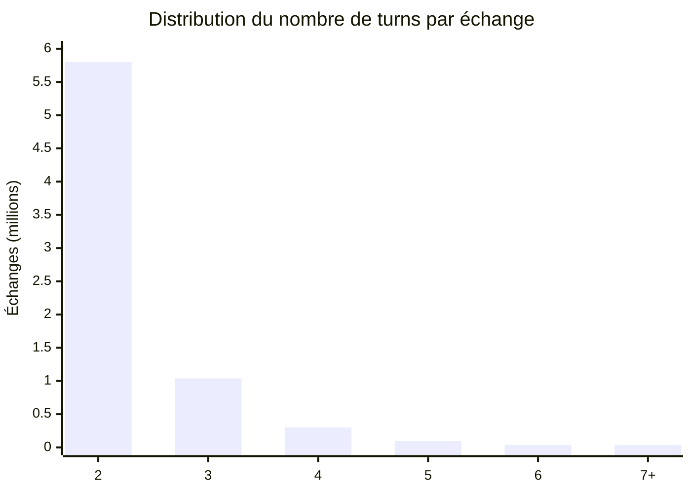

| Métrique | Valeur |
|---|---|
| Échantillons | 7 303 464 |
| Turns total | 16 881 010 |
| Mots total | 139 922 950 |
| Tokens moyen | 32.8 |
| Tokenizer | Hermes-3-Llama-3.1-8B |

Le bot est prévu pour tourner sur un GGUF quantifié (ex. `Discord-Hermes-3-8B.Q3_K_M.gguf`).


---

## 👀 Vue d'ensemble simplifiée

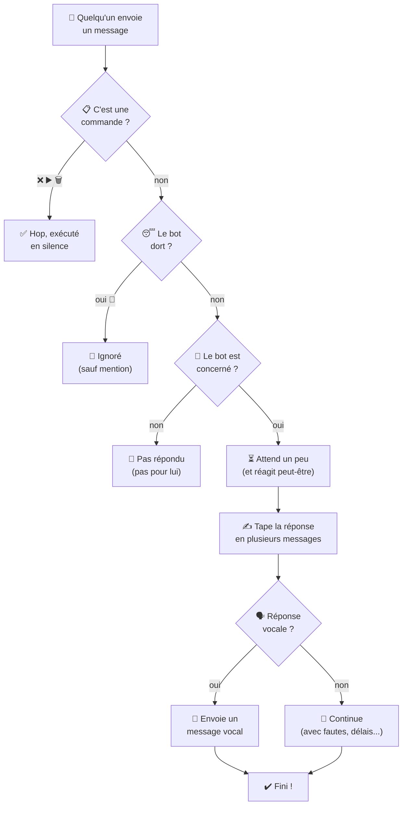

---

## Système de déclenchement

### State machine — décision message entrant

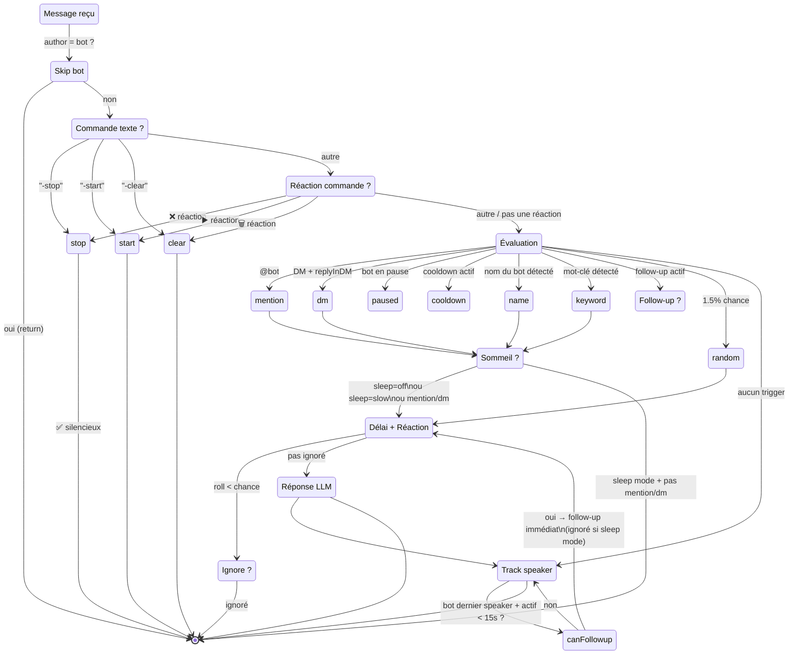

### Ordre de priorité des déclencheurs

| # | Raison | Conditions | Bypass ignore | Bypass pause |
|---|---|---|---|---|
| 1 | `mention` | Le bot est `@mentionné` | Oui (0%) | Oui |
| 2 | `dm` | Message privé avec `replyInDM = true` | Oui (0%) | Non |
| 3 | `name` | Message contient "Luna", "Pixie" ou le pseudo du bot (mot entier) | Non (8%) | Non |
| 4 | `keyword` | Message contient un mot-clé (mot entier) : `hello`, `hi`, `hey`, `yo`, `ai`, `bot`... | Non (8%) | Non |
| 5 | `follow-up` | Bot était le dernier interlocuteur + activité < 15s + < 3 follow-up / 60s | — | — |
| 6 | `random` | 1.5% de chance sur chaque message qui n'a pas matché | Non (8%) | Non |

**Mot entier (`\b`)** : "ai" ne matche pas "mais", "vrai", "lait". Seul le mot isolé "ai" ou "AI" déclenche.

### Cooldown

8 secondes entre deux réponses dans un même salon. Bypassé par les mentions et les follow-up.

### Follow-up

Quand le bot répond, il s'enregistre comme `lastSpeaker`. Tout message suivant dans les 15s déclenche une réponse immédiate (sans timer, sans check de mot-clé). Budget : 3 follow-up par fenêtre de 60s (via `responseCount` décrémenté après 60s).

---

## Mécanismes de réponse

### Délai variable

Le délai varie selon le type de déclencheur (voir section [Concentration variable](#concentration-variable)). Plus le message sollicite directement le bot, plus il répond vite.

Aucun typing pendant ce délai — le typing n'apparaît que quand le LLM commence à générer (premier token reçu).

### Ignore chance

Probabilité d'ignorer un message malgré un trigger, pour simuler l'inattention humaine. Varie selon le type de déclencheur (voir section [Concentration variable](#concentration-variable)). 0% pour les mentions, DMs et follow-up.

### Réactions

Probabilité variable selon le type de déclencheur (voir section [Concentration variable](#concentration-variable)). Quand le bot réagit :
- 30% → émoji personnalisé du serveur (aléatoire parmi les emojis du guild)
- 70% → émoji unicode depuis une liste prédéfinie

### Typing indicator

```typescript
onFirstToken: startTyping   → envoie typing + intervalle 8s
finally: clearInterval      → arrête le typing
```

### Réponse multi-chunk

Le LLM stream sa réponse en chunks (découpés sur les `\n`). Chaque chunk devient un message Discord séparé, avec un délai proportionnel à la longueur du chunk (`min(délai × length/200, 1)`) entre chaque message — simule le temps d'écrire. Seul le premier message a un `messageReference` (reply visuel). En mode vocal, le typing indicator est désactivé et les chunks sont ignorés.

### Simulation de fautes de frappe

Avec une probabilité configurable (`typo_chance`), le bot introduit une faute de frappe sur une lettre aléatoire d'un des messages (remplacement par une touche adjacente sur le clavier, layout AZERTY ou QWERTY). Après un court délai (2–4s), il corrige la faute — comme un humain qui tape vite et corrige.

Le mode de correction est configurable via `typo_correction_style` :
- `"edit"` — édite le message entier pour le remplacer par la version corrigée.
- `"message"` — envoie un nouveau message avec `mot_corrigé*` (convention humaine standard sur Discord).
- `"mixed"` — 50/50 aléatoire entre les deux (défaut).

```yaml
typo_chance: 0.06
typo_correction_delay_min: 2000
typo_correction_delay_max: 4000
typo_layout: "azerty"
typo_correction_style: "mixed"
```

Exemple de fautes AZERTY : `bonjour → bonjpur`, `salut → slaut`, `comment → cpmment`.

### Messages vocaux (TTS)

Avec une probabilité configurable (`voice_message_chance`), la réponse est envoyée comme **message vocal Discord** au lieu de texte. Le pipeline :

1. Le texte est nettoyé (mentions → `@utilisateur`, URLs supprimées, tronqué à 500 caractères)
2. Synthèse vocale via **Piper TTS** (fichier WAV)
3. Conversion WAV → OGG via `ffmpeg`
4. Mesure de la durée via `ffprobe`
5. Upload sur le CDN Discord (3 étapes : création d'attachment, PUT du fichier, POST du message vocal)

Si le texte contient des emoji ou caractères spéciaux, le bot ignore le TTS et envoie le message en texte normal.

```yaml
voice_message_chance: 0.08
```

### Reply style

Pondéré selon que le salon est en "conversation active" (bot a parlé récemment) ou non :

| Contexte | `messageReference` | `mentionRepliedUser` | Poids |
|---|---|---|---|
| Froid | `true` | `false` | 70% |
| Froid | `true` | `true` | 20% |
| Froid | `false` | `false` | 10% |
| Actif | `true` | `false` | 50% |
| Actif | `true` | `true` | 15% |
| Actif | `false` | `false` | 30% |
| Actif | `false` | `true` | 5% |

En DM, `messageReference` est toujours `false`.

### Concentration variable

Le bot adapte son comportement (délai, réaction, inattention) selon le type de déclencheur. Plus on s'adresse directement à lui, plus il répond vite et attentivement.

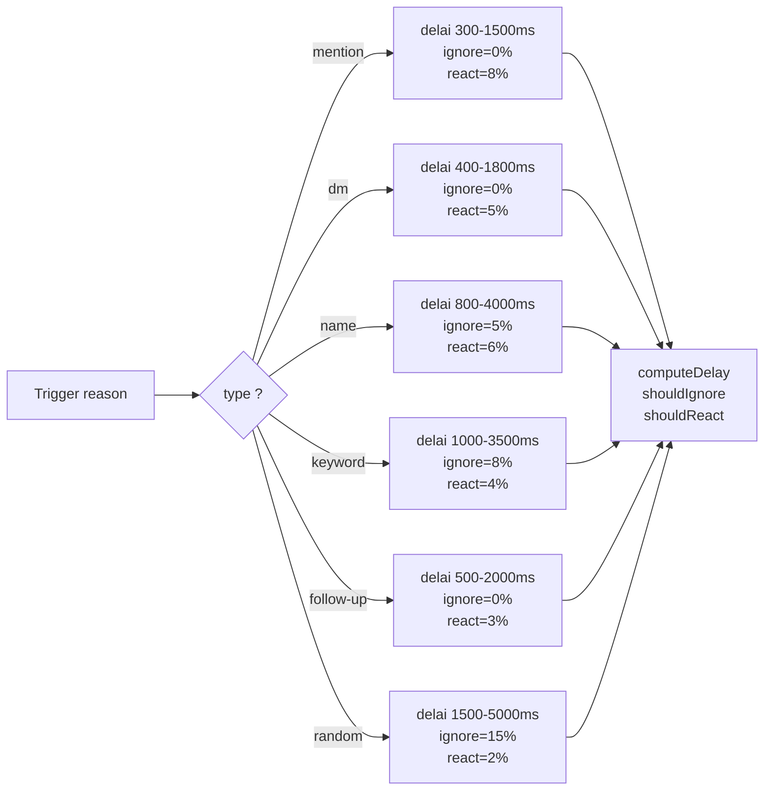

| Trigger | Délai min | Délai max | Ignore chance | Reaction chance |
|---------|-----------|-----------|---------------|-----------------|
| `mention` | 300ms | 1500ms | 0% | 8% |
| `dm` | 400ms | 1800ms | 0% | 5% |
| `name` | 800ms | 4000ms | 5% | 6% |
| `keyword` | 1000ms | 3500ms | 8% | 4% |
| `follow-up` | 500ms | 2000ms | 0% | 3% |
| `random` | 1500ms | 5000ms | 15% | 2% |

### File d'attente anti-spam

Quand le bot est déjà en train de répondre, les nouveaux messages ne sont pas perdus mais **mis en file d'attente** :

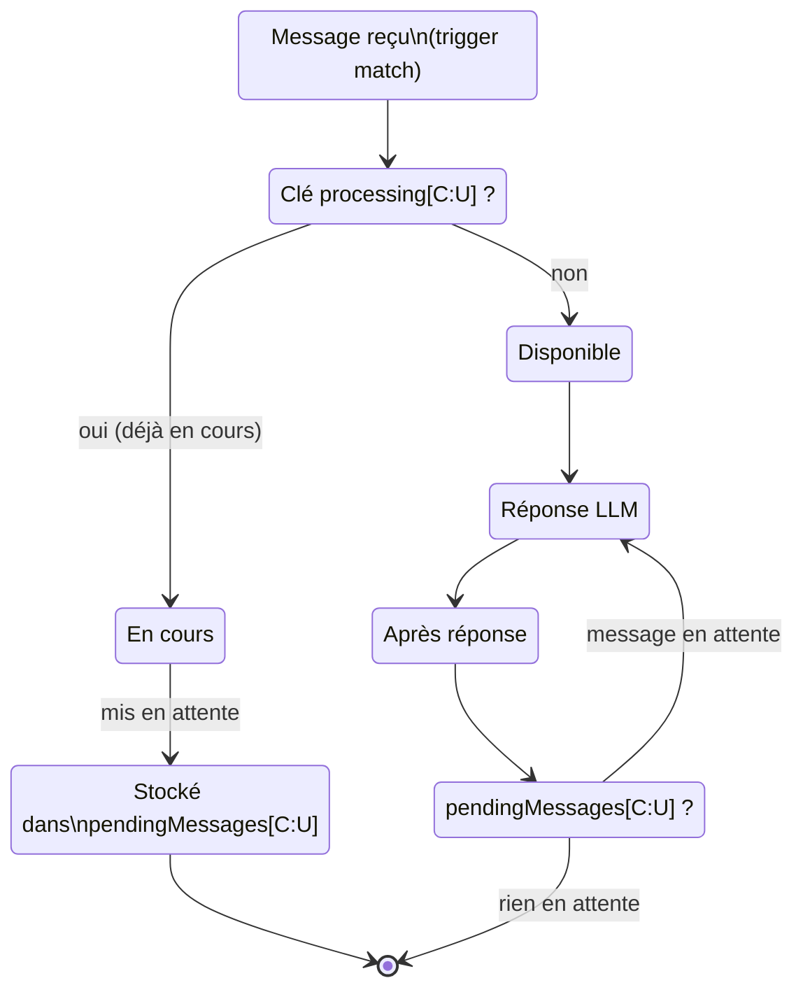

Chaque clé est `"channelId:userId"` — un utilisateur ne peut avoir qu'un message en attente par salon. Quand la réponse en cours termine, le message en file est traité immédiatement.

### Persistance d'état

Le bot sauvegarde son état dans `state.json` pour survivre aux redémarrages :

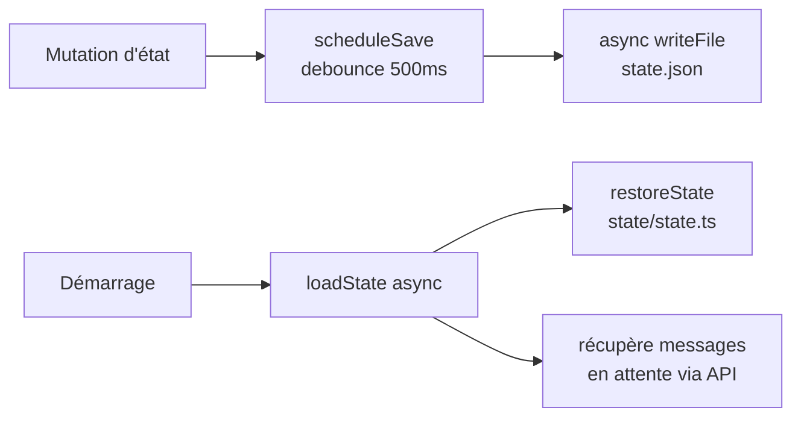

**Ce qui est persisté :**
- `pendingMessages` — file d'attente (channelId, messageId, userId, raison).
- `paused` — état pause.
- Cooldowns, timestamps d'activité, dernier interlocuteur, compteurs de follow-up.

Sauvegardé à chaque mutation (ajout/retrait de la file, pause/dépause, clear) avec un debounce de 500ms pour grouper les changements rapides.

### Auto-restart LLM

Si le processus llama-cli crash (OOM, segfault, etc.), il est automatiquement relancé :

1. Réinitialisation des flags internes (`isModelReady`, `isProcessing`, etc.)
2. La file d'attente (`requestQueue`) est préservée — les requêtes en cours seront retraitées
3. Backup exponentiel : 1s → 2s → 4s → 8s → 16s (max 5 tentatives)
4. Après un redémarrage réussi, le compteur de tentatives est réinitialisé

Utile pour les quantifications agressives (Q2_K) qui peuvent crash sur des prompts complexes.

```yaml
# Pas de configuration nécessaire — activé par défaut
```

### Plages de sommeil

Le bot peut simuler une présence non-24/7. Pendant les heures configurées, son comportement change :

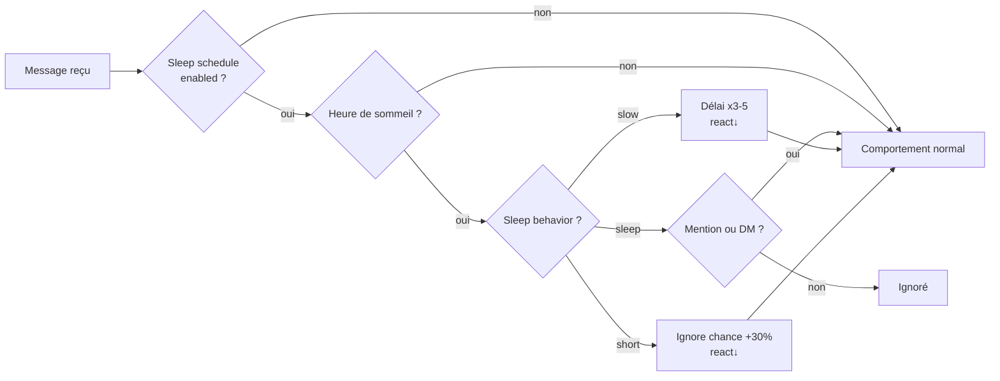

| Mode | Effet |
|------|-------|
| `sleep` | Seules les mentions (@bot) et les DMs sont traitées. Tout le reste est ignoré. |
| `slow` | Délais multipliés par 3–5, réactions quasi nulles. Le bot est "endormi mais répond". |
| `short` | Ignore chance augmenté de 30%, réactions quasi nulles. Le bot est "distrait". |

Configurable via `sleep_schedule` dans `config.yml`.

Exemple de timeline sur 24h :

```mermaid
gantt
    title Plages de sommeil (exemple)
    dateFormat HH:mm
    axisFormat %H:%M
    tickInterval 2hour

    section Comportement
    Éveillé        : active, 07:00, 3h
    Court          : short, 10:00, 1h
    Éveillé        : active2, 11:00, 5h
    Lent           : slow, 16:00, 2h
    Éveillé        : active3, 18:00, 4h
    Sommeil        : sleep, 22:00, 9h
```

### Messages spontanés

Toutes les 5 minutes, 12% de chance que le bot poste un message de son propre chef.

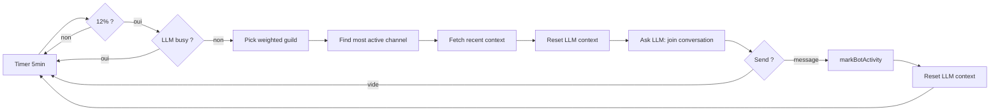

**Sélection du serveur** : classement par `lastMessageID` du salon le plus actif, poids linéaire décroissant (le serveur le plus actif a N× plus de chances que le dernier).

---

## Commandes

Les commandes sont **invisibles** — pas de message public, juste une ✅ de confirmation.

### Par message texte

| Commande | Effet |
|---|---|
| `-stop` | Pause tous les déclencheurs, reset le contexte LLM, vide les cooldowns |
| `-start` | Réactive le bot |
| `-clear` | Reset l'historique de conversation du salon + cooldowns + follow-up |

### Par réactions

Réagis sur **n'importe quel message du bot** avec :

| Emoji | Effet |
|---|---|
| ❌ | Stop (pause + reset) |
| ▶️ | Start (reprise) |
| 🗑️ | Clear (reset historique) |

En cas d'erreur interne, le bot réagit avec ❌ sur ton message au lieu d'afficher un gros message d'erreur.

---

## Configuration

Deux couches, la YAML écrase les valeurs par défaut, puis `.env` écrase pour les secrets et chemins.

### `config.yml` (recommandé)

Toute la configuration du bot : triggers, mannerisms, styles de reply. Exemple :

```yaml
names:
  - "Luna"
  - "Pixie"

keywords:
  - "hello"
  - "hi"
  - "hey"
  - "ai"
  - "bot"

random_chance: 0.015
cooldown_seconds: 8
reply_in_dm: true

response_delay_min: 800
response_delay_max: 4000

reaction_chance: 0.06
ignore_chance: 0.08

spontaneous_interval_ms: 300000
spontaneous_chance: 0.12
```

Voir le fichier complet à la racine.

### `.env`

| Variable | Défaut | Description |
|---|---|---|
| `DISCORD_TOKEN` | — | Token du bot Discord (obligatoire) |
| `LLAMA_CLI_PATH` | `llama/llama-cli` | Chemin vers l'exécutable `llama-cli` |
| `LLAMA_MODEL_PATH` | `models/Discord-Hermes-3-8B.Q2_K.gguf` | Chemin du modèle GGUF |
| `LLM_PORT` | `3124` | Port du serveur LLM HTTP |

### `prompt.txt`

Fichier lu au démarrage, contient le system prompt. Exemple :

```
Your name is pixieglow. You are a 21-year-old girl studying art.
Talk naturally and never prefix your replies with your name.
```

### Paramètres LLM (llama-cli)

Les flags `-t` / `-tb` (thread count) sont automatiquement détectés via `os.cpus().length`.

```yaml
temp: 0.75
dynatemp-range: 0.15
top-k: 40
top-p: 0.95
min-p: 0.05
repeat-penalty: 1.12
repeat-last-n: 256
presence-penalty: 0.1
batch: 4096
ubatch: 256
context: 4096
```

Chat template : ChatML (`<|im_start|>/<|im_end|>`)

Ces paramètres sont codés en dur dans `src/config.ts` (non modifiables via `config.yml`).

---

## Logs

Le bot trace toutes ses décisions avec des préfixes filtrables :

| Préfixe | Information |
|---|---|
| `[trigger]` | Évaluation de chaque message, résultat (`→ name`, `→ keyword`, `→ rien`...) |
| `[trigger]` | `canFollowUp=` avec les raisons (recentBot, lastSpeaker, followCount) |
| `[mannerisms]` | Délai calculé, rolls d'ignore/réaction avec la valeur |
| `[bot]` | Décision de répondre, follow-up immédiat, reply style choisi |
| `[spontaneous]` | Message spontané envoyé ou réponse vide |
| `[eris]` | Erreurs de la librairie Discord (attrapées sans crash, log uniquement) |
| `[tts]` | Synthèse vocale, upload CDN, ou envoi de voice message |
| `[persist]` | Sauvegarde/restauration de l'état du bot (`state.json`) |
| `[llm-core]` | Spawn, crash, redémarrage du processus llama-cli |

---

## Setup

```bash
# Cloner et installer
npm install

# Configuration
cp .env.example .env
# éditer DISCORD_TOKEN dans .env
# éditer config.yml (triggers, mannerisms, LLM, etc.)

# System prompt
echo "Your name is pixieglow. You are a 21-year-old girl studying art." > prompt.txt

# Lancer en dev
npm run dev

# Build + production
npm run build
npm start
```

### Scripts npm

| Script | Description |
|---|---|
| `npm run dev` | LLM server (hot) + esbuild watch + bot client (watch) |
| `npm run start` | LLM server + bot client (production) |
| `npm run build` | Bundle bot + serveur avec esbuild → `self-cli.js` + `llm-server.js` |
| `npm run build-client` | Bundle bot uniquement |
| `npm run build-server` | Bundle serveur LLM uniquement |
| `npm run client-only` | Build watch + bot client (sans LLM server) |
| `npm run server-only` | LLM server uniquement |
| `npm run lint` | Biome lint |
| `npm run lint:write` | Biome lint avec auto-fix |
| `npm run format` | Biome format |
| `npm run check` | Biome check complet |
| `npm run download-model` | Télécharge le modèle Discord-Hermes-3-8B.Q2_K.gguf depuis HuggingFace |

---

## Portail Développeur Discord

- Activer **Message Content Intent** (onglet Bot)
- Inviter avec scope `bot` + permissions `Send Messages`, `Read Message History`, `Add Reactions`
- Gateway intents : `guilds`, `guildMessages`, `guildMessageReactions`, `messageContent`, `directMessages`

---

## Structure du projet

```
src/
├── index.ts          # Point d'entrée → cli.ts
├── cli.ts            # CLI unifié (bot|server|direct)
├── bot.ts            # Handler principal Eris (allégé)
├── config.ts         # Toute la configuration (env, triggers, LLM, styles)
├── mannerisms.ts     # Délai, ignore, réactions, concentration
├── sleep.ts          # Plages de sommeil (présence variable)
├── typo.ts           # Simulation de fautes de frappe + correction
├── spontaneous.ts    # Messages spontanés pondérés
├── guild.ts          # findMostActiveChannel helper
├── tts.ts            # Synthèse vocale PiperTTS, upload CDN, voice messages
├── llm-client.ts     # Client HTTP vers le serveur LLM
├── llm-server.ts     # Ré-export rétrocompatible vers core/llm-server.ts
├── llm.ts            # Ré-export rétrocompatible vers core/llm-core.ts
├── persistence.ts    # Ré-export rétrocompatible vers state/persistence.ts
├── trigger.ts        # Ré-export rétrocompatible vers state/*
├── core/
│   ├── index.ts      # Barrel export
│   ├── llm-core.ts   # Logique LLM partagée (spawn, queue, parsing, restart)
│   ├── llm-server.ts # Serveur HTTP NDJSON
│   └── llm-direct.ts # Mode CLI direct (standalone)
├── state/
│   ├── index.ts      # Barrel export
│   ├── state.ts      # Cooldowns, activité, suivi conversation
│   ├── trigger.ts    # Évaluation des déclencheurs uniquement
│   └── persistence.ts # Sauvegarde/restauration d'état (async)
└── bot/
    ├── pending.ts     # File d'attente anti-spam (processing + pendingMessages)
    ├── reactions.ts   # Commandes par réactions (❌▶️🗑️)
    └── typo-correction.ts # Correction différée des fautes de frappe
```

### Flux détaillé d'une réponse

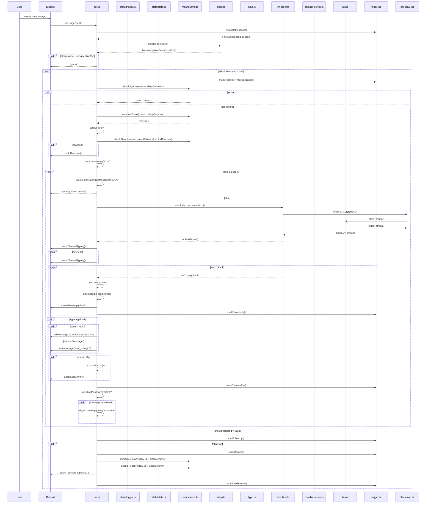

### Flux commandes par réactions

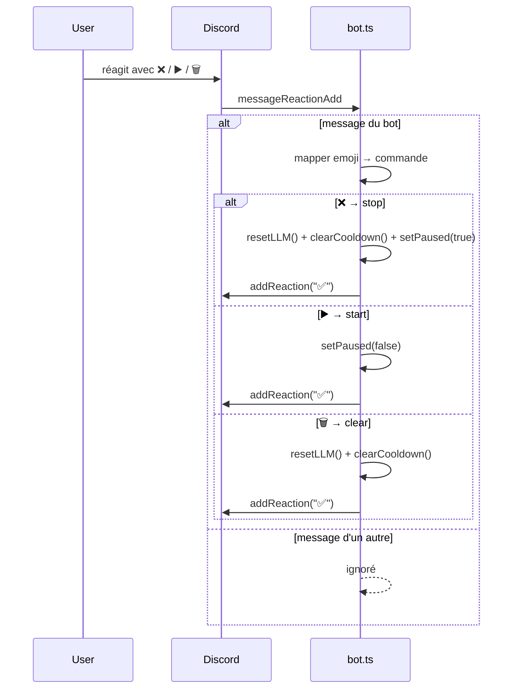
