# State Machines & Flowcharts -- discord-llm (Project Luna)

This folder contains all architecture diagrams, state machines, flowcharts, and Gantt charts
for the **discord-llm** project -- an autonomous Discord bot using a local LLM via llama‑server (shared model, prompt cache).

**Source files:** `.mmd` (Mermaid syntax) -- viewable on GitHub or editable in any text editor.  
**Exports:** `.svg` (vector, transparent background) in [`output/`](output/).

Regenerate all SVGs: `npm run diagrams`

---

## 01 -- Architecture Overview

This is the high-level system diagram. The bot has two entry points: the CLI dispatcher (`cli.ts`) can launch as a Discord bot via Eris, or as a standalone LLM HTTP server. The two processes are managed by PM2: `llama-server` (native C++ binary, shared model across 4 slots) and the bot (`self-cli.cjs`).

The configuration layer reads from `config.yml` and `.env` with hot-reload support via live getters -- most settings can change at runtime without restarting. The LLM Core is the brain: a request queue backed by two operational modes -- talking to a local `llama-server` over HTTP (shared model, prompt cache, sessions by channel ID), or hitting an OpenAI-compatible API over HTTP. All LLM events flow through a typed event bus (`llmBus`) so subscribers stay decoupled.

The bot subsystem ties everything together: it evaluates triggers, manages anti-spam queues, handles reaction commands, and fires off spontaneous messages. The "Human Behaviors" layer adds realistic delays, sleep schedules, and typos. The TTS pipeline converts responses into voice messages using Piper TTS, ffmpeg, and Discord's CDN upload flow. State management uses an in-memory store with an event bus that triggers debounced persistence to `state.json`, so the bot survives restarts without losing session state or pending messages.

---

## 02 -- Message Processing

[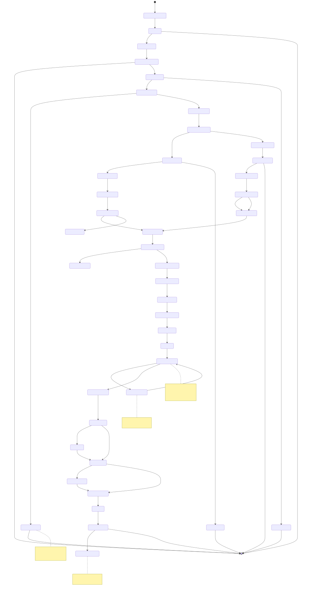](02-message-processing.mmd)

This is the main state machine -- the core loop that fires on every message the bot sees. It starts when Discord fires a `messageCreate` event. First, bot-authored messages are immediately skipped. Then `evaluateMessage()` checks for commands (`-stop`, `-start`, `-clear`) or triggers like mentions, name mentions, keywords, DMs, and a random chance.

If triggered, the flow enters the human-behavior layer: checks sleep schedules (silently ignore during sleep hours), session limits (pause the channel after 8 rapid replies), ignore probability (based on trigger type, boosted during "short" mode), and forget chance (3% -- the bot just doesn't reply). Surviving all that, `computeDelay()` calculates a wait time based on message length, inactivity, and sleep mode. After the delay, it optionally adds a reaction, then enters the anti-spam gate -- ensuring only one active LLM request per channel:user pair.

Once the LLM responds, tokens stream in with 20-80ms between words to simulate typing. Each newline in the output becomes a separate Discord message (for multi-paragraph replies). After the response, the bot may send a voice message, apply a typo (6% chance with a 2-4s delayed correction), and cleans up by tracking the speaker and draining the pending queue. There's a separate follow-up path: if the bot just spoke and a user replies within 15 seconds, it can chain up to 3 additional responses -- creating a back-and-forth conversation.

---

## 03 -- Trigger Evaluation

[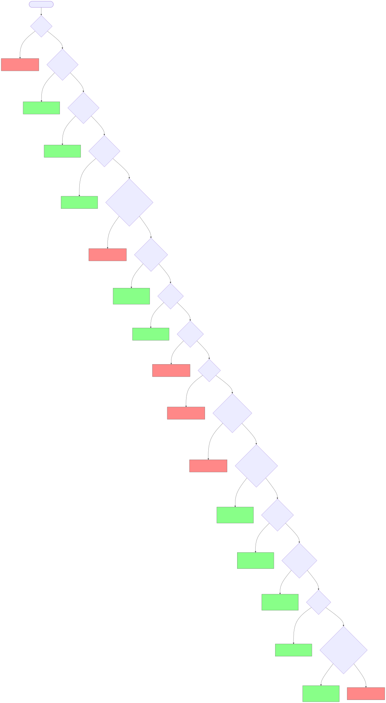](03-trigger-evaluation.mmd)

This is the gatekeeper -- it decides whether any given message warrants a response. It's a cascade of checks, each one either returning `shouldRespond=true` with a reason or falling through to the next check. The reason is important because downstream systems (like delay computation and ignore probability) use it to adjust behavior per trigger type.

First, bot authors are skipped. Then it checks for the three commands. Then it skips the bot's own messages (so it doesn't talk to itself), checks for @mentions, then DMs (only if `replyInDM` is enabled). If the channel is paused or on cooldown (and this isn't a mention or follow-up), it's a no. After that, it checks for the bot's name, custom names, keywords, or if it's a follow-up to a recent bot reply.

The last check is a flat 1.5% random chance (`randomChance` in config). This makes the bot chime in unprompted even when nobody mentioned it -- just enough to feel alive without being annoying. The fallthrough logic means a message that hits a keyword gets the `keyword` reason, which maps to specific delay and ignore thresholds -- so name mentions might get faster replies than keyword matches.

---

## 04 -- LLM Core Queue

[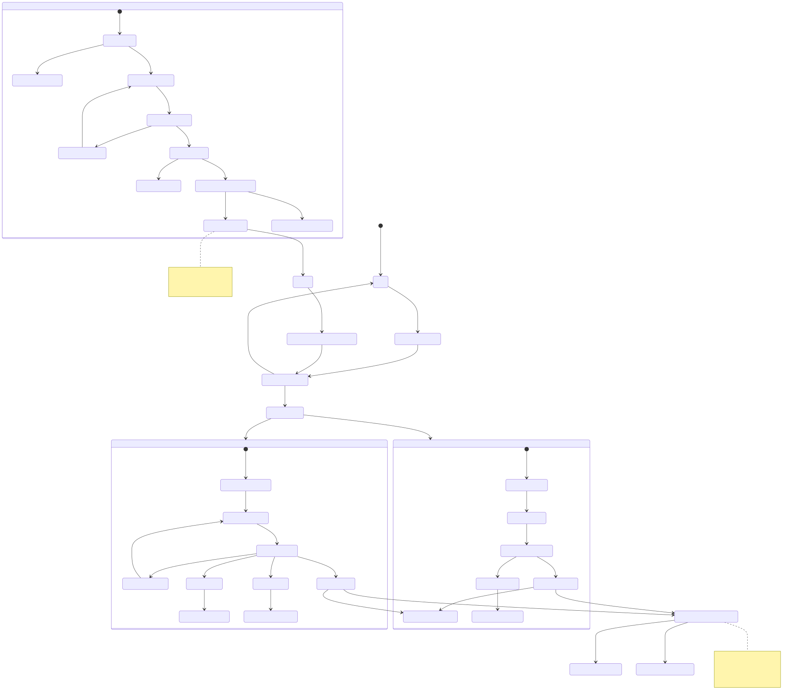](04-llm-core-queue.mmd)

This shows how the bot actually gets text out of the language model. When `askLLM()` is called, the request is pushed onto a FIFO queue. `processQueue()` dispatches to one of two backends based on `LLM_MODE`: Proxy (talks to local `llama-server` via HTTP `/v1/chat/completions`) or Online (hits an OpenAI-compatible API streaming endpoint).

In proxy mode, `llm-client.ts` manages session history (system prompt + user/assistant messages per channel) in memory. It sends the full conversation to `llama-server`'s OpenAI-compatible API with `id_slot` for slot pinning and `cache_prompt` for KV cache reuse. The server responds with standard JSON containing the assistant's reply. Online mode uses the standard OpenAI SSE streaming format: `data: {"choices": [{"delta": {"content": "..."}}]}`.

Regardless of backend, all tokens go through `emitWordTokens()` which feeds a word emission queue. Words are emitted one at a time with a random 20-80ms delay between them -- the human-typing simulation. Each word fires a `token` event, and after each word-chunk a `flush` event tells the bot to send whatever it has. The typing indicator is started directly before sending (not tied to the first token).

---

## 05 -- LLM Server Retry

[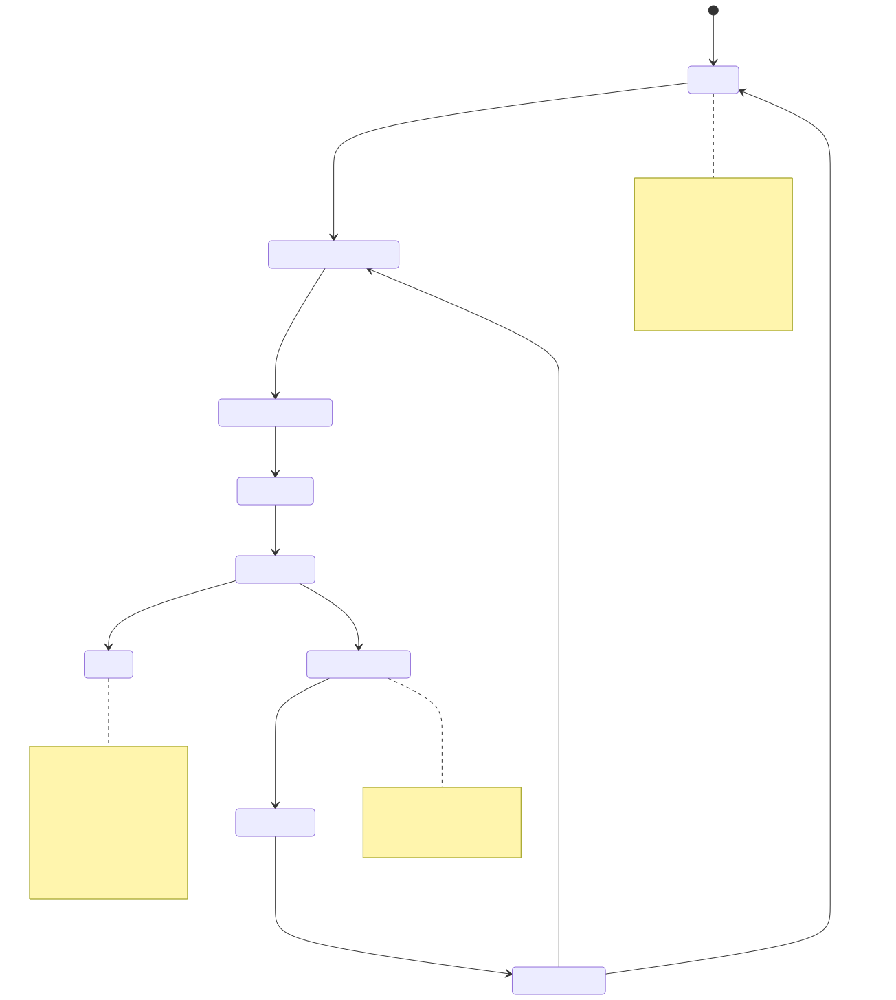](05-llm-crash-recovery.mmd)

The retry machine handles temporary connection errors to llama-server. Since the server is managed externally by PM2 (which auto-restarts it on crash), the client side only needs to handle brief outages during server restarts or network blips.

When a fetch() to `/v1/chat/completions` fails (connection refused, timeout, DNS failure), the bot emits an `error` event and schedules a retry. The retry count increments, and if under the limit of 5, applies exponential backoff: 1s, 2s, 4s, 8s, 16s (capped at 30s). After 5 consecutive failures, the bot gives up -- all queued requests are rejected with an error, and the bot logs the failure. The next user message will trigger a new attempt.

Common causes: server restarting after a model reload, brief network interruptions, or the PM2 process being temporarily unresponsive. Since llama-server manages its own prompt cache with a configurable TTL, a brief retry window doesn't lose conversation context.

---

## 06 -- Session Limit

[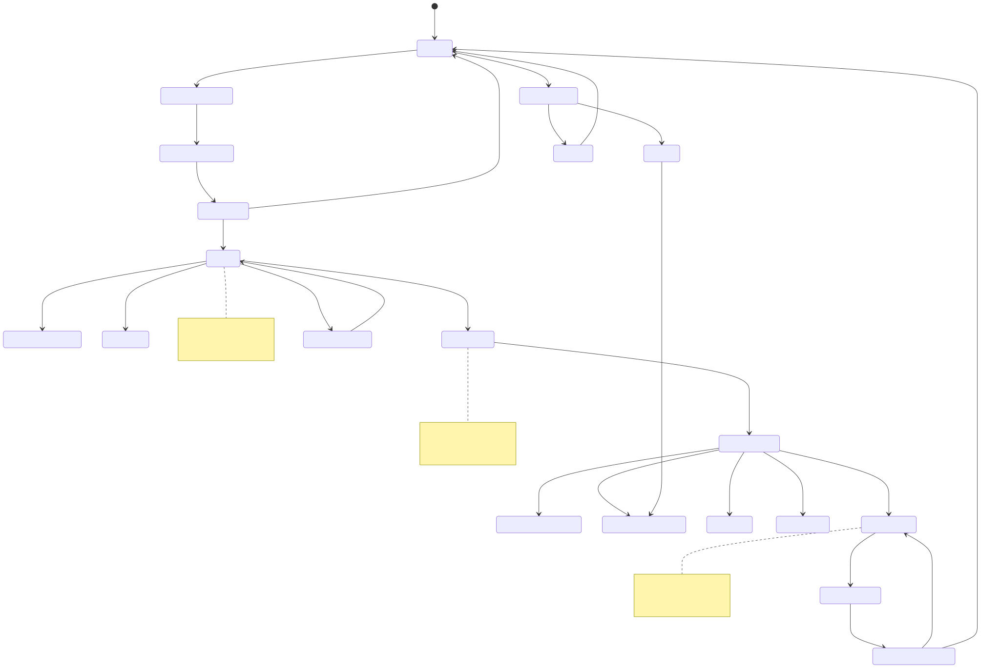](06-session-limit.mmd)

This prevents the bot from dominating a conversation with rapid-fire replies. Each channel has a `sessionMessageLimit` (default 8). After every reply, `sessionCounts[channelId]` increments. When it hits the limit, the channel enters a `PAUSED` state for `sessionPauseSeconds` (default 30s). During the pause, incoming messages are queued but not processed -- the bot stays silent, mimicking a natural conversational lull.

When the timer expires, the bot deletes both the count and pause state, calls `resetLLM()` to clear the LLM context, logs resumption, and drains the queue -- processing queued messages one by one. The drain loop checks after each message whether the channel got re-paused and stops if so.

There's also an idle expiry mechanism: if the channel has been idle for more than `sessionResetMinutes` (default 3 minutes), the session count is deleted -- effectively resetting the budget. Session pause is tracked per-channel, not per-user, so one user spamming affects everyone in the channel.

---

## 07 -- Anti-Spam Queue

[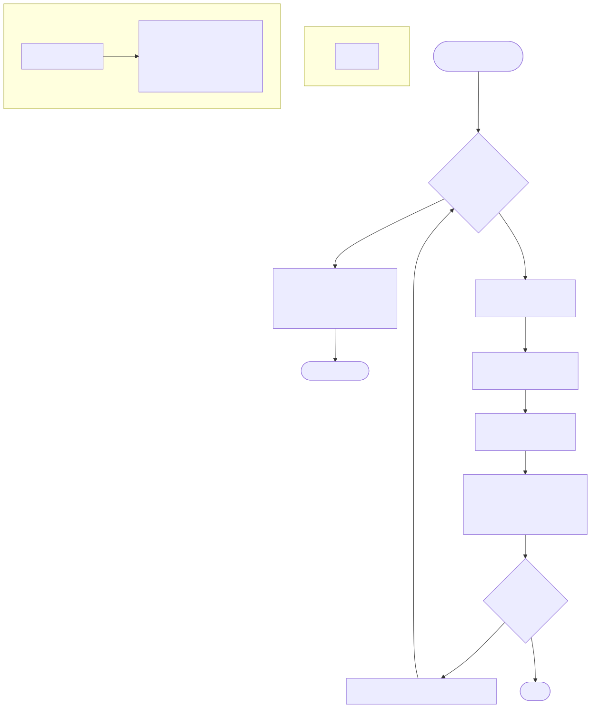](07-anti-spam-queue.mmd)

This solves a specific problem: what happens if a user sends two messages back-to-back while the LLM is still processing the first one? The key insight is deduplication by `channelId:userId` -- each user gets one active LLM request per channel at a time.

When `triggerLunaReply()` is called with a key, it checks a `processing` Set. If the key isn't there, it's added and the request proceeds. If it is (meaning a prior request is still in flight), the message is stored in a `pending` Map under the same key -- overwriting any previously pending message. So if user A sends messages 1, 2, and 3 while the LLM is busy, only message 3 will be queued. That's intentional -- the most recent message is the most relevant.

After the LLM finishes processing, `doneProcessing()` removes the key from the Set and calls `drainPending()`. If there's a queued message, it calls `triggerLunaReply()` again -- creating a recursive chain. On restart, `state.json` preserves the pending Map, and the bot re-fetches those messages by channel + message ID via Discord's API.

---

## 08 -- Dynamic Status

[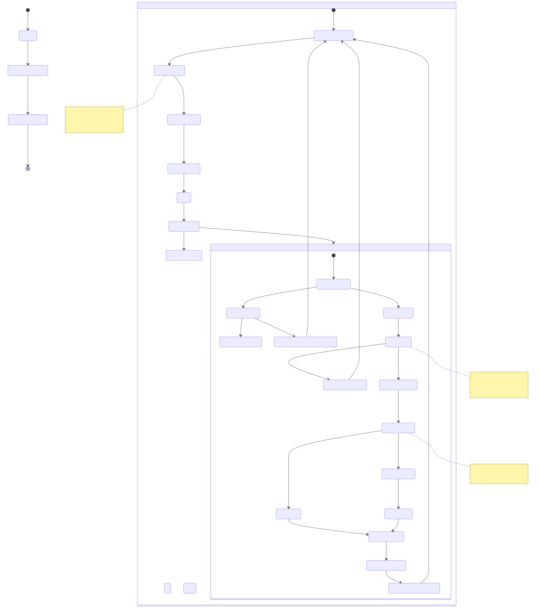](08-dynamic-status.mmd)

This makes the bot's Discord presence feel alive by cycling through configured status presets (e.g., "with code", "with fire", "with your mom"). When `startDynamicStatus()` is called, it enters a rotation loop with a base interval of 15 minutes, 0.5x–1.5x jitter, and a minimum of 60 seconds -- preventing perfectly periodic updates that would look robotic.

First it checks sleep behavior: during sleep hours, it sets status to `invisible` instead of cycling. If awake, there's a 10% chance to skip the update entirely, then a 15% chance to repeat the last preset -- giving some statuses more screen time naturally. Otherwise, it cycles to the next preset in round-robin fashion.

The jitter, skip chance, and repeat chance together create a non-repeating, organic-feeling pattern. Without these, the status would tick like a metronome. The sleep → invisible behavior is particularly nice: not only does the bot stop responding, its presence vanishes too.

---

## 09 -- Spontaneous Message

[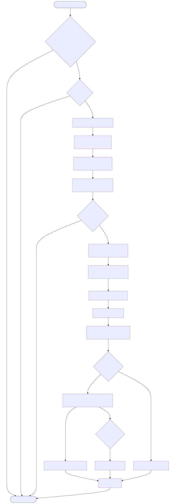](09-spontaneous-message.mmd)

Spontaneous messages make the bot feel like an active participant. A `setInterval` fires every 5 minutes. On each tick, there's a 12% chance (`spontaneousChance`) to proceed. If the chance hits, it first checks if the LLM is busy, then selects a guild and channel weighted by activity -- busier servers are more likely to get spontaneous messages.

Once a channel is chosen, the bot fetches recent context, builds a system prompt including conversation history, resets the LLM context, and asks it to "join the conversation." If the LLM produces non-empty text, it sends the message. Then it resets the LLM context again -- so the spontaneous message is a self-contained interaction that doesn't leak into subsequent conversations.

The double `resetLLM()` (before and after) means spontaneous messages are completely isolated from ongoing chat context. Error handling catches permission failures (e.g., the bot can't send in that channel) without crashing.

---

## 10 -- TTS Pipeline

[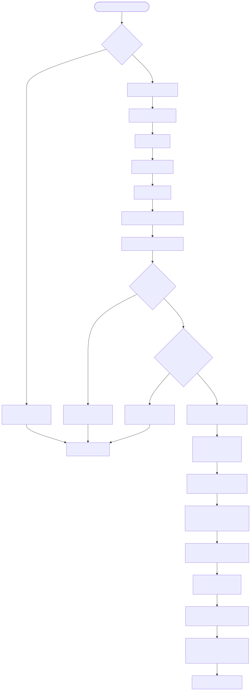](10-tts-pipeline.mmd)

This converts text responses into Discord voice messages using Piper TTS. It's triggered by `sendTextAsVoiceMessage()` which checks that Piper is initialized and that the text is safe for TTS (no emoji or special characters).

Sanitization is aggressive: mentions become `@user`, channels removed, custom emojis stripped, URLs removed, and non-letter/number/space characters deleted. The result is truncated to 500 characters. If cleaning produces empty text, synthesis is skipped. If emoji characters are detected, the message is sent as plain text instead.

If sanitization passes, Piper synthesizes WAV audio. The WAV is converted to OGG via ffmpeg (libopus at 32k, 24000Hz mono). Duration is extracted via ffprobe, and a fake sine-wave waveform is generated for the voice message UI. The OGG is uploaded to Discord's CDN: request upload URL → PUT file → post message with `flags=8192` (voice message flag).

---

## 11 -- Typo Correction

[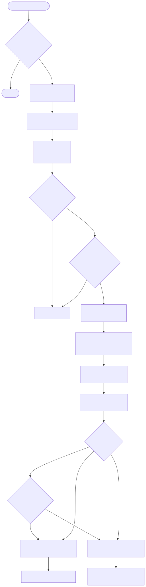](11-typo-correction.mmd)

This adds keyboard-mistake realism. After the LLM response is sent, there's a 6% chance (`typoChance`) that the bot "realizes" it made a typo and corrects itself. A random word is selected from the response chunks, a letter is picked, the adjacent key on the configured layout (AZERTY or QWERTY) replaces it.

After 2-4 seconds (`typoCorrectionDelay`), the bot sends the correction. The style can be `edit` (silently fixes the original message), `message` (posts `word*`), or `mixed` (50/50 random). The delay is crucial: immediate corrections would look automated, but a 2-4s pause strongly suggests a human who noticed their own mistake.

The edit mode is more subtle (the original message changes without a new post), while the message mode is more visible and natural -- people often asterisk-correct themselves. The distinction between these modes adds another layer of behavioral variety.

---

## 12 -- Follow-up Detection

[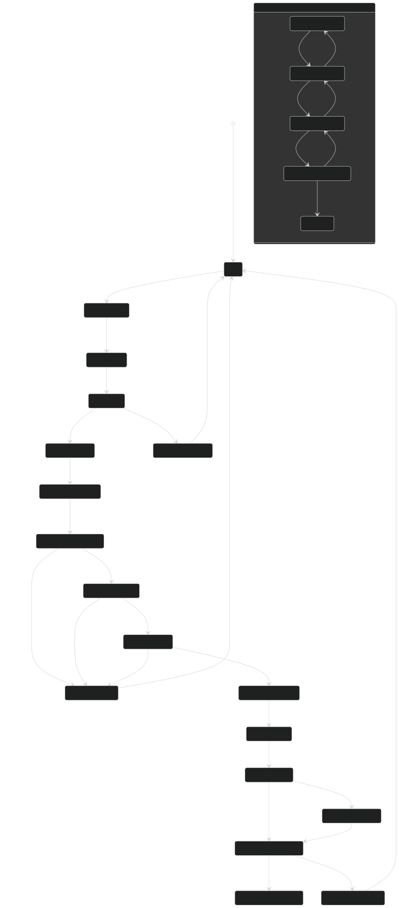](12-followup-detection.mmd)

This enables multi-turn conversations. After `triggerLunaReply()` completes, `trackSpeaker()` records the bot as the last speaker. The bot enters a 15-second watching window -- if no user messages arrive, it expires and returns to idle.

If a user replies within 15 seconds, `canFollowUp()` checks: was the bot active in this channel within the last 15 seconds? Is the bot the last speaker? Has the follow-up budget been exhausted? The budget caps at 3 consecutive follow-ups (`MAX_FOLLOWUPS`) -- preventing infinite loops.

Each follow-up goes through `computeDelay('follow-up')` with its own thresholds, and may add a reaction. The budget decays: the response count decreases by 1 every 60 seconds of inactivity. So the conversation can extend over several minutes as long as replies stay within 60s of each other. If another user speaks between the bot and the original user, the last speaker changes and follow-up is blocked -- preventing the bot from ignoring one user to continue with another.

---

## 13 -- State Persistence

[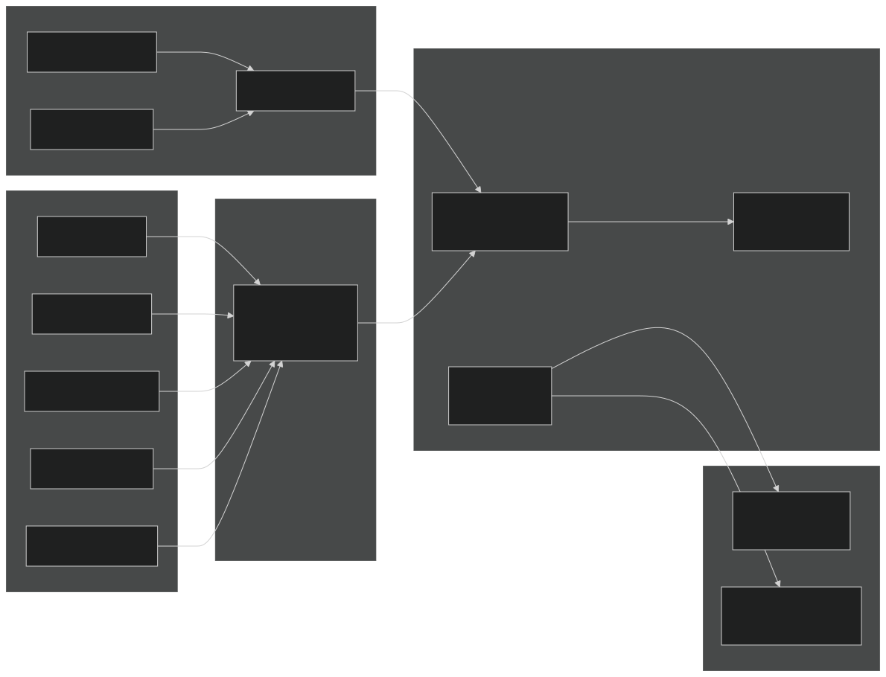](13-state-persistence.mmd)

This ensures the bot survives restarts without losing its memory. Any state mutation -- `setPaused()`, `markReplied()`, `markBotActivity()`, etc. -- emits a `state:changed` event on the `stateBus`. The persistence layer catches this and debounces saves with a 500ms timeout. Debouncing is important: during rapid state changes (like streaming a response), you don't want to write to disk on every single word.

`persistState()` serializes all Maps and state to `state.json`. On startup, `loadState()` reads this back and `restoreState()` rehydrates the Maps in memory. The pending module has its own `saveAllState()` which also feeds into the same debounced scheduler.

The trickiest part is `restorePending()`: messages are stored as channelId + messageId pairs, so restoring requires calling Discord's API (`getMessage()`) to re-fetch each message. If `getMessage()` fails (message was deleted while offline), that pending entry is simply skipped. The state is eventually consistent.

---

## 14 -- Event Bus Architecture

[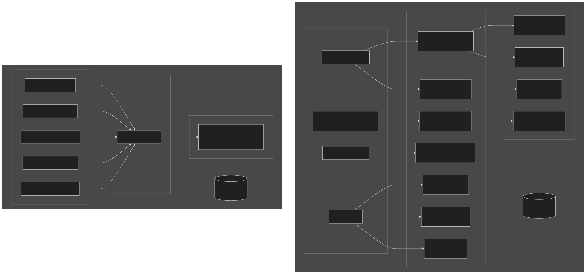](14-event-bus-architecture.mmd)

This shows the typed event bus system that decouples the bot's components. There are two buses: `llmBus` (for LLM events) and `stateBus` (for state changes). Both use a `TypedBus<TEvents>` generic providing type-safe `emit()`, `on()`, and `once()` methods.

The `llmBus` carries seven events: `token` (single word emitted), `flush` (end of word chunk -- time to send a Discord message), `done` (complete text generated), `error` (LLM error), `crash` (LLM process crash), `ready` (model loaded), and `reset` (context cleared). Emitters are in `llm-core.ts`; subscribers are in `bot.ts` which accumulates tokens and sends messages on flush.

The `stateBus` carries a single event -- `state:changed` -- emitted by the five state mutation functions in `state.ts`. The only subscriber is `persistence.ts`, which calls `scheduleSave()` to debounce the write to disk. This separation means `state.ts` doesn't need to know anything about file I/O -- it just fires events.

---

## 15 -- Delay Computation

[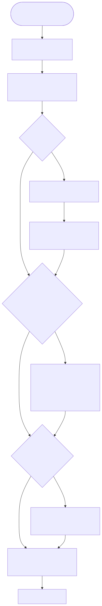](15-delay-computation.mmd)

This is where the bot simulates human reaction time. The formula starts with a base delay randomized between `delay_min` and `delay_max` -- thresholds that vary by trigger type. From there, three multiplicative factors stack up.

First, the **reading factor**: for every 500 characters of message length, the delay increases by 30-100% (randomized), capped at 3x. A long rant gets a proportionally longer pause. Second, the **inactivity warmup**: if the channel has been idle for more than `warmupMinutes` (default 10), the delay increases by up to 5x -- like someone rejoining a chat after being away. Third, the **sleep slow mode**: during "slow" sleep schedule, delay gets multiplied by 3-5x.

Finally, everything gets hit with an aggressive jitter multiplier of 0.5x–1.5x. Delays are never predictable -- even with the same inputs, you'll get different values each time. A typical mention reply might be 800ms–4s base, plus reading time, plus inactivity, times jitter -- giving anywhere from 500ms to 15s+. Consistent fast replies are a dead giveaway for a bot.

---

## 16 -- Sleep Schedule

[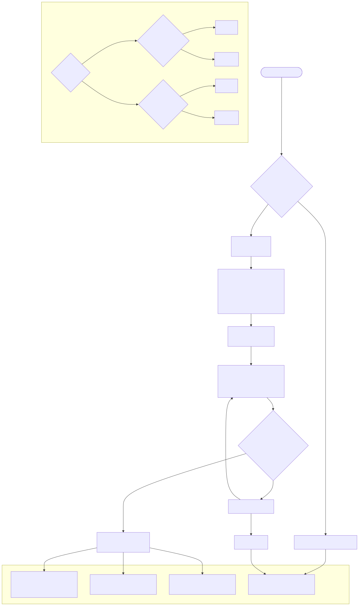](16-sleep-schedule.mmd)

This gives the bot a circadian rhythm. Configuration provides an array of `timeSchedules` entries, each with a `start`, `end`, and `behavior`. The system converts UTC to the configured timezone and computes minutes-since-midnight for comparison.

Time windows support midnight crossing: if `start > end`, the window spans midnight (e.g., 23:00 to 07:00). `isInWindow()` handles this: same-day checks `now >= start && now < end`; overflow checks `now >= start || now < end`. Multiple entries can cover different parts of the day, and the first match wins.

Three behaviors: `sleep` -- ignore all messages except @mentions and DMs, with invisible Discord status; `slow` -- delay ×3-5x with reactions ≤2% (simulating drowsiness); `short` -- 30% extra ignore chance, reactions ≤2% (simulating being short-tempered). If no schedule matches, behavior is `null` -- full normal operation.

---

## 17 -- Hesitation and Forget

[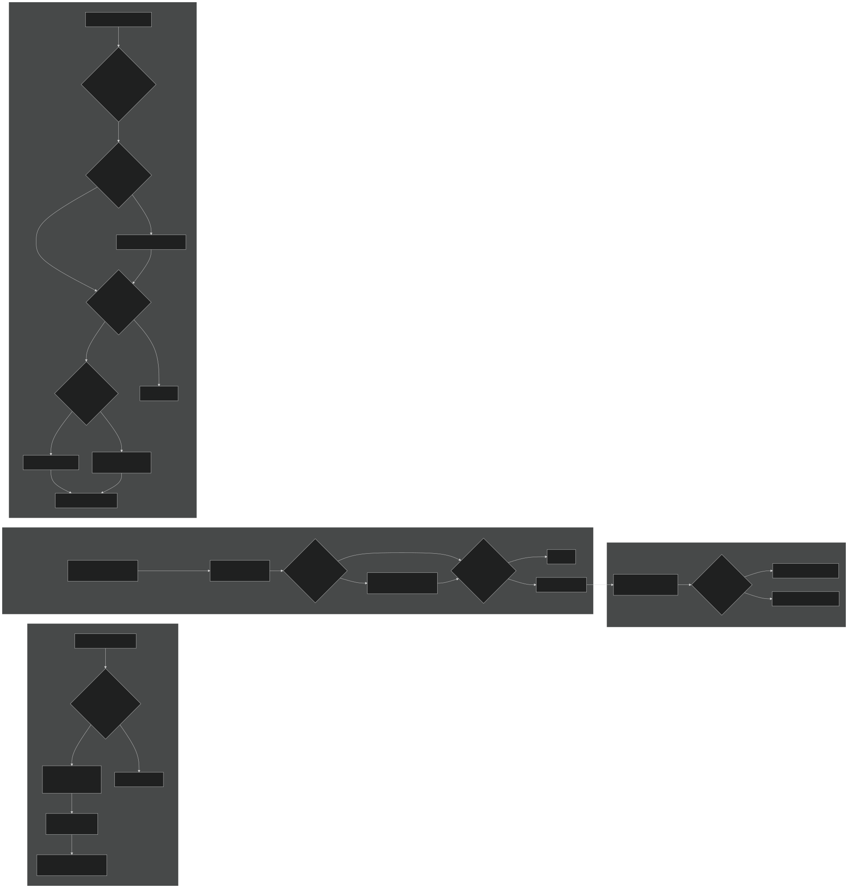](17-hesitation-and-forget.mmd)

This covers three human-like behaviors. **Hesitation** (15% chance) prefixes the first sentence with a filler word: "uh...", "um...", "well...", "i mean...", "hmm...", or "so...". This is applied before the first message flush, so the hesitation word ships with the first chunk of text. It makes the bot seem to be thinking out loud.

**Forgetting** (3% chance): even after the bot has decided to respond, there's a small chance it just doesn't. No response, no log -- it silently drops the message. This simulates distraction or interruption. The 3% rate is low enough to be surprising but not frustrating.

**Reactions** happen after the delay but before the actual LLM call. `shouldReact()` checks the reaction chance from trigger-specific thresholds. During `slow` or `short` sleep modes, chance is capped at 2%. If it passes, there's a 30% chance for a server-specific emoji vs. 70% for one of 14 built-in unicode emojis (😂, 😊, ❤️, etc.). The reaction appears during the delay period, before the text reply.

---

## 18 -- Reply Style Selection

[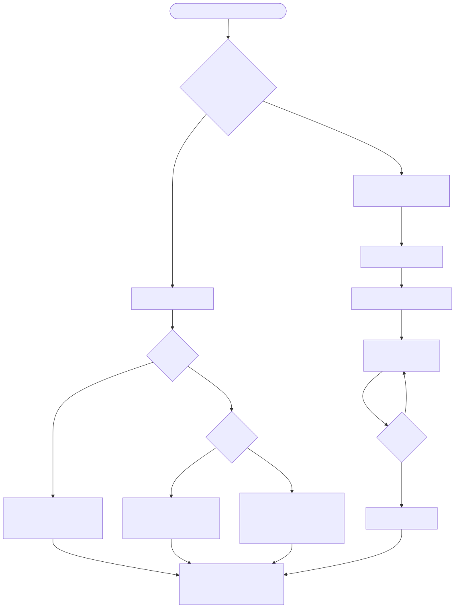](18-reply-style-selection.mmd)

This determines how the bot formats its messages -- quoting the user's message and whether it pings them. The key input is `isActiveConversation`, which checks for bot activity in the channel within the last 15 seconds.

For **cold conversations** (no recent bot activity): 70% quote without ping, 20% quote with ping, 10% neither. The 70/20/10 split favors non-pinging quotes because being pinged every time would be annoying in busy channels.

For **active conversations** (the bot just spoke): it reads the `replyStyles` config array with weighted entries. Each entry has a `weight` and style object. The system sums all weights, generates a random number, iterates through entries subtracting weights until zero, and picks the winner. This lets server admins tune behavior -- e.g., heavily weighting quote-with-ping during active conversations to keep the conversational flow clear. Only the first message gets the quote treatment; subsequent flushes are sent without reference.

---

## 19 -- Config Hot Reload

[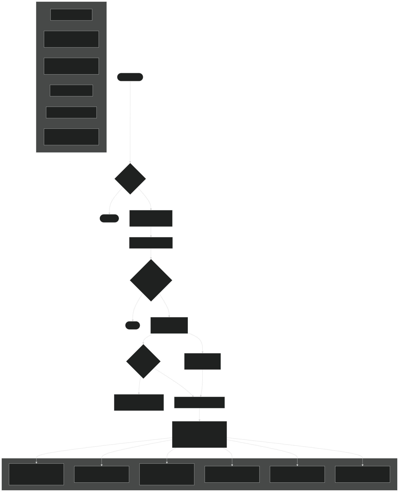](19-config-hot-reload.mmd)

Hot reloading lets you tweak behavior without restarting. `watchConfig()` uses `fs.watch()` on `config.yml` to detect changes. When a change event fires, it re-parses the YAML and updates `rawCfg`. All modules access config through getter functions, so they automatically pick up new settings on the next read.

**Hot-reloadable** settings: trigger names/keywords, random chance, cooldown seconds, concentration thresholds (delays, ignore, reaction chances), typo/hesitation/forget chances, voice message chance, time schedules, dynamic status presets, session message limits. **Cold-restart** settings: Discord token, llama paths, model path, host/port, mode, system prompt, TTS paths.

If the YAML is malformed, the old config remains active and an error is logged -- a typo while editing won't break the running bot. On Linux, `fs.watch` uses `inotify` which is reliable. The bot only reacts to `'change'` events, so an atomic save that renames a temp file might trigger `'rename'` and be ignored.

---

## 20 -- Reaction Commands

[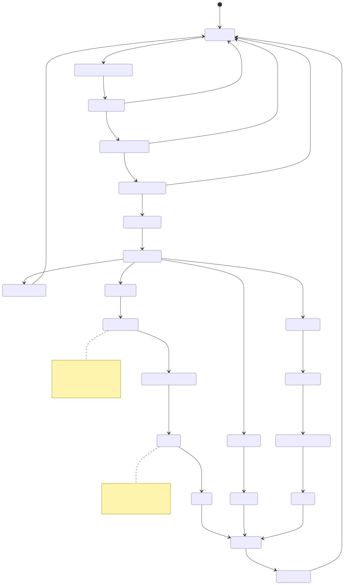](20-reaction-commands.mmd)

This provides a Discord-native way to control the bot -- users react to its messages with specific emoji. The system listens for `messageReactionAdd` events, ignoring the bot's own reactions, reactions on others' messages, and reactions in DMs (only text channels).

The reaction-to-command mapping uses `reactionCommands` -- a config object mapping emoji to commands (`stop`, `start`, `clear`). `stop` calls `resetLLM()` + `clearCooldown()` + `setPaused(true)`. `start` calls `setPaused(false)`. `clear` resets the LLM and cooldown without pausing.

After executing a command, the bot adds a white check mark (`:white_check_mark:`) to acknowledge receipt. The acknowledgment is important because Discord's UI gives no other feedback for reaction-based interactions. `trackSpeaker()` records the reacting user as the last speaker, so follow-up detection continues from the right person after pause/unpause.

---

## 21 -- Timing Gantt

This Gantt chart visualizes the real-time performance of a complete message processing cycle. The x-axis is in milliseconds, giving a concrete sense of how long each phase actually takes.

The evaluation and filter phase takes only 2-3ms -- nearly instant. The delay phase is the big variable: base `computeDelay()` ranges from 800-4000ms. The optional reaction takes about 10ms. The LLM processing is the bottleneck: 1-5 seconds for generation, then tokens stream at 20-80ms per word. Each message send takes about 15ms.

The optional TTS pipeline adds roughly 200ms. The typo correction waits 2-4 seconds. Cleanup takes under 5ms. The total time can be anywhere from 2 seconds (fast LLM, no delay, no TTS) to 15+ seconds (long delay, slow LLM, TTS, and typo correction).

---

## 22 -- Complete Lifecycle

This is the master state machine that unifies all 23 other diagrams into a single end-to-end lifecycle. The bot starts in `READY`, connects to Discord, and then three parallel loops run: the main message processing loop, the dynamic status rotation loop (every ~15 minutes), and the spontaneous message loop (every 5 minutes with 12% chance).

The message processing path is the most elaborate. A `messageCreate` event enters the trigger chain -- checking for commands and auto-triggers. Auto-triggers proceed through sleep check, session check, ignore roll, forget roll, delay phase (with optional reaction), anti-spam gate, LLM execution (streaming, voice, typo), session limit check, and cleanup.

Non-triggered messages go through follow-up detection: if the bot just spoke within 15 seconds and the budget allows, it enters a mini follow-up flow with its own delay, optional reaction, and `triggerLunaReply()`. The beauty of this unified view is seeing how every sub-system -- trigger evaluation, sleeping, ignoring, forgetting, delay, reactions, anti-spam, LLM streaming, voice, typos, session limits, follow-ups, status rotation, and spontaneity -- all compose together into one coherent bot that behaves unpredictably but believably.

---

## 23 -- Message Burst

[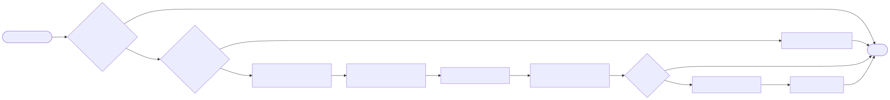](23-burst.mmd)

This diagram shows how a single line of text can be split into multiple fragments to simulate human typing rhythm. When the LLM flushes a response line (either during streaming on `\n` or after the final `askLLM` completes), the flush handler checks `burst_chance` (default 15%). If the chance hits and the text is at least 4 words long, the line is split at word boundaries into 2 or 3 fragments.

The first fragment is sent immediately with the reply style (`messageReference` if it's the first chunk). Subsequent fragments are queued with `setTimeout` delays randomized between `burst_delay_min` and `burst_delay_max` (default 1.5-4s), sent as plain messages without reference. Short messages (< 4 words) and voice responses never burst. The effect is subtle: most responses are normal, but occasionally the bot "types" in stops and starts, revealing its thought process piece by piece.

---

## 24 -- Topic Fatigue

[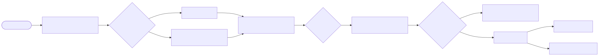](24-topic-fatigue.mmd)

Topic fatigue adds conversational boredom. Every incoming message, `recordMessage()` extracts significant words (alphabetic, >= 4 characters, lowercased) and appends them to a per-channel word log. The log is trimmed to `topic_fatigue_window * 10` words (default 100). Before each response, the system counts word frequencies: if any word appears `topic_fatigue_threshold` or more times (default 3), the channel is considered fatigued.

When fatigued, two things change: the response delay is multiplied by `topic_fatigue_delay_multiplier` (default ×2, scaling with excess occurrences, capped at ×5), and the ignore probability increases by `topic_fatigue_ignore_bonus` (default +15%). This makes the bot seem bored of repetitive topics -- it takes longer to answer and is more likely to ignore. The word logs are persisted in `state.json`, so fatigue survives restarts. If `topic_fatigue_enabled` is false or the channel hasn't repeated itself, everything runs normally and both modifiers stay at 1× and 0%.

---

## Color Legend

| Color | Meaning | Diagram types |
|-------|---------|---------------|
| 🟢 Green node | Positive response, action taken | flowchart |
| 🔴 Red node | Blocked, ignored, end of path | flowchart |
| 🔵 Blue node | Entry point or sub-process | flowchart |
| 📝 Note | Implementation details | stateDiagram, flowchart |

## Codebase stats

- Total source files: ~30 TypeScript files
- Lines of code: ~3500 LOC
- Tests: ~71 test files (Bun)
- LLM backends: 2 (proxy, online)
- Event bus types: 7 (llmBus) + 1 (stateBus)
- Simulated human behaviors: 10 (delay, ignore, forget, hesitation, typo, reaction, voice, follow-up, burst, topic fatigue)
